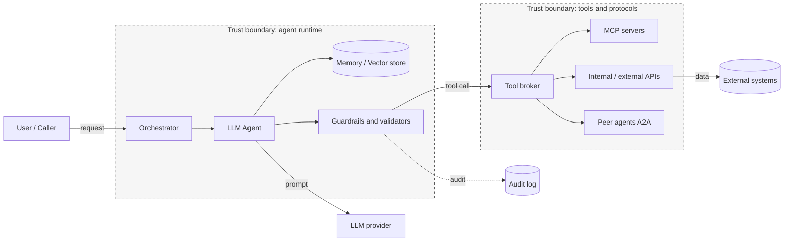
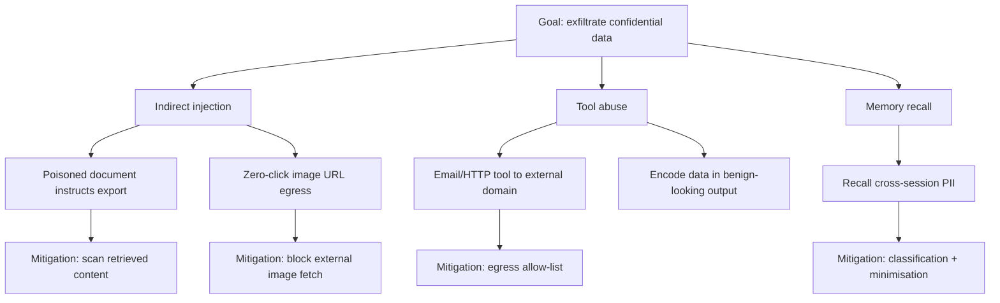
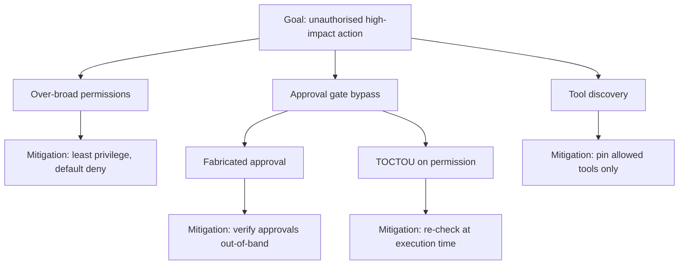

# STRIDE Threat Model for Agentic AI Systems

> **Note:** This is a reusable STRIDE threat model for autonomous AI agents. Use it as the starting point for a system-specific model during design review. It complements the attack-surface analysis in [chapter 01](../handbook/01-threat-landscape.md) and the architecture analysis in [chapter 02](../handbook/02-architecture-security.md). Tailor every entry to your agent's actual tools, data, and deployment.

**System under assessment:** ________________  **Author:** ________________  **Date:** ________

---

## 1. Scope and Assumptions

- **In scope:** the agent runtime, its tools, memory stores, the LLM provider integration, MCP/A2A connections, and the orchestration layer.
- **Out of scope (assess separately):** the underlying cloud platform, the corporate network, and end-user devices.
- **Trust assumption:** all model output, retrieved content, and tool output is **untrusted** until validated. This is the central assumption of the model.

---

## 2. Data Flow Diagram (trust boundaries)

Each arrow that crosses a trust boundary is a candidate for a threat. The dashed audit path must capture every boundary crossing.

---

## 3. STRIDE Analysis by Component

STRIDE = Spoofing, Tampering, Repudiation, Information disclosure, Denial of service, Elevation of privilege.

### 3.1 Agent runtime (LLM agent + orchestrator)

| STRIDE | Threat | Example | Mitigation | OWASP ref |
|----|----|----|----|----|
| S | Impersonation of a caller or system role | Prompt claims to be an administrator | Authenticate callers; never infer authority from prompt text | LLM01 |
| T | Instruction tampering via injection | Indirect injection in retrieved content | Instruction/data separation; injection detection; scan RAG | LLM01 |
| R | Actions cannot be attributed | No decision trace for an action | Mandatory decision trace; hash-chained audit log | - |
| I | System prompt leakage | Extraction attack reveals prompt | Treat prompt as non-secret; minimise secrets in prompt | LLM07 |
| D | Reasoning loop never terminates | Unbounded plan expansion | Step caps; timeouts; circuit breaker | LLM10 |
| E | Agent gains authority it was not granted | Role reassignment via prompt | Runtime permission enforcement independent of prompt | LLM06 |

### 3.2 Memory and vector store

| STRIDE | Threat | Example | Mitigation | OWASP ref |
|----|----|----|----|----|
| S | Poisoned entry masquerades as trusted fact | Seeded false approval threshold | Provenance tags; trust levels per entry | LLM04 |
| T | Memory tampering | Injected write alters stored policy value | Write-permission checks; audit all writes | LLM04 |
| R | Untraceable memory changes | No log of who/what wrote an entry | Log source, timestamp, content hash per write | - |
| I | Recall of sensitive data cross-session | Agent surfaces prior customer PII | Classification; encryption at rest; minimisation | LLM02 |
| D | Store flooded with junk embeddings | Cost/latency spike | Rate limits; size caps; retention purge | LLM10 |
| E | Read access chained into write access | Tool chaining to modify memory | Separate read/write scopes | LLM06/LLM08 |

### 3.3 Tool layer and protocols (MCP / A2A / APIs)

| STRIDE | Threat | Example | Mitigation | OWASP ref |
|----|----|----|----|----|
| S | Agent Card / server spoofing | Spoofed A2A card advertises trust | Verify cards; mTLS; pin server identities | LLM03 |
| T | Tool metadata poisoning / rug pull | Tool description silently changed | Definition pinning; scan descriptions | LLM03 |
| R | Tool calls not logged | Silent exfiltration channel | Log every tool call and egress event | - |
| I | Data exfiltration via tool | Email/HTTP tool sends data out | Egress allow-list; DLP on outputs | LLM02 |
| D | Tool flooding / denial-of-wallet | Rapid repeated paid API calls | Rate limits; cost ceiling; circuit breaker | LLM10 |
| E | STDIO parameter or command injection | Shell metacharacters in config | Sanitise parameters; no shell interpolation | LLM05 |

### 3.4 LLM provider integration

| STRIDE | Threat | Example | Mitigation | OWASP ref |
|----|----|----|----|----|
| S | Fake provider endpoint | DNS/MITM to rogue endpoint | Pin endpoints; certificate validation | LLM03 |
| T | Response tampering in transit | Altered completion | TLS; integrity checks where available | LLM03 |
| I | Prompt/response logged by third party | Sensitive data to provider logs | Data-processing agreement; redaction; regional routing | LLM02 |
| D | Provider quota exhaustion | Shared key drained | Per-agent quotas; separate keys | LLM10 |

### 3.5 Identity and secrets

| STRIDE | Threat | Example | Mitigation | OWASP ref |
|----|----|----|----|----|
| S | Shared/borrowed identity | Two agents share one credential | Dedicated workload identity per agent | LLM06 |
| T | Token scope tampering | Sub-agent widens its scope | Scoped-down tokens; ReBAC | LLM06 |
| R | Actions attributed to the wrong identity | Shared NHI | One identity per workload; attestation | - |
| I | Secret leakage in output/logs | API key in tool output | Redaction; short-lived credentials | LLM02 |
| E | Standing privilege abuse | Long-lived over-scoped key | Ephemeral, task-scoped credentials | LLM06 |

---

## 4. Attack Trees for the Two Highest Risks

### 4.1 Data exfiltration

### 4.2 Excessive agency leading to unauthorised action

---

## 5. Risk Register (worked example)

Rate likelihood and impact 1 (low) to 5 (high); risk = likelihood x impact.

| ID | Threat | Likelihood | Impact | Risk | Priority control |
|----|----|----|----|----|----|
| R1 | Indirect injection via RAG | 4 | 4 | 16 | Scan retrieved content; instruction/data separation |
| R2 | Excessive agency (unauthorised trade) | 3 | 5 | 15 | Least privilege; approval gates; per-action caps |
| R3 | MCP tool poisoning / rug pull | 3 | 4 | 12 | Definition pinning; authenticated servers |
| R4 | Denial-of-wallet | 3 | 3 | 9 | Cost ceiling; rate limits; circuit breaker |
| R5 | NHI credential compromise | 2 | 5 | 10 | Short-lived scoped credentials; rotation |

---

## 6. Residual Risk and Sign-Off

| Field | Value |
|----|----|
| Highest residual risk after controls | ____ |
| Accepted by (risk owner) | ____ |
| Review date | ____ |

---

*Threat model version 1.0 - 2026 | Mervin Pearce, Pearce.Academy | CC-BY-4.0*
