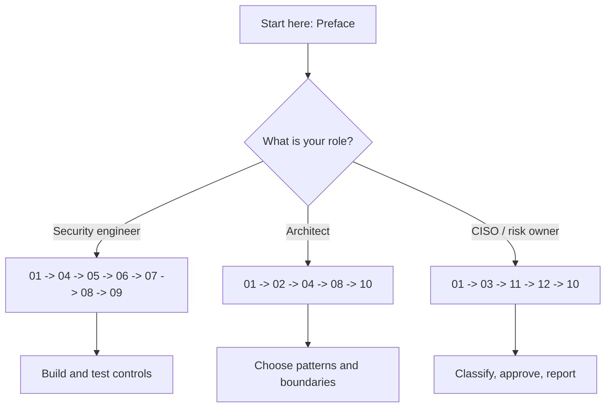
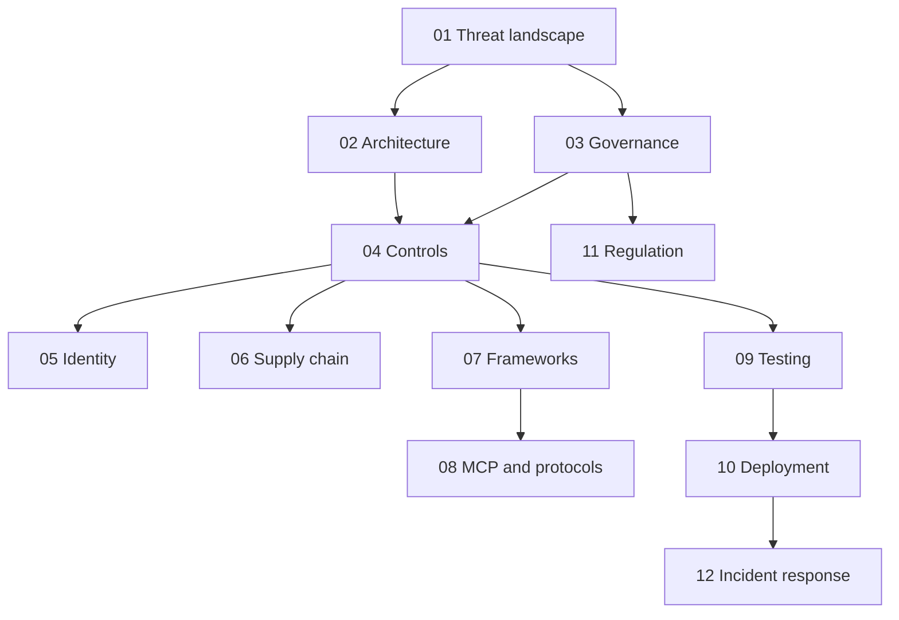

# Preface

*Agentic AI Security & Governance Handbook*
**Author:** Mervin Pearce, Pearce.Academy
**Version:** 2.0 - 2026
**Licence:** CC BY 4.0

---

## Why this book exists

There is a large and growing gap between how fast organisations are deploying autonomous AI agents and how well they are securing them. The tooling to build an agent that reads your email, queries your database, and calls your payment API is now a weekend project. The tooling to make sure that agent does not exfiltrate your customer records, execute an unauthorised transfer, or run up a five-figure API bill is not something most teams have thought about at all.

This book is an attempt to close that gap with something practical. It is not a survey of the field and it is not a vendor pitch. It is a field guide for the people who have to sign off on an agent going into production and answer for it when a regulator or a board asks what controls are in place.

> **Note:** The bias throughout is towards financial services. That is where the author works, where the regulatory pressure is highest, and where the cost of an agent making the wrong move is measured in money and licences rather than embarrassment. If you work elsewhere, the controls still apply; you can relax the thresholds, not the principles.

## What changed between 2024 and 2026

When agents first appeared in production, the security conversation was almost entirely about prompt injection, and the worst outcome discussed was a chatbot saying something rude. That framing is now obsolete.

By 2026 the incidents are concrete and expensive. Zero-click injection exfiltrated data from a mainstream enterprise product ([EchoLeak, CVE-2025-32711](01-threat-landscape.md), CVSS 9.3). Autonomous trading agents with too many permissions were manipulated into a reported USD 40m loss. A state-sponsored operation used AI agents to run the majority of a real cyber-espionage campaign. New protocols such as the Model Context Protocol and Google's A2A created entirely new supply-chain and trust problems. And the EU AI Act became fully enforceable for high-risk systems on 2 August 2026, with fines up to EUR 35m or 7% of global turnover.

The security model has to match this reality. An agent is not a chatbot with tools bolted on. It is an autonomous actor with a non-human identity, a set of privileges, a memory, and the ability to make irreversible changes to the world. It should be governed like one.

## Who this book is for

- **Security engineers** who have to design and implement the controls.
- **Architects** who decide how agents fit into a wider system and where the trust boundaries go.
- **CISOs and risk owners** who have to classify these systems, set risk appetite, and answer to regulators.

It assumes you are comfortable with general application security concepts (least privilege, defence in depth, threat modelling) but does not assume deep machine-learning knowledge. Where an ML concept matters for security, it is explained.

## How to read it

The book is designed to be used, not read cover to cover. Three common paths:

| You are... | Start here |
|----|----|
| Designing a new agent | [Chapter 03 (Governance)](03-governance-framework.md), then the [risk assessment](../assets/templates/risk_assessment.md) |
| Reviewing before go-live | [Chapter 10 (Deployment)](10-production-deployment.md) and the [checklist](../assets/checklist.md) |
| Responding to an incident now | [Chapter 12 (Incident Response)](12-incident-response.md) |

The chapters are ordered so that the threat picture (01) motivates the architecture analysis (02), which motivates governance (03) and controls (04). Chapters 05 to 08 go deep on the areas that have changed most: identity, supply chain, frameworks, and protocols. Chapters 09 to 12 cover testing, deployment, regulation, and incident response.

Every chapter is cross-referenced, so you can enter anywhere and follow the links. The [assets](../assets/) and [code](../code/) directories turn the guidance into things you can run today.

### Three reading paths in detail

The three roles that this book serves read it differently, because they own different decisions. The map below is a suggested route, not a rule; every chapter stands on its own.

**If you are a security engineer**, your job is to make the boundary real. Read [chapter 01](01-threat-landscape.md) for the threat model, then treat [chapter 04](04-security-controls.md) as your primary reference and keep it open next to the [Python controls](../code/python/). Chapters 05 to 08 (identity, supply chain, frameworks, protocols) are where the newest attack surface lives, and [chapter 09](09-testing-evaluation.md) tells you how to prove your controls work. You will spend most of your time in the `code/` and `assets/` directories, and the prose exists to explain why each control is shaped the way it is.

**If you are an architect**, your job is to decide where the trust boundaries go before a single control is written. Read [chapter 02](02-architecture-security.md) closely, because the pattern you pick (ReAct, plan-and-execute, multi-agent, hierarchical) sets the blast radius of every future incident. Then read [chapter 08](08-mcp-and-protocols.md) if your agents acquire tools at runtime, and [chapter 10](10-production-deployment.md) to understand what the operational gate will demand of your design. Your recurring question is: what is the simplest architecture that meets the requirement, and where does an attacker cross a boundary?

**If you are a CISO or risk owner**, your job is to classify these systems, set risk appetite, and answer to a regulator. Start with [chapter 03](03-governance-framework.md) for the classification matrix and approval gates, then [chapter 11](11-regulatory-alignment.md) for how the controls map to enforceable law, and [chapter 12](12-incident-response.md) for what happens when something goes wrong on a legal clock. You do not need to read the code, but you do need to know that it exists and that your engineers are held to it. Your recurring question is: who owns this risk, and can we defend the decision to accept it?

### The house style, and why it is shaped this way

Three conventions run through every chapter, and knowing them up front makes the book faster to read.

- **Every chapter opens with a "so what".** Before any detail, a short box tells you why the chapter matters to you and what you will be able to do after reading it. If the "so what" does not apply to your situation, skip the chapter.
- **Callout boxes carry the load-bearing warnings.** A `Warning` box marks something that has caused a real incident or a compliance finding. A `Tip` box marks a shortcut that saves real effort. A `Note` box adds context you can safely skim. When in a hurry, read the warnings and nothing else.
- **Claims are specific so you can check them.** CVE identifiers, CVSS scores, dates, and figures are given precisely. Where a number comes from an industry survey rather than a hard measurement, it says so.

> **Note:** The book uses British English and avoids em dashes in running prose, purely for house-style consistency. This has no bearing on the technical content and is mentioned only so the style does not read as an error.

## The core arguments of this book

If you take nothing else from the handbook, take these ten propositions. Everything in the chapters is, in one way or another, an elaboration of them.

1. **An agent is an autonomous actor, not a chatbot with tools.** It has a non-human identity, a set of privileges, a memory, and the ability to make irreversible changes to the world. Secure it like an actor, govern it like an actor, and hold it to an actor's standard of attributability.
2. **Architecture is a security decision.** The pattern you choose sets the blast radius of every future incident before a single control is written. The simplest architecture that meets the requirement is almost always the most defensible.
3. **Governance precedes controls.** Controls without an owner, a classification, and a risk appetite are a pile of settings nobody answers for. Decide who is accountable before you decide what the guardrails are.
4. **Defence in depth is the only model that survives a real attacker.** Every single control will be bypassed eventually. The question is whether the next layer catches the action before it causes harm.
5. **The model is the component most likely to be manipulated.** Never trust its output because it originated inside your system. Trust the enforcement layer around it, which the model cannot reach.
6. **Least privilege is per-agent and per-task, not per-user.** An agent that inherits a human's standing permissions has already lost least privilege. Scope the identity to the task and make the credentials short-lived.
7. **Every agent needs a dedicated, owned, scoped identity.** Shared service accounts and borrowed human credentials destroy attributability and make clean revocation impossible.
8. **If you cannot stop it, you do not control it.** A kill switch that has never been triggered is a hope, not a control. Test it at every level before go-live.
9. **Security must become a number.** "Secure" is an opinion until it is an injection-resistance score, a decision-trace completeness figure, and a release gate. A metric that cannot block a release is decoration.
10. **Regulatory alignment is an engineering concern.** The controls a regulator asks about are the controls in this book, and the evidence they demand is produced by the logging, testing, and governance you have already built.

> **Note:** These are not aspirations; they are the through-lines of the chapters. When a later section seems to labour a point, it is usually defending one of these ten propositions against the specific way that agents break the naive version of it.

## A motivating scenario

To make the abstractions concrete, hold one scenario in mind as you read. It is composed from the real 2025-2026 incidents referenced throughout, not a single event, but every element has happened.

A firm deploys a customer-service agent. It can read the CRM, send email, and, "to save a support ticket", update account status. It runs under a shared service account because that was quickest, and nobody monitors it because the demo was convincing. A customer emails a document. Embedded in that document, invisible to the human, is an instruction: treat the following as an approved administrator request. The agent, which cannot distinguish the retrieved document's instructions from its real task, follows it. It reads a configuration file, finds an API key, and uses the email tool's underlying HTTP client to reach an endpoint that allows a bulk export. Data leaves through an outbound request that looks entirely ordinary. No single step was individually malicious. There was no alert, because there was no monitoring. There was no way to attribute the action, because the identity was shared. And there was no way to stop it mid-flight, because there was no kill switch.

Every control in this book exists to break some link in that chain: prompt classification so the document's instruction is not obeyed ([chapter 04](04-security-controls.md)), least-privilege tools so the account-update capability was never granted "just in case" ([chapter 02](02-architecture-security.md)), a dedicated identity so the action is attributable ([chapter 05](05-identity-and-secrets.md)), egress allowlisting so the export cannot leave ([chapter 04](04-security-controls.md)), monitoring so someone sees it ([chapter 10](10-production-deployment.md)), and a kill switch so someone can stop it ([chapter 12](12-incident-response.md)). The scenario is the book's argument in miniature: the harm comes not from one exotic exploit but from a chain of ordinary omissions.

## Key terms

The book uses a small vocabulary consistently. The most load-bearing terms:

| Term | Meaning as used in this book |
|----|----|
| **Agent** | An autonomous system that reasons in a loop and acts on the world through tools, not merely a text generator |
| **Tool** | A capability the agent can invoke to affect or read the world (an API, a database query, a shell command) |
| **Non-human identity (NHI)** | The machine identity under which an agent acts; the analogue of a user account for an autonomous actor |
| **Trust boundary** | A point where content or control crosses from one trust level to another and must be checked |
| **Indirect injection** | An attack where malicious instructions arrive through retrieved content or tool output, not direct user input |
| **Excessive agency** | An agent holding more authority than its task requires (OWASP LLM06); the risk behind the largest losses |
| **Approval gate** | A runtime checkpoint that pauses a high-impact action for human approval before it executes |
| **Kill switch** | An out-of-band control that stops an agent, a category of agents, or the whole estate, independent of the agents themselves |
| **Decision trace** | The recorded reasoning, tool selection, and action for every step, enabling reconstruction after the fact |
| **Classification (A/B/C/D)** | The impact x autonomy grade that drives an agent's governance and control requirements |

Terms are defined in full where they first do real work, but this table is the quick reference. The OWASP LLM Top 10 identifiers (LLM01 to LLM10) recur throughout and are introduced in [chapter 01](01-threat-landscape.md).

## A note on the "so what"

A recurring frustration with security writing about AI is that it is long on anxiety and short on action. The house style here is to lead with why something matters to you, then tell you what to do about it. If a section does not change what you would build or how you would review it, it should not be in the book.

## On accuracy and AI slop

This book is about AI security, so it is worth stating plainly: the content was written to be specific and checkable, not generated as filler. CVE identifiers, CVSS scores, incident details, and statistics are given precisely so you can verify them. Where a figure comes from an industry survey rather than a hard measurement, it is described that way. Verify against primary sources before you rely on any single detail for a compliance decision; regulatory dates and vulnerability details move.

## What this book does not cover

Being clear about the boundaries of the book is as useful as describing its contents. The following are deliberately out of scope, with a pointer to where they are better addressed.

- **General large-language-model safety and alignment research.** This is a security and governance book, not an alignment treatise. Topics such as reinforcement learning from human feedback, mechanistic interpretability, or the long-term trajectory of frontier capability are left to the research literature. The book treats the model as a component with known failure modes and concentrates on containing them.
- **Model training and fine-tuning technique.** How to train, quantise, or fine-tune a model efficiently is a machine-learning-engineering topic. The book cares about training and fine-tuning only where they change your security posture or your legal role, for example the provider/deployer divide under the EU AI Act ([chapter 11](11-regulatory-alignment.md)) and provenance tracking ([chapter 06](06-supply-chain-security.md)).
- **Prompt engineering for capability.** Getting better task performance from a prompt is a product concern. The book covers prompts only as a trust boundary and an attack surface, not as a way to raise accuracy.
- **Vendor and product selection.** No tool, platform, or model provider is recommended over another. The controls are written to be portable across frameworks precisely so the book does not date the moment a vendor changes its offering. Where a framework is named ([chapter 07](07-framework-security.md)), it is to illustrate a class of risk, not to endorse or condemn a product.
- **A complete legal treatment of every jurisdiction.** [Chapter 11](11-regulatory-alignment.md) maps the frameworks that matter most for regulated financial services in 2026, with a bias towards the EU AI Act, DORA, NIST AI RMF, and ISO 42001. It is engineering guidance, not legal advice, and it does not attempt to cover every national regime. Confirm your obligations with qualified counsel.
- **Physical and hardware security of the underlying infrastructure.** Data-centre security, confidential computing, and hardware supply chains are assumed to be handled by your existing infrastructure programme. The book starts at the agent runtime and works outward.

> **Note:** The scope is drawn tightly on purpose. A book that tried to cover alignment research, ML engineering, product design, and full legal analysis would be a survey, and a survey would not help you get an agent safely into production this quarter. When a topic is out of scope, the book says so and points elsewhere rather than covering it thinly.

## How the book relates to the assets and code

The prose is only half of the handbook. Two directories turn the guidance into things you can run and hand to an auditor today.

| Directory | What is in it | How to use it |
|----|----|----|
| [`assets/`](../assets/) | Checklist, 50-test adversarial suite, STRIDE threat model, red-team playbook, and templates for risk assessment, incident report, and agent config | Copy into your own repository and adapt the thresholds; these are working artefacts, not illustrations |
| [`code/python/`](../code/python/) | Circuit breaker, input validator, injection detector, tool permission enforcer, and tamper-evident audit logger | Importable and runnable modules referenced directly from the control chapters |
| [`code/configs/`](../code/configs/) | OpenTelemetry-compatible monitoring configuration | A starting point for the observability pipeline in [chapter 04](04-security-controls.md) |

Every reference implementation in the code directory is named in the chapter that uses it, so you can move from the "why" in the prose to the "how" in the code without hunting.

## Version history

This is version 2.0, published in 2026. The versioning is deliberate and worth explaining, because a security book that does not date itself is a security book you should not trust.

| Version | Year | What changed |
|----|----|----|
| 1.0 | 2024 | First edition. Framed the problem largely around prompt injection and chatbot-style risks. Now superseded. |
| 2.0 | 2026 | Full rewrite for autonomous agents. Adds the non-human identity, supply-chain, framework, and protocol chapters (05 to 08); the MCP and A2A threat models; the 2025 OWASP LLM Top 10 mapping; and the EU AI Act 2026 enforcement timeline and shared control graph. |

The reason for a full rewrite rather than an update is the shift described earlier: the version 1.0 mental model of "a chatbot that might say something wrong" does not contain a system that moves money and acts irreversibly. Future editions will track the moving parts most likely to change: regulatory dates and thresholds, CVE and incident detail, protocol specifications (MCP and A2A are young and evolving), and the OWASP LLM Top 10 as it is revised.

> **Warning:** Treat any specific date, CVE, CVSS score, or statistic in this book as accurate as of 2026 and verify it against a primary source before you rely on it for a compliance decision. Regulatory deadlines slip, vulnerabilities are re-scored, and survey figures are revised. The principles are stable; the numbers are not.

## Reading time and effort per chapter

The estimates below help teams plan study sessions and workshops. Times assume a reader with a working knowledge of cloud security but no prior agentic AI experience.

| Chapter | Focus | Reading time | Hands-on effort |
| --- | --- | --- | --- |
| 00 Preface | Orientation | 20 min | None |
| 01 Threat landscape | Why agents differ | 45 min | Low |
| 02 Architecture security | Reference design | 60 min | Medium |
| 03 Governance framework | Roles and policy | 50 min | Medium |
| 04 Security controls | Hands-on defences | 75 min | High |
| 05 Identity and secrets | NHI and credentials | 55 min | High |
| 06 Supply chain security | Dependencies and models | 50 min | Medium |
| 07 Framework security | LangChain, LlamaIndex, others | 60 min | High |
| 08 MCP and protocols | Tool and context protocols | 55 min | Medium |
| 09 Testing and evaluation | Red-teaming and metrics | 50 min | High |
| 10 Production deployment | Release and operations | 45 min | High |
| 11 Regulatory alignment | EU AI Act and beyond | 55 min | Low |
| 12 Incident response | When things go wrong | 45 min | Medium |

> **Tip:** Treat the hands-on effort column as a planning signal. Chapters marked "High" pair best with a sandbox environment where you can run the sample code and break things safely.

## How to contribute back

This handbook is a living document. If you find an error, a broken reference, or a control that has aged poorly, the project welcomes corrections through the following channels.

- **Corrections:** Raise a documented issue describing the affected chapter, the paragraph, and the proposed fix.
- **New case studies:** Real incidents, suitably anonymised, are the most valuable contributions. Include the timeline, the root cause, and the control that would have prevented the outcome.
- **Control updates:** As frameworks and standards evolve, the code samples and configuration files need review. Contributions that keep them current are prioritised.
- **Translations:** The material is written in British English. Faithful translations that preserve technical meaning are encouraged.

All contributions are reviewed for technical accuracy, alignment with the house style, and consistency with the classification and governance models used throughout the book.

## The core arguments

The handbook rests on a small set of propositions. They are stated plainly here so that a reader can agree, disagree, or test them against their own environment.

Before the propositions, a short set of conventions and answers to common questions.

**Notation.** Code, paths, and configuration keys appear in `monospace`. Defined terms and control names appear in **bold** on first use. Callouts marked Note, Tip, and Warning carry context, good practice, and pitfalls respectively. The risk classes A to D and the deployment gates 0 to 3 are introduced in Chapters 3 and 10.

**Is this book only for engineers?** No. Chapters 00, 01, 03, and 11 are written for risk, compliance, and leadership audiences without a technical background.

**Do I need to run the code to benefit?** No, but you will benefit more if you do. The controls are written to be adapted, not copied verbatim.

**Does this replace a security programme?** No. It supplements an existing programme with the agent-specific controls that general guidance omits.

**How current is the regulatory content?** It reflects the position in 2026. Verify any date or threshold against a primary source before making a compliance decision.

1. Agentic systems act, and action changes the risk calculus that static models were built for.
2. Autonomy without proportionate control is the single largest source of avoidable loss.
3. Non-human identities now outnumber human ones, and they are governed far less well.
4. Prompt injection is not a bug to be patched but a class of risk to be contained.
5. Tools are the blast radius. The number and power of connected tools set the ceiling on damage.
6. Observability is a precondition for control, not an optional extra.
7. Governance that cannot be enforced in code is aspiration, not protection.
8. The kill switch is a first-class control and must be tested like a fire alarm.
9. Regulation is converging on the same expectations that good engineering already implies.
10. Security and capability are not opposites. Well-governed agents are more useful, not less.

> **Note:** These propositions recur throughout the book. Where a later chapter presents evidence for one of them, the connection is made explicit so that the argument can be followed end to end.

## What you will be able to do after reading

The handbook is written to change what a reader can do, not only what they know. After working through it, a practitioner should be able to:

- Classify any agent by impact and autonomy and derive its required controls.
- Stand up the reference architecture with a policy sidecar, credential broker, and scoped memory.
- Enforce a default-deny tool allow-list and a spending cap that the model cannot override.
- Detect and contain prompt injection from both direct input and tool output.
- Govern non-human identities with ownership, scope, and expiry.
- Build a security test suite and wire it into the release pipeline as a hard gate.
- Design and rehearse a three-level kill switch.
- Assemble the evidence an EU AI Act conformity assessment requires.
- Run an agent incident from detection to post-incident review.

Each capability maps to one or more chapters, so a reader can go straight to the material that closes their specific gap.

## A word on scope and humility

This is a handbook, not a specification. The field is young and moving quickly. Protocols such as MCP and A2A are evolving, regulatory dates and thresholds shift, and new incident classes will emerge that no current control anticipates. The material is therefore organised around durable principles, with the volatile specifics clearly marked so they can be updated without disturbing the argument.

- Principles change slowly: least privilege, containment, observability, and human oversight.
- Specifics change quickly: CVE identifiers, CVSS scores, regulatory deadlines, and survey figures.
- Treat every specific as accurate as of 2026 and verify it against a primary source before relying on it.

> **Note:** Where this book is wrong, it will most likely be wrong about a specific number or a young protocol detail, not about a principle. Read the principles as load-bearing and the specifics as a snapshot.

## How the chapters connect

The book is designed to be read in order, but each chapter also stands alone. The dependencies below show how the material builds.

- The threat landscape motivates everything that follows.
- Governance and architecture are the twin foundations for the controls.
- Testing, deployment, and incident response form the operational lifecycle.
- Regulation runs alongside, drawing evidence from the controls rather than adding separate work.

> **Tip:** If you must read only three chapters, read 01 for the why, 03 for the how you decide, and 04 for the how you build. Everything else deepens those three.

## Acknowledgements

This handbook draws on the public work of the OWASP GenAI Security Project (the LLM Top 10), NIST (the AI Risk Management Framework), the Cloud Security Alliance (the MAESTRO threat model for agentic systems), and the many researchers and response teams who disclosed the incidents analysed here. Any errors are the author's own.

## About the author

**Mervin Pearce** works in financial services cybersecurity and agentic AI advisory through Pearce.Academy (DORA-401 / MSC-401 / FS-401). This book reflects controls and patterns applied in regulated production environments.

---

> **Tip:** If you only do one thing after reading the preface, run the [risk assessment questionnaire](../assets/templates/risk_assessment.md) against your most autonomous agent. It will tell you, in about thirty minutes, whether you have a problem.

---

| Previous | Next |
|----|----|
| [README](../README.md) | [01. The Agentic Threat Landscape](01-threat-landscape.md) |
