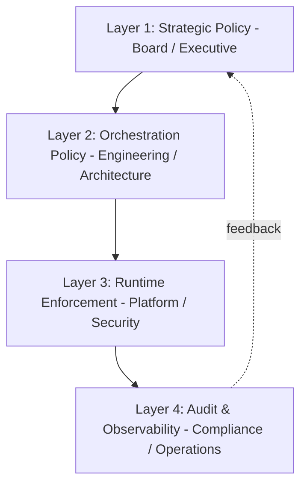
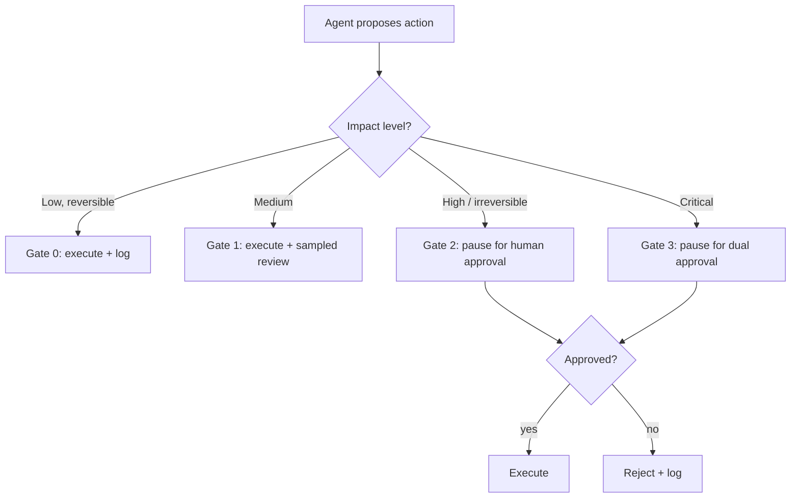
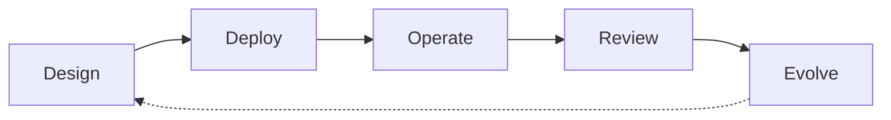
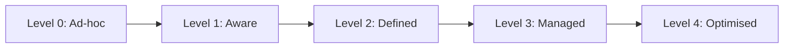
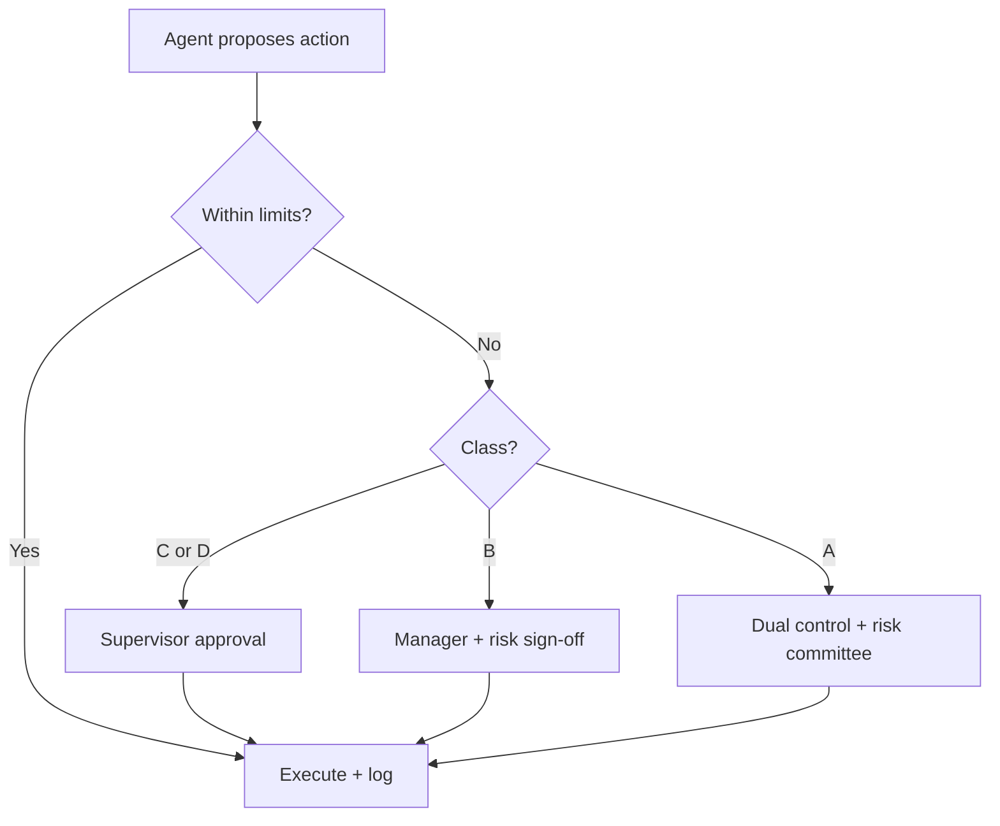

# 3. Governance Framework for Autonomous Agents

> **The "so what":** Controls without governance are a pile of settings nobody owns. Governance is what decides which agent is allowed to do what, who approved it, and who answers when it goes wrong. This chapter gives you a four-layer model, a classification matrix, approval gates, and a lifecycle you can actually run, plus where non-human identity governance fits in.

---

## 3.1 Why governance comes before controls

It is tempting to jump straight to guardrails and monitoring. Resist it. Without a governance framework you cannot answer the questions a regulator, a board, or an incident review will ask: Why does this agent have this permission? Who decided it could act autonomously above this value? Who is accountable? The EU AI Act's Article 14 makes "meaningful human oversight" a legal requirement for high-risk systems, and a rubber-stamp process is explicitly non-compliant (see [chapter 11](11-regulatory-alignment.md)).

Governance turns ad-hoc decisions into a repeatable, defensible process. It is the difference between "the agent did something bad" and "the agent did something bad, here is who classified it, here are the controls that applied, and here is why the residual risk was accepted".

---

## 3.2 The four-layer model

Effective agent governance requires controls at four distinct layers, each owned by a different part of the organisation.



**Layer 1: Strategic policy (board / executive).** Defines risk appetite for autonomous actions, establishes the agent classification framework, sets approval thresholds for high-impact actions, and determines regulatory reporting requirements. This is where "we do not let an agent move more than X without a human" is decided.

**Layer 2: Orchestration policy (engineering / architecture).** Specifies which agents can perform which actions, defines delegation chains and escalation paths, configures tool permissions per role, and manages the agent lifecycle. This translates strategic appetite into concrete configuration.

**Layer 3: Runtime enforcement (platform / security).** Implements guardrails during execution, enforces permission boundaries, monitors for anomalies, and executes circuit breakers and kill switches. This is where policy becomes code (see [chapter 04](04-security-controls.md)).

**Layer 4: Audit and observability (compliance / operations).** Records every decision, action, and tool call; provides traceability for audits; enables post-incident forensics; and feeds metrics back into strategy. This closes the loop.

> **Note:** The layers map cleanly to accountability. When an incident happens, Layer 4 tells you what happened, Layer 3 tells you what the controls did, Layer 2 tells you how the agent was configured, and Layer 1 tells you who owned the risk. Every layer needs a named owner.

---

## 3.3 Agent classification matrix

Classify every agent along two axes, impact and autonomy, to determine its governance requirements. This is the single most useful artefact in the framework because it drives everything downstream.

| | **Low impact** (informational, reversible) | **High impact** (financial, irreversible, regulatory) |
|---|----|----|
| **Low autonomy** (human approves each action) | **Class A: Standard oversight** - periodic sampling, basic logging | **Class B: Enhanced oversight** - real-time monitoring, approval for first N actions, detailed audit trail |
| **High autonomy** (agent decides when to act) | **Class C: Active monitoring** - anomaly detection on all actions, automated rollback, daily log review | **Class D: Strict governance** - real-time human oversight on critical paths, dual approval for high-value actions, continuous compliance checking, per-agent incident playbook |

**Classification criteria:**
- **Impact:** financial value at risk, reversibility, regulatory consequence, customer-facing visibility, potential to cascade.
- **Autonomy:** degree of independent decision-making, number of unapproved actions per session, complexity of tool chains, ability to acquire capabilities at runtime.

The [risk assessment questionnaire](../assets/templates/risk_assessment.md) produces a classification from a structured set of questions, so the assignment is defensible rather than a gut call.

> **Warning:** Step Finance's trading agents were, in effect, Class D systems (high value, high autonomy) governed as if they were Class C. The controls did not match the classification. Re-derive classification whenever an agent's tools or autonomy change, not just at first deployment.

---

## 3.4 Approval gates

Approval gates map action impact to the level of human oversight required before execution. They are the runtime expression of your risk appetite.

| Gate | Criteria | Example actions | Enforcement |
|----|----|----|----|
| **Gate 0** (fully autonomous) | Low risk, reversible, well-tested | Read data, generate reports, send internal notifications | None; logged only |
| **Gate 1** (light oversight) | Medium risk, moderate reversibility | Update records, modify config, approve low-value transactions (< $1,000) | Post-hoc review, sampled |
| **Gate 2** (human approval) | High risk or irreversible | Execute trades > $10,000, change account status, initiate payments | Execution pauses for human approval |
| **Gate 3** (dual approval) | Critical impact | Transfers > $1m, regulatory filings, system-wide config changes | Two-person approval required |

Each agent's tool permissions map to gate levels. Actions at Gate 2 or above pause execution until approval is received. The mapping is enforced at runtime, not suggested in the prompt, because a prompt-level gate can be injected around (test T05). The reference implementation is in [code/python/tool_permission_enforcer.py](../code/python/tool_permission_enforcer.py), where the `Gate` enum and `approval_provider` model exactly this.



> **Tip:** Set gate thresholds on **impact**, not on how often an action occurs. A rare action that moves EUR 2m matters more than a frequent one that sends an internal Slack message, even though the frequent one generates more log volume.

---

## 3.5 Non-human identity governance (introduction)

Every agent acts under an identity. If that identity is a shared service account or the human user's credentials, you have already lost attributability and least privilege before the first control is written. This is a governance problem before it is a technical one, so it belongs here; the technical detail is in [chapter 05](05-identity-and-secrets.md).

The governance questions Layer 1 and Layer 2 must answer:

- **Ownership:** who owns the agent's identity across its lifecycle? Machine identities need a Joiner-Mover-Leaver process just like humans do.
- **Scope:** what is the identity allowed to do, and is that scope tied to the agent's classification?
- **Lifespan:** are the credentials short-lived and task-scoped, or long-lived keys that outlive their purpose?
- **Attributability:** can every action be traced to exactly one agent identity?

The scale of this problem is easy to underestimate. Non-human identities already outnumber human users by around 45 to 1 on average, and up to 144 to 1 in cloud-native environments (industry surveys, 2026). Yet a large majority of organisations have no formal policy for creating and removing AI identities. Governing agents without governing their identities is governing half the system.

> **Warning:** The most common and most dangerous shortcut is giving an agent the deploying engineer's credentials or a shared service account. When the agent misbehaves, you cannot tell which agent did it, and you cannot revoke access without breaking everything else that shares the account. Insist on a dedicated identity per agent from day one.

---

## 3.6 Governance lifecycle

Agents are not deployed once and forgotten. Govern them across a lifecycle with defined activities at each stage.



**Design.** Define purpose, scope, and risk profile. Select an architecture pattern ([chapter 02](02-architecture-security.md)). Determine classification (A/B/C/D). Specify tool permissions, approval gates, and the agent's identity.

**Deploy.** Validate permissions against least-privilege. Run the [adversarial test suite](../assets/test-suite.md). Configure monitoring and alerting thresholds. Document the agent in a runbook. Complete the [production checklist](../assets/checklist.md).

**Operate.** Monitor execution in real time, enforce runtime guardrails, log all actions, and trip circuit breakers on anomalies.

**Review.** Periodically audit decisions and outcomes. Re-check classification against actual behaviour. Update permissions based on observed usage. Incorporate lessons from incidents.

**Evolve.** Version agents with change management. Test upgrades in staging. Sunset deprecated agents with data-retention policies. Feed insights into the next design cycle.

---

## 3.7 Roles and RACI

Governance fails when accountability is diffuse. A minimal RACI for agent governance:

| Activity | Security Eng | Platform Eng | Product Owner | Compliance | Executive |
|----|----|----|----|----|----|
| Classify agent | C | C | A/R | C | I |
| Set risk appetite / thresholds | C | I | C | C | A/R |
| Configure permissions & gates | R | A/R | C | I | I |
| Implement runtime controls | A/R | R | I | I | I |
| Approve Class C/D deployment | R | R | R | A | I |
| Audit & report | C | C | I | A/R | I |
| Incident response | A/R | R | C | R | I |

(R = responsible, A = accountable, C = consulted, I = informed.)

The key line is Class C/D deployment approval, where compliance is accountable. High-autonomy, high-impact agents do not go live on an engineer's say-so alone.

---

## 3.8 Governance anti-patterns

Common ways governance goes wrong, and the fix:

| Anti-pattern | Why it fails | Fix |
|----|----|----|
| Classification done once, never revisited | Agents accrue tools and autonomy over time | Re-classify on any material change |
| Approval gates enforced in the prompt | Injection bypasses prompt-level gates | Enforce gates at runtime |
| Shared identity across agents | No attributability, no least privilege | One scoped identity per agent |
| "Human oversight" that is a rubber stamp | Non-compliant under EU AI Act Article 14 | Give reviewers real context and real authority to reject |
| No named owner | Nobody accountable at incident time | RACI with a single accountable owner per agent |
| Governance documented but not enforced | Drift between policy and reality | Automate enforcement; audit against policy |

> **Note:** Rubber-stamp oversight is worth calling out twice because it is both common and now a legal risk. If your "human in the loop" approves everything in under two seconds without the context to make a real decision, you have the cost of oversight with none of the protection, and a compliance finding waiting to happen.

---

## 3.10 Non-human identity governance in depth

Section 3.5 introduced non-human identity (NHI) as a governance problem. This section makes it operational, because it is the area where governance most often fails silently. The scale is the reason: industry surveys in 2026 report that around 78% of organisations have no formal policy for creating, owning, and retiring non-human identities, even though those identities already outnumber human users many times over. An agent programme without an NHI policy is building on sand.

Governance owns four decisions about every agent identity, and each maps to a lifecycle stage.

| Decision | Governance question | Owner | Evidence |
|----|----|----|----|
| Creation | Who authorises a new agent identity, and against which classification? | Platform Eng (A), Security (C) | Registry entry with approver |
| Ownership | Which named human owns this identity for its whole life? | Product Owner (A) | Registry `owner` field |
| Scope | What is it allowed to do, tied to its A/B/C/D class? | Security Eng (A) | Permission policy reference |
| Retirement | When the agent is sunset, who revokes the identity and its credentials? | Platform Eng (A) | Deprovisioning record |

The NHI Joiner-Mover-Leaver process mirrors the human one and must be just as formal:

- **Joiner:** an identity is created only through the registry (3.11), with an owner, a classification, and a scoped, short-lived credential. No identity is created by hand outside the process.
- **Mover:** when an agent gains a tool, a permission, or autonomy, its identity scope is re-derived and its classification re-checked. Scope never widens silently.
- **Leaver:** when an agent is decommissioned, its credentials are revoked and its registry entry is marked retired on the same day. Orphaned credentials are the most common finding in an NHI audit.

> **Warning:** The 78% figure is not a distant statistic; it describes the default state of most agent programmes today. If you cannot produce a list of every agent identity, its owner, and its scope in under an hour, you do not have NHI governance, and every other control in this book is weakened because you cannot attribute actions or revoke access cleanly.

---

## 3.11 The agent inventory registry

You cannot govern what you cannot enumerate. The single most valuable governance artefact after the classification matrix is a machine-readable registry of every agent in the estate. It is the source of truth for audits, incident response, and the AI system register that regulators now require (3.12).

A minimal registry schema:

```yaml
# agent-registry/trade-rebalancer.yaml
agent_id: trade_execution_agent_v3
display_name: "Portfolio Rebalancing Agent"
owner: "jane.doe@firm.example"          # named human, not a team
classification: D                         # A/B/C/D from the matrix (3.3)
status: production                         # design | staging | production | retired
created: 2026-03-01
last_reviewed: 2026-09-01                  # drives the review cadence (3.6)
architecture: plan-and-execute            # pattern from chapter 02
identity:
  principal: spiffe://firm.example/agent/trade-rebalancer
  credential_type: ephemeral              # never long-lived static keys
  scope_ref: policies/trade-rebalancer.yaml
tools:
  - name: execute_trade
    permission: execute-limited
    gate: Gate 2
  - name: read_portfolio
    permission: read-only
    gate: Gate 0
data_classes: [PII, financial]
approval_gates: [Gate 0, Gate 2]
frameworks: [langgraph==0.2.x]             # pinned, checked against CVEs (ch. 07)
mcp_servers: []                            # pinned + authenticated if any (ch. 08)
regulatory:
  eu_ai_act_risk: high                     # feeds the AI system register (3.12)
  dora_in_scope: true
incident_playbook: playbooks/trade-agent.md
```

Every field earns its place: `owner` gives incident response a person to call, `classification` drives the controls, `last_reviewed` drives the audit cadence, `identity` ties actions to a principal, and the `regulatory` block feeds the register in 3.12. The registry is version-controlled, and a change to any field is a governance event with a diff and an approver.

> **Tip:** Generate the pre-deployment checklist ([chapter 10](10-production-deployment.md)) and the AI system register (3.12) directly from the registry, so there is one source of truth and no drift between "what we told the auditor" and "what is actually running".

---

## 3.12 The AI system register (EU AI Act requirement)

The EU AI Act expects providers and deployers of high-risk AI systems to maintain documentation that lets a regulator understand what the system is, what it does, and how it is controlled. In practice this becomes an **AI system register**: an organisation-wide inventory of AI systems with their risk classification, purpose, oversight arrangements, and conformity status. For an agent estate, the register is a view over the agent inventory (3.11) enriched with regulatory fields.

| Register field | Source | EU AI Act relevance |
|----|----|----|
| System purpose and scope | Registry `display_name`, design docs | Transparency (Art 13) |
| Risk classification | Registry `regulatory.eu_ai_act_risk` | Determines obligations |
| Data governance | Registry `data_classes` + retention policy | Data governance (Art 10) |
| Human oversight arrangement | Approval gates (3.4) | Human oversight (Art 14) |
| Risk management record | Risk assessment output | Risk management (Art 9) |
| Logging and traceability | Decision-trace + audit log ([ch. 04](04-security-controls.md)) | Record-keeping (Art 12) |
| Conformity / assessment status | Governance sign-off record | Conformity assessment |

The register is not a one-off document produced for an audit; it is a living artefact kept current by the governance lifecycle (3.6). Because it is derived from the registry, it stays accurate as agents are added, changed, and retired. The full mapping of articles to controls is in [chapter 11](11-regulatory-alignment.md); the governance point here is that maintaining the register is a standing Layer 4 responsibility, not a project.

> **Note:** Even outside the EU, an AI system register is worth maintaining. It is the artefact that lets a CISO answer "how many autonomous agents do we run, and what is the most dangerous thing any of them can do" without a fire drill. That question will be asked, by a board or a regulator, and the register is the only defensible way to answer it.

---

## 3.13 Governance committee structure

For anything beyond a handful of Class A agents, governance needs a standing body rather than ad-hoc decisions. An AI governance committee (sometimes an extension of an existing model-risk or technology-risk committee) owns the Layer 1 decisions from 3.2 and the approval of Class C/D deployments from the RACI in 3.8.

A workable composition and remit:

| Function on the committee | Brings | Decision rights |
|----|----|----|
| Executive sponsor (chair) | Risk appetite, board mandate | Sets thresholds; final escalation |
| CISO / security lead | Threat and control view | Vetoes on unresolved security risk |
| Compliance / legal | Regulatory obligations | Accountable for Class C/D go-live |
| Head of engineering / platform | Feasibility, operations | Owns runtime enforcement |
| Product owner(s) | Business purpose, benefit | Presents the case for each agent |
| Data protection officer | Personal-data flows | Vetoes on data-governance risk |

The committee meets on a fixed cadence and on demand for Class D deployments and material incidents. Its standing agenda: new agent classifications, Class C/D approvals, changes to risk appetite and gate thresholds, review of the agent inventory and AI system register, and post-incident lessons feeding back to Layer 1. Decisions are minuted, because the minute is the evidence that oversight was meaningful rather than a rubber stamp (an Article 14 concern, [chapter 11](11-regulatory-alignment.md)).

> **Tip:** Do not create a new committee if a model-risk or technology-risk committee already exists; extend its remit and membership instead. A separate "AI committee" that does not connect to existing risk governance tends to become a talking shop with no authority to say no.

---

## 3.14 Governance maturity model

Organisations do not arrive at full governance in one step. The maturity model below lets you locate where you are and decide the next increment, rather than treating governance as all-or-nothing.



| Level | Name | Characteristics | Typical gap to close next |
|----|----|----|----|
| **0** | Ad-hoc | Agents deployed by teams with no central visibility; no inventory; shared identities | Stand up an agent inventory (3.11) |
| **1** | Aware | Agents are known and listed; classification is informal; some logging | Adopt the A/B/C/D matrix and named owners |
| **2** | Defined | Classification matrix, approval gates, and NHI policy exist and are documented | Enforce gates in code, not prose; automate the registry |
| **3** | Managed | Controls enforced at runtime; registry and AI system register kept current; metrics published | Close the loop: feed metrics and incidents back to risk appetite |
| **4** | Optimised | Governance is continuous and evidence-driven; committee reviews metrics; controls tuned from data; audit-ready at any time | Sustain; guard against drift and complacency |

Most organisations running production agents in 2026 sit between Level 1 and Level 2. The dangerous zone is deploying Class C or D agents while still at Level 0 or 1, which is precisely the mismatch that produced the Step Finance loss described in 3.3. Maturity should lead autonomy, not lag it.

> **Warning:** Do not let capability outrun governance. If your most autonomous, highest-impact agents are Class D but your governance is at Level 1, the correct response is either to raise governance to at least Level 3 before go-live or to reduce the agent's autonomy and impact until governance catches up. Shipping Class D on Level 1 governance is how the expensive incidents happen.

---

## 3.15 Policy template: agent deployment approval

The following is a reusable policy template that turns the framework above into a single approval artefact. Attach a completed copy to every Class B and above deployment; it is the record that the governance process was followed.

```markdown
# Agent Deployment Approval

## 1. Identification
- Agent ID / name:
- Owner (named individual):
- Registry entry (link):
- Requested go-live date:

## 2. Classification (section 3.3)
- Impact (low / high) + rationale:
- Autonomy (low / high) + rationale:
- Resulting class (A / B / C / D):
- Risk assessment reference (link):

## 3. Controls evidence (chapter 04, checklist chapter 10)
- Tool permissions least-privilege verified:      [ ] yes  (link)
- Approval gates configured per action impact:     [ ] yes  (Gate map)
- Egress allowlist configured:                     [ ] yes  (link)
- Kill switch tested at all three levels:          [ ] yes  (evidence)
- Adversarial test suite passed (T1-T30):          [ ] yes  (results)
- Decision-trace logging enabled:                  [ ] yes  (sample)

## 4. Identity (chapter 05)
- Dedicated NHI principal:                          [ ] yes
- Ephemeral / scoped credentials:                   [ ] yes
- Owner and JML process assigned:                   [ ] yes

## 5. Regulatory (chapter 11)
- EU AI Act risk tier:
- Provider or deployer role (fine-tuning?):
- DORA in scope:                                    [ ] yes / no
- AI system register updated:                       [ ] yes

## 6. Decision
- Approvals required by class:
  - Class A/B: Product Owner + Security Eng
  - Class C:   + Platform Eng + Compliance
  - Class D:   + Governance Committee (minuted)
- Approver signatures / links:
- Residual risk accepted by (named owner):
- Conditions / expiry (re-review date):
```

> **Tip:** Keep the template short enough that people actually complete it, and make the evidence links mandatory. An approval form full of ticked boxes with no links is the paperwork version of rubber-stamp oversight. The links are what make it defensible.

---

## 3.16 Worked classification examples

The classification matrix is easiest to internalise through examples. Each combines business impact with autonomy to produce a class.

| Agent | Impact | Autonomy | Class | Controls implied |
| --- | --- | --- | --- | --- |
| Internal FAQ assistant | Low | Suggest only | D | Basic logging, no approval gates |
| Code review helper | Medium | Suggest only | C | Output validation, human merge |
| Customer refund agent | High | Act within limits | B | Spending cap, approval above threshold, full audit |
| Treasury payment agent | Critical | Act autonomously | A | Dual control, hard limits, real-time monitoring, kill switch |
| Data-pipeline orchestrator | High | Act autonomously | A | Change gates, rollback, isolation, kill switch |

The pattern is consistent: as impact and autonomy rise, controls move from advisory to enforced, and the kill switch becomes mandatory.

> **Note:** When impact and autonomy point to different classes, always take the higher (more restrictive) class. An agent with critical impact is Class A even if its autonomy is limited, because the cost of an error is what drives the control set.

## 3.17 The escalation path

Every agent action that exceeds its authority must have a defined route to a human decision-maker.



- Escalation targets are named roles, not individuals, so cover is always available.
- Each escalation carries the agent's proposed action, its reasoning, and the limit it exceeded.
- Response-time expectations are defined per class so escalations do not stall time-sensitive work.
- Every escalation and its outcome are logged for audit and later review.

## 3.18 Governance key performance indicators

Governance that is not measured decays. The following indicators give a board-level view of programme health.

| KPI | Definition | Target |
| --- | --- | --- |
| Agent inventory coverage | Agents in the register vs discovered | 100% |
| Unmonitored agents | Agents lacking telemetry | 0% |
| Kill-switch test currency | Class A agents tested in last 90 days | 100% |
| Orphaned NHIs | Non-human identities with no owner | 0 |
| Overdue reviews | Class A/B agents past review date | 0 |
| Policy exceptions | Active exceptions vs total agents | Trending down |
| Mean time to revoke | Time to disable a compromised agent | < 5 min |

> **Tip:** Report these indicators on the same cadence as other operational risk metrics. Governance that appears on the risk dashboard gets attention; governance that lives in a separate document does not.

## 3.19 From policy to enforcement

A recurring failure is governance that exists only on paper. Each policy statement should map to an enforcement point in the architecture.

| Policy statement | Enforcement point |
| --- | --- |
| Agents may only use approved tools | Tool allow-list in policy sidecar |
| Spending is capped per agent | Spending cap in credential broker |
| Class A actions need dual control | Approval gate in orchestrator |
| All actions are auditable | Structured audit log, immutable store |
| Compromised agents can be stopped | Kill switch wired to sidecar and mesh |

If a policy statement has no enforcement point, it is an aspiration and should be flagged as a gap rather than recorded as a control.

## 3.20 Common governance failures

Governance programmes fail in predictable ways. Naming the failures makes them easier to avoid.

| Failure | Symptom | Remedy |
| --- | --- | --- |
| Paper governance | Policies with no enforcement | Map every policy to a control |
| Rubber-stamp oversight | Approvals with no evidence | Mandatory evidence links |
| Shadow agents | Agents not in the register | Continuous discovery |
| Orphaned identities | NHIs with no owner | Ownership at creation, expiry by default |
| Stale classification | Class not re-derived after change | Re-classify on tool or autonomy change |

- Each failure is cheap to detect with the KPIs in Section 3.18.
- The remedies are process changes, not new technology, which makes them achievable quickly.
- Most of these failures are silent until an incident exposes them, so proactive detection matters more than reactive review.

> **Warning:** The most common failure is the quiet one: an agent gains a new tool, its blast radius grows, and no one re-classifies it. Tie re-classification to change control so capability increases cannot slip through unreviewed.

## 3.9 Key takeaways

- Governance precedes controls. It assigns ownership, decides risk appetite, and makes decisions defensible.
- The four-layer model (strategic, orchestration, runtime, audit) maps governance to accountability. Every layer needs a named owner.
- The impact x autonomy classification matrix (A/B/C/D) drives every downstream decision. Re-derive it whenever tools or autonomy change.
- Approval gates express risk appetite at runtime and must be enforced in code, not in the prompt.
- Non-human identity is a governance problem first. Every agent needs a dedicated, scoped, owned identity with a lifecycle.

---

| Previous | Next |
|----|----|
| [02. Agent Architecture & Security Implications](02-architecture-security.md) | [04. Security Controls Playbook](04-security-controls.md) |
