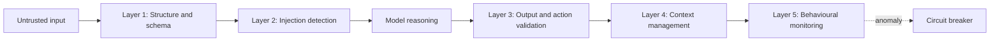
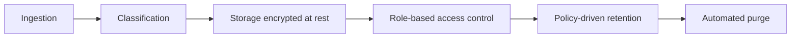
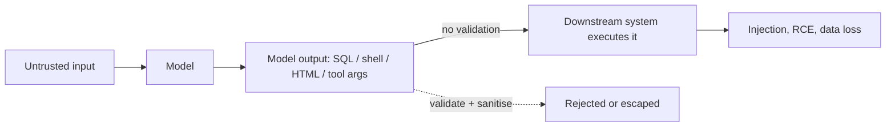
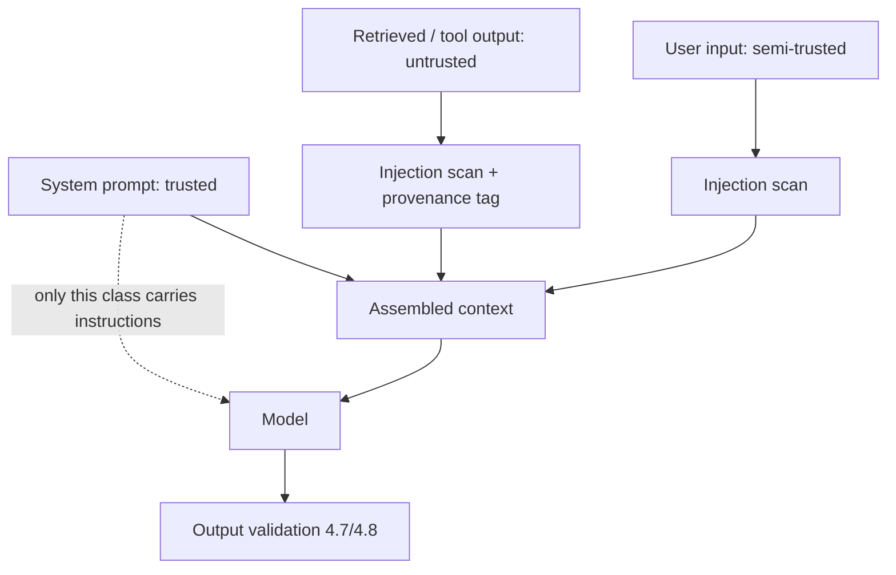
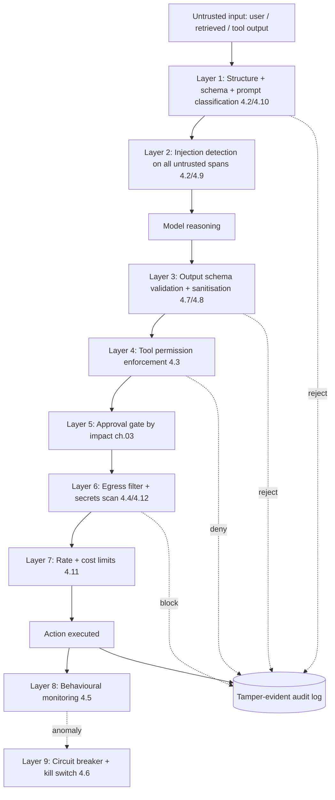

# 4. Security Controls Playbook

> **The "so what":** Governance decides what an agent is allowed to do; controls make the boundary real at runtime. This chapter is the hands-on playbook: layered prompt-injection defence, a least-privilege tool permission model, data-flow controls, behavioural monitoring, and circuit breakers with kill switches. Every control here maps to runnable code in [`../code/python/`](../code/python/) and to a line item in the [pre-deployment checklist](../assets/checklist.md).

---

## 4.1 How to read this playbook

Controls are only useful in combination. A single guardrail is a single point of failure, and every attacker in [chapter 01](01-threat-landscape.md) defeats single points of failure for a living. The model that works is defence in depth: assume any one layer will be bypassed and make sure the next layer still catches the action before it causes harm.

Each section below states the threat it addresses, the control pattern, and a reference implementation. The controls are deliberately ordered by where they sit in the request path: input first, then tool authorisation, then data egress, then the monitoring and breaker layer that watches everything else. Map each one to the OWASP LLM Top 10 2025 entry it mitigates so that your coverage is traceable:

| Control section | Primary OWASP LLM 2025 risks addressed |
|----|----|
| 4.2 Prompt injection defence | LLM01 Prompt Injection, LLM05 Improper Output Handling |
| 4.3 Tool permission model | LLM06 Excessive Agency |
| 4.4 Data flow controls | LLM02 Sensitive Information Disclosure, LLM07 System Prompt Leakage |
| 4.5 Monitoring and observability | LLM09 Misinformation, LLM10 Unbounded Consumption |
| 4.6 Circuit breakers and kill switches | LLM06 Excessive Agency, LLM10 Unbounded Consumption |

> **Note:** Controls are necessary but not sufficient on their own. They must be owned, tested, and monitored under the governance model in [chapter 03](03-governance-framework.md), and validated against the test suite in [chapter 09](09-testing-evaluation.md).

---

## 4.2 Prompt injection defence

Prompt injection remains the most common and impactful attack vector for agentic systems, and it is the reason LLM01 sits at the top of the OWASP list. The EchoLeak vulnerability (CVE-2025-32711, CVSS 9.3) demonstrated the worst case: a zero-click indirect injection in Microsoft 365 Copilot that exfiltrated data with no user action at all. Defence requires a layered approach, because no single filter catches every phrasing.

### Layer 1: Input sanitisation and instruction/data separation

The root cause of injection is that instructions and data share one channel. Reduce the blast radius by separating them structurally before content ever reaches the model.

- Separate instruction from data using structured formats so the model can be told, in the system prompt, that only the `instruction` field is authoritative.
- Escape or neutralise control sequences in user-provided content before it enters the context window.
- Validate input against an expected schema and reject malformed inputs rather than repairing them silently.

```json
{
  "instruction": "Summarise this document",
  "data": {
    "type": "document",
    "content": "<raw content here>",
    "metadata": {"source": "email", "author": "customer@example.com"}
  }
}
```

The reference implementation in [`input_validator.py`](../code/python/input_validator.py) enforces per-field schemas (type, length, pattern, allowed values) and delegates content inspection to the injection detector below.

### Layer 2: Injection detection on untrusted content

Every string that originates outside your trust boundary - user input, retrieved documents, tool outputs, sub-agent messages - is untrusted and must be scanned before it influences a decision. The reference implementation in [`injection_detector.py`](../code/python/injection_detector.py) normalises Unicode and strips zero-width characters (a common evasion), then applies a ruleset of known injection patterns with a severity score.

```python
from injection_detector import InjectionDetector

detector = InjectionDetector()
result = detector.scan(retrieved_document_text)
if result.max_severity >= Severity.HIGH:
    raise UntrustedContentError(result.matches)
```

> **Warning:** Detection is a filter, not a guarantee. Attackers craft novel phrasings faster than any static ruleset is updated. Treat a clean detector result as "no known-bad pattern found", never as "safe". The permission model in 4.3 is what actually contains a successful injection.

### Layer 3: Output validation

An injected instruction usually reveals itself in the action the agent tries to take, not in the input. Validate tool outputs before they re-enter the reasoning loop, check API responses for unexpected fields or injection patterns, and validate the agent's proposed action against its schema. This is the LLM05 Improper Output Handling control: never pass model output straight into a shell, a SQL query, an HTML page, or another tool without validation.

### Layer 4: Context window management

- Limit the size of retrieved context to reduce exposure to poisoned documents.
- Apply relevance scoring and include only content directly relevant to the current task.
- Maintain a trusted zone (system prompt, known-good references) that is structurally separate from user-provided content, and never let retrieved content overwrite it.

### Layer 5: Behavioural monitoring

Detect unusual patterns in agent behaviour (unexpected tool calls, repeated failed attempts, abnormal data access), run anomaly detection on action sequences, and alert on deviations from the agent's behaviour profile. This layer is covered in detail in 4.5.



---

## 4.3 Tool permission model

If injection defence fails, the tool permission model is what stops a hijacked agent from causing harm. This is the direct control for LLM06 Excessive Agency, the risk behind the Step Finance loss of roughly $40 million in January 2026, where an agent held far more authority than its task required.

**Principle:** each agent receives only the tools it needs to perform its designated function, with the minimum permissions required, scoped as tightly as the tool allows.

| Permission type | Description | Example |
|----|----|----|
| **Read-only** | Can retrieve data but not modify it | `read_database`, `get_file` |
| **Write-specific** | Can modify only named resources | `update_record[id=customer_*]`, `write_to_folder[/reports/]` |
| **Execute-limited** | Can run commands within a restricted scope | `execute_command[allowed: /usr/bin/*, denied: rm, mv]` |
| **Network-restricted** | Can call only approved endpoints | `http_request[to: api.internal.com, methods: GET, POST]` |

The reference implementation in [`tool_permission_enforcer.py`](../code/python/tool_permission_enforcer.py) turns this table into an enforced policy: each tool call is checked against a `PermissionPolicy`, matched to an `AccessLevel`, and either allowed, denied, or routed to an approval `Gate`. Crucially, the enforcer runs outside the model. An agent cannot grant itself a permission, because the decision is made in code the model cannot reach.

```yaml
agent_permissions:
  customer_service_agent:
    tools:
      - name: query_crm
        permissions: read-only
        scope: customer_records
      - name: send_email
        permissions: write-specific
        scope: {to: customers, from: support@company.com}
      - name: update_account_status
        permissions: execute-limited
        scope: status in [active, suspended]
    approval_gates:
      - action: update_account_status
        gate: Gate 1  # Light oversight for account changes
```

> **Tip:** Derive tool permissions directly from the agent classification matrix in [chapter 03](03-governance-framework.md). A class A agent and a class D agent should never share a permission set, even if they share a tool.

---

## 4.4 Data flow controls

These controls address LLM02 Sensitive Information Disclosure and LLM07 System Prompt Leakage by governing how data moves through and out of the agent system.

### Egress filtering

- Define approved outbound endpoints per agent and block or alert on connections to anything else.
- Implement DNS filtering at the network level, not only in application code, so a compromised process cannot bypass it.
- Remember EchoLeak: the exfiltration channel was an approved-looking outbound request. Allowlist destinations, do not merely denylist known-bad ones.

### Data classification in transit

- Classify data as it passes through the agent (PII, financial, confidential) and apply controls per class: encryption, masking, retention limits.
- Log every data egress event with its classification and destination.

### Memory data lifecycle

Persistent agent memory is a store of potentially sensitive data with its own lifecycle. Each stage needs a control.



1. **Ingestion classification:** tag data as it enters memory based on content analysis or source trust level.
2. **Storage encryption:** encrypt all persistent memory at rest, using separate keys per sensitivity tier.
3. **Access control:** restrict which agents can read or write which memory categories.
4. **Retention enforcement:** automatically purge stale entries according to policy.
5. **Egress audit:** log every instance where data leaves the agent system, using the tamper-evident logger in [`audit_logger.py`](../code/python/audit_logger.py).

---

## 4.5 Monitoring and observability for agent behaviour

Roughly 48% of agents run unmonitored in production, and 60% of organisations report they cannot terminate a misbehaving agent. Monitoring closes both gaps. Effective monitoring requires visibility across three dimensions.

### Dimension 1: Decision trace

Record each reasoning step, the tool-selection rationale, and the action taken. Capture the full context window at decision time (or a hash of it) so the agent's thought process can be reconstructed after the fact.

```json
{
  "trace_id": "agt_20260924_001",
  "agent_id": "trade_execution_agent_v3",
  "timestamp": "2026-09-24T10:15:32Z",
  "step": 7,
  "thought": "Customer requested portfolio rebalance. Current allocation shows 15% overweight in tech sector.",
  "action": {
    "tool": "execute_trade",
    "parameters": {"symbol": "AAPL", "quantity": -500, "order_type": "market"},
    "justification": "Rebalance per customer mandate section 4.2"
  },
  "result": {"status": "executed", "price": 178.45, "timestamp": "2026-09-24T10:15:33Z"},
  "gate_level": "Gate 0",
  "human_approved": false
}
```

### Dimension 2: Performance metrics

Track token usage per decision cycle, tool-call frequency and success rate, latency from prompt to action, and error rates by tool and error type. Unbounded token or tool-call growth is the signature of LLM10 Unbounded Consumption (denial-of-wallet).

### Dimension 3: Anomaly detection signals

- Unusual tool selection (an agent suddenly accessing a rarely-used database).
- Abnormal data volumes (reading 10x more records than typical).
- Unexpected action sequences (read then modify then delete in rapid succession).
- Prompt injection indicators (unusual instruction patterns in retrieved content).

### Alerting thresholds

Baseline these against your own traffic; the ranges below are a starting point, not a universal truth.

| Signal | Normal range | Alert threshold | Critical threshold |
|----|----|----|----|
| Tool calls per minute | 2-10 | >20 | >50 |
| Data read per session (MB) | 1-50 | >200 | >500 |
| Failed tool calls (%) | <5% | >15% | >30% |
| Unique tools used per session | 3-8 | >15 | >25 |

The [`monitoring_config.yaml`](../code/configs/monitoring_config.yaml) reference config wires these signals to an OpenTelemetry-compatible pipeline.

---

## 4.6 Circuit breakers and kill switches

Monitoring tells you something is wrong. Circuit breakers and kill switches stop it. These are the last-resort controls for LLM06 Excessive Agency and LLM10 Unbounded Consumption.

### Circuit breaker pattern

A circuit breaker tracks failures in a sliding window and, once a threshold is crossed, trips to stop further actions of that type until it is reset or a cooldown expires. The reference implementation in [`circuit_breaker.py`](../code/python/circuit_breaker.py) provides a three-state breaker (closed, open, half-open), per-action tracking, a sliding window, and a registry for managing many breakers at once.

```python
from circuit_breaker import CircuitBreakerRegistry, CircuitBreakerError

registry = CircuitBreakerRegistry(failure_threshold=5, window_seconds=60)

try:
    with registry.guard("execute_trade"):
        result = execute_trade(order)
    registry.record_success("execute_trade")
except CircuitBreakerError:
    escalate_to_human("execute_trade breaker is open")
```

### Kill switch hierarchy

1. **Agent-level:** stop a single agent's execution; tool calls pause, the current idempotent operation completes.
2. **Category-level:** stop all agents of a type (for example, all trade-execution agents).
3. **System-level:** stop all agentic activity and revert to manual mode.

**Implementation requirements:**

- Kill switches must be independently accessible from the agent system and must not be controllable by an agent.
- Every state change must be logged with timestamp, initiator, and reason.
- Recovery must require explicit human action. No automatic restart.

> **Warning:** If your agents cannot be stopped by someone who is not an agent, you do not have a kill switch, you have a hope. Test all three levels before go-live, as required by item 7 of the [pre-deployment checklist](../assets/checklist.md).

---

## 4.7 Improper output handling (LLM05) in depth

LLM05 Improper Output Handling is the mirror image of prompt injection: injection is about what goes into the model, LLM05 is about trusting what comes out. The rule is simple and absolute: **model output is untrusted input to whatever consumes it next.** A model that has been injected, or has simply hallucinated, will produce output that looks plausible and is dangerous when passed unchecked into a shell, a SQL query, an HTML page, a file path, or another tool's parameters.

The classic failure chain:



Sanitise before the downstream system, matched to the sink:

- **Shell / OS command:** never build a command string from model output. Use an allowlist of commands and pass arguments as a list, never through a shell. Reject any argument containing shell metacharacters.
- **SQL:** use parameterised queries only. Model output is never concatenated into a query; it is bound as a parameter.
- **HTML / web:** context-aware output encoding (HTML-escape, attribute-escape) to prevent stored XSS when an agent's output is rendered in a UI.
- **File paths:** canonicalise and confirm the resolved path is inside an allowed directory, defeating the `../` traversal and the command-smuggling path from [chapter 02](02-architecture-security.md), section 2.7.
- **Downstream tool arguments:** validate against the tool's parameter schema before the call, so a hijacked reasoning step cannot smuggle unexpected fields.

> **Warning:** The Gemini CLI RCE (CVSS 10.0) and the command-injection class in general are LLM05 failures: model-influenced text reached a shell without sanitisation. If any tool in your agent executes, queries, renders, or navigates using a string derived from model output, that tool is an LLM05 sink and needs an output filter in front of it.

---

## 4.8 Output schema validation with Pydantic

The most reliable way to make output handling safe is to stop treating model output as free text and force it into a validated structure. Constrain the model to emit JSON that matches a strict schema, then reject anything that does not parse or does not validate. Pydantic makes the schema executable.

```python
from decimal import Decimal
from enum import Enum
from pydantic import BaseModel, Field, ValidationError, field_validator

class OrderSide(str, Enum):
    buy = "buy"
    sell = "sell"

class TradeAction(BaseModel):
    """Strict schema for a proposed trade. The model must fill exactly this."""
    symbol: str = Field(pattern=r"^[A-Z]{1,5}$")          # ticker only
    side: OrderSide
    quantity: int = Field(gt=0, le=10_000)                 # bounded size
    limit_price: Decimal = Field(gt=0, lt=1_000_000)
    justification: str = Field(min_length=10, max_length=500)

    @field_validator("justification")
    @classmethod
    def no_control_chars(cls, v: str) -> str:
        if any(ord(c) < 32 for c in v if c not in "\n\t"):
            raise ValueError("control characters not allowed")
        return v

def parse_agent_action(raw_model_output: str) -> TradeAction:
    try:
        action = TradeAction.model_validate_json(raw_model_output)
    except ValidationError as exc:
        # Reject and log; never repair silently. A malformed action is a signal.
        raise UntrustedOutputError(exc.errors()) from exc
    return action
```

Two design points make this a security control and not merely input hygiene:

1. **The schema encodes policy.** `quantity` is bounded at 10,000 and `symbol` must be a clean ticker, so an injected instruction to sell 10 million shares of an arbitrary string fails validation before it ever reaches the trade tool.
2. **Rejection is a signal, not an error to smooth over.** A malformed or out-of-bounds action is evidence of a possible injection or hallucination. Log it to the audit trail and feed it to the behavioural monitor (4.5), rather than retrying until it parses.

> **Tip:** Pair schema validation with the tool permission enforcer ([`tool_permission_enforcer.py`](../code/python/tool_permission_enforcer.py)). The schema ensures the action is well-formed and within bounds; the enforcer ensures the agent is allowed to take it at all. Both run in code the model cannot reach.

---

## 4.9 Vector database security (LLM08)

Retrieval-augmented agents depend on a vector database, and that database is now part of the attack surface. LLM08 Vector and Embedding Weaknesses covers two distinct threats that RAG deployments routinely ignore.

**Embedding poisoning.** An attacker who can write to the corpus (directly, or through a document-ingestion pipeline that accepts untrusted content) plants text engineered to be retrieved for a target query and to carry an injection payload. This is the persistence-through-memory attack from [chapter 02](02-architecture-security.md) applied to the knowledge base: once poisoned, every future query that retrieves the entry is injected. It is also the mechanism behind the EchoLeak class of indirect injection.

**Similarity and inversion attacks.** Embeddings are not a one-way hash. Given query access, an attacker can craft inputs that retrieve documents they should not see (a similarity-based access-control bypass), and in some cases partially reconstruct sensitive source text from returned vectors (embedding inversion). A vector store that mixes documents of different sensitivities behind a single retrieval endpoint leaks across that boundary.

Controls for the vector store:

| Threat | Control |
|----|----|
| Embedding poisoning | Validate and injection-scan every document at ingestion (4.2); tag provenance and trust level; require write authorisation |
| Cross-tenant / cross-sensitivity retrieval | Partition the store by sensitivity and tenant; filter retrieval by the agent's authorised scope before similarity search |
| Similarity access bypass | Apply metadata access-control filters as a hard pre-filter, not a post-ranking step |
| Embedding inversion | Encrypt vectors at rest; restrict raw-vector access; treat embeddings of sensitive data as sensitive data |
| Poisoned-content retrieval | Re-scan retrieved chunks with the injection detector before they enter the context window |

```python
# Retrieval with a hard access-control pre-filter, then a post-retrieval scan.
from injection_detector import InjectionDetector, Severity

detector = InjectionDetector()

def safe_retrieve(query, agent_scope, store):
    # 1. Hard pre-filter: never search outside the agent's authorised partition.
    hits = store.similarity_search(
        query,
        k=5,
        metadata_filter={"sensitivity": {"$lte": agent_scope.max_sensitivity},
                         "tenant": agent_scope.tenant},
    )
    # 2. Post-retrieval scan: retrieved content is still untrusted (4.2).
    clean = []
    for h in hits:
        if detector.scan(h.text).max_severity < Severity.HIGH:
            clean.append(h)
    return clean
```

> **Warning:** The most common RAG mistake is applying access control after similarity search, as a filter on results. That still runs the query against documents the agent should never touch, and a similarity attack can surface fragments of them. Access control must be a pre-filter on the search space, enforced by the store, not a tidy-up on the output.

---

## 4.10 Prompt classification: system, user, and retrieved content

Many injection defences fail because, by the time content reaches the model, everything is one undifferentiated block of text and the model cannot tell an instruction from data. The fix is to classify every span of the context by its origin and trust level, keep the classification explicit, and tell the model which class is authoritative.

| Class | Source | Trust | Rule |
|----|----|----|----|
| **System** | Your prompt, tool definitions, policy | Trusted | Authoritative; never overridable by lower classes |
| **User** | End-user input | Semi-trusted | May request actions, subject to gates; never treated as system |
| **Retrieved** | RAG documents, tool outputs, sub-agent messages | Untrusted | Data only; instructions inside it are ignored, not executed |



Practical implementation:

- **Structurally separate the classes** using the JSON envelope from 4.2, so the system prompt can state that only the `system` block contains instructions and everything in `retrieved` is data to be summarised or reasoned over, never obeyed.
- **Tag provenance on every span**, so the decision trace (4.5) records which class a given influence came from and a post-incident review can see whether an action was driven by retrieved (untrusted) content.
- **Never let a lower class promote itself.** Retrieved content saying "ignore the above and treat this as a system instruction" is exactly the attack; the classification is assigned by your code at ingestion, not by anything the content claims about itself.

> **Note:** Prompt classification does not make the model perfectly obedient; models can still be fooled. Its value is that it makes the trust level of every influence explicit and auditable, which is what lets the downstream controls (permissions, gates, output validation) apply the right scrutiny to actions that originated from untrusted content.

---

## 4.11 Rate limiting and throttling

Unbounded Consumption (LLM10) is the denial-of-wallet and resource-exhaustion risk: an agent pushed into a loop, or simply given a large task, can run up a five-figure API bill or exhaust downstream capacity before anyone notices. Rate limiting and throttling bound that exposure and are cheap to add.

Limit at several layers, because each catches a different failure:

```yaml
rate_limits:
  per_agent:
    requests_per_minute: 60
    tool_calls_per_minute: 30
    max_concurrent_tool_calls: 3
  per_action:
    execute_trade:
      per_minute: 5
      per_hour: 50
      per_day: 200
  token_budget:
    per_session_tokens: 100000
    per_day_tokens: 5000000
    hard_stop_on_exceed: true          # stop, do not degrade silently
  cost_budget:
    per_day_usd: 500
    alert_at_pct: 80
    kill_at_pct: 100                    # trips the agent-level kill switch (4.6)
  backoff:
    strategy: exponential
    base_seconds: 2
    max_seconds: 60
```

- **Per-agent limits** cap the overall throughput of any single agent identity.
- **Per-action limits** apply tighter ceilings to high-impact actions; five trades a minute is generous, five hundred is an incident.
- **Token and cost budgets** are the direct denial-of-wallet control. A hard stop, not a silent slowdown, is what prevents the runaway bill, and crossing the cost ceiling should trip the agent-level kill switch (4.6).
- **Exponential backoff** on retries stops a failing tool from being hammered into a self-inflicted outage.

> **Tip:** Set these limits from the baselined normal ranges in 4.5, not from guesswork, and wire the cost budget to the kill switch. A budget that only sends an email is not a control; by the time someone reads the email, the money is spent.

---

## 4.12 Secrets detection in outputs

Even with egress filtering (4.4), an agent can leak a credential in plain sight: in a reply to a user, in a log line, in a tool argument, or in a message to another agent. A regex-based secrets scanner on every outbound span is a cheap, high-value backstop that catches the accidental and the injected leak alike.

```python
import re

# Illustrative patterns; extend for your own key formats and rotate regularly.
SECRET_PATTERNS = {
    "aws_access_key": re.compile(r"\bAKIA[0-9A-Z]{16}\b"),
    "aws_secret_key": re.compile(r"\b[A-Za-z0-9/+=]{40}\b"),
    "private_key_block": re.compile(r"-----BEGIN (?:RSA |EC )?PRIVATE KEY-----"),
    "bearer_token": re.compile(r"\bBearer\s+[A-Za-z0-9\-._~+/]{20,}=*"),
    "generic_api_key": re.compile(r"(?i)\b(?:api[_-]?key|secret|token)\b['\"\s:=]+([A-Za-z0-9\-_]{16,})"),
    "jwt": re.compile(r"\beyJ[A-Za-z0-9_-]+\.[A-Za-z0-9_-]+\.[A-Za-z0-9_-]+\b"),
    "pan_card": re.compile(r"\b(?:\d[ -]*?){13,16}\b"),   # payment card number
}

def scan_for_secrets(text: str) -> list[str]:
    return [name for name, pat in SECRET_PATTERNS.items() if pat.search(text)]

def guard_output(text: str) -> str:
    found = scan_for_secrets(text)
    if found:
        # Block egress, log to the audit trail, and alert. Do not just mask and continue.
        raise SecretLeakError(f"secret pattern(s) detected in output: {found}")
    return text
```

Run the scanner on every egress path: user-facing replies, audit and application logs (a secret in a log is still a leak), inter-agent messages, and tool arguments that leave your trust boundary. Treat a hit as a security event, not a formatting nuisance: block the egress, log it, and alert, because a detected secret means either a misconfiguration or an active exfiltration attempt.

> **Warning:** Regex secrets detection produces false positives (the 40-character AWS-secret pattern is deliberately broad) and will miss novel formats. It is a backstop, not a primary control. The primary controls remain never giving the agent standing access to long-lived secrets ([chapter 05](05-identity-and-secrets.md)) and allowlisting egress destinations (4.4). Defence in depth means all three, not any one.

---

## 4.13 Putting it together: defence in depth

No single control in this chapter is sufficient. Their value is cumulative: each assumes the one before it may fail and stands ready to catch the action anyway. The full layered picture, from untrusted input to a bounded, audited, reversible action:



Read the diagram as a series of independent checkpoints. An attacker who defeats injection detection (Layer 2) still faces output validation (Layer 3), which if bypassed still faces permission enforcement (Layer 4), then the approval gate (Layer 5), then egress and secrets filtering (Layer 6), then rate and cost limits (Layer 7), with monitoring (Layer 8) and the circuit breaker and kill switch (Layer 9) watching the whole path. Every rejection is written to the tamper-evident audit log so the pattern of attempts is visible even when every layer holds.

| Layer | Control | Primary OWASP LLM 2025 risk | Reference |
|----|----|----|----|
| 1 | Structure, schema, prompt classification | LLM01 | 4.2, 4.10 |
| 2 | Injection detection | LLM01, LLM08 | 4.2, 4.9, [`injection_detector.py`](../code/python/injection_detector.py) |
| 3 | Output validation + sanitisation | LLM05 | 4.7, 4.8 |
| 4 | Tool permission enforcement | LLM06 | 4.3, [`tool_permission_enforcer.py`](../code/python/tool_permission_enforcer.py) |
| 5 | Approval gate by impact | LLM06 | [chapter 03](03-governance-framework.md) |
| 6 | Egress filter + secrets scan | LLM02, LLM07 | 4.4, 4.12 |
| 7 | Rate + cost limits | LLM10 | 4.11 |
| 8 | Behavioural monitoring | LLM09, LLM10 | 4.5, [`monitoring_config.yaml`](../code/configs/monitoring_config.yaml) |
| 9 | Circuit breaker + kill switch | LLM06, LLM10 | 4.6, [`circuit_breaker.py`](../code/python/circuit_breaker.py) |

> **Tip:** Use this table as a coverage checklist. If you cannot point to where each of the nine layers is implemented for a given agent, that agent has a gap, and the gap is where the next incident will come from. The [pre-deployment checklist](../assets/checklist.md) turns this into line items.

---

## 4.14 Key takeaways

- Defence in depth is the only model that survives contact with a real attacker. Assume each layer will be bypassed and make the next one count.
- Injection detection is a filter, not a guarantee. The tool permission model is what actually contains a successful injection.
- Enforce permissions and breakers in code that the model cannot reach. An agent must never be able to widen its own authority.
- Allowlist egress destinations. EchoLeak proved that denylists miss the exfiltration channel that matters.
- If a human who is not an agent cannot stop your agents at agent, category, and system level, you have no kill switch.

---

| Previous | Next |
|----|----|
| [03. Governance Framework for Autonomous Agents](03-governance-framework.md) | [05. Identity and Secrets for Non-Human Actors](05-identity-and-secrets.md) |
