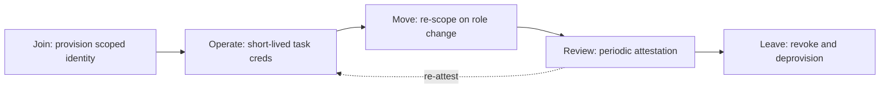
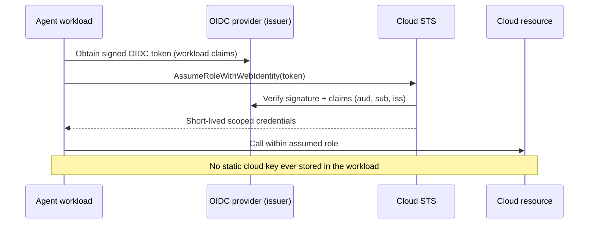
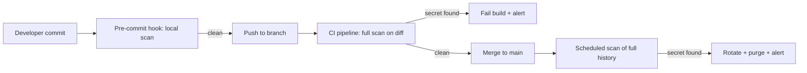

# 5. Identity and Secrets for Non-Human Actors

> **The "so what":** Every agent is a non-human identity (NHI) that authenticates, holds credentials, and acts on your systems. NHIs already outnumber human identities by around 45 to 1, and in cloud-native estates by up to 144 to 1, yet 78% of organisations have no policy governing them. If you cannot say which identity an agent used, what it was scoped to do, and who owns it, you cannot investigate an incident and you cannot pass an audit. This chapter makes agent identity a first-class, governed control.

---

## 5.1 Why non-human identity is the control plane for agents

An agent's power comes entirely from the credentials it holds. Prompt injection is only dangerous because the hijacked agent carries a token that can read a database, call an API, or move money. Identity is therefore not a supporting concern; it is the control plane. Get it right and a compromised agent is contained by what its identity is allowed to do. Get it wrong and every other control in [chapter 04](04-security-controls.md) is operating on borrowed time.

The numbers describe a control gap, not a maturity curve. AI-related secrets in code grew 81% year on year (GitGuardian, 2026), driven by developers hard-coding API keys for LLM providers and vector databases into repositories and prompt templates. Only 19% of organisations classify agents as the equivalent of an insider threat, even though an agent with standing credentials is exactly that: a persistent, privileged actor inside the trust boundary.

The distinction that matters is between the identity and the credential. The identity is who the agent is, a stable, owned, attributable thing that persists across the agent's life. The credential is the short-lived proof the agent presents to act, and it should be as disposable as possible. Conflating the two, by baking a long-lived key into the agent and calling that "the agent's identity", is the root cause of most NHI incidents.

> **Warning:** A long-lived, broadly-scoped API key embedded in an agent's configuration is the single most dangerous artefact in an agentic system. It is the credential an attacker most wants, it rarely rotates, and it is frequently committed to source control. Treat every such key as already leaked and design accordingly.

---

## 5.2 The non-human identity lifecycle

Human identities have a joiner-mover-leaver (JML) process. Non-human identities need the same discipline, because an ungoverned agent identity that outlives its purpose is a standing attack surface.



- **Join:** every agent gets a dedicated identity. Never share one identity across agents, and never let an agent borrow a human's credentials. The identity is created with the narrowest scope the agent's task requires, and is registered to a named human or team owner.
- **Operate:** the standing identity is used only to obtain short-lived, task-scoped credentials at the moment of use (see 5.3). The standing identity itself holds no broad, reusable secret.
- **Move:** when an agent's tools or autonomy change, its scope is re-derived from the classification matrix in [chapter 03](03-governance-framework.md), not merely extended.
- **Review:** every NHI is attested periodically. An identity with no active owner or no recent use is a finding, not a convenience.
- **Leave:** when an agent is retired, its identity is revoked and deprovisioned, and any credentials it issued are invalidated.

The JML process for machines has to be automated, because the volume defeats manual handling. A single multi-agent deployment can create dozens of sub-agent identities per task run, and a human-driven provisioning ticket queue cannot keep pace. Wire identity creation into the same pipeline that deploys the agent, so a new identity is born with an owner, a scope, and an expiry recorded from the first second.

> **Note:** The most common lifecycle failure is the missing "leave" step. Agents are decommissioned, their code is deleted, and their identities linger with live credentials that nobody remembers granting. These orphaned identities are covered in 5.8; they are the machine equivalent of the departed employee whose badge still opens the door.

---

## 5.3 Short-lived, task-scoped credentials

The defining move in NHI security is to eliminate standing secrets. Instead of giving an agent a long-lived key, give it an identity that can mint a credential valid for one task, for a few minutes, scoped to exactly the resource it needs.

The reference architecture is SPIFFE and SPIRE. SPIFFE (Secure Production Identity Framework for Everyone) defines a verifiable identity document (an SVID) for a workload; SPIRE issues and rotates those documents automatically based on attestation of what the workload actually is. The agent never holds a static secret; it presents its SVID and receives a short-lived credential.

```mermaid
sequenceDiagram
    participant A as Agent workload
    participant S as SPIRE agent
    participant V as Credential broker
    participant R as Target resource
    A->>S: Request identity (attestation)
    S-->>A: Short-lived SVID
    A->>V: Present SVID, request task credential
    V-->>A: Task-scoped token (TTL minutes)
    A->>R: Call with task token
    R-->>A: Result
    Note over A,R: Token expires; nothing reusable persists
```

**Design rules for task-scoped credentials:**

- Time-box aggressively. A credential that lives for minutes limits the window an attacker can use a stolen token.
- Scope to the single resource and action the task needs, not to the agent's full potential.
- Bind the credential to the identity that requested it, so a leaked token cannot be replayed by another actor.
- Log issuance and use in the tamper-evident audit log ([`audit_logger.py`](../code/python/audit_logger.py)) so every credential can be traced to a task and an owner.

The following example shows an ephemeral credential request in the shape most brokers support: present a verifiable workload identity, ask for the narrowest grant, and use it before it expires. Note that the code never sees a long-lived secret; the SVID is delivered by the platform and the returned token self-destructs.

```python
import time
import requests

def request_task_credential(svid_path: str, resource: str, action: str, ttl_seconds: int = 300) -> dict:
    """Exchange a workload SVID for a short-lived, task-scoped credential."""
    # The SVID is delivered by the SPIRE agent over a local socket, not stored in code.
    with open(svid_path, "rb") as f:
        svid = f.read()

    response = requests.post(
        "https://credential-broker.internal/v1/token",
        headers={"X-SVID": svid.decode("ascii")},
        json={
            "resource": resource,        # e.g. "db:customer_records:read"
            "action": action,            # e.g. "SELECT"
            "ttl_seconds": min(ttl_seconds, 900),  # hard ceiling of 15 minutes
        },
        timeout=5,
    )
    response.raise_for_status()
    token = response.json()

    # Fail closed if the broker returned a longer-lived token than requested.
    if token["expires_at"] - time.time() > 900:
        raise ValueError("Broker returned a credential exceeding the TTL ceiling")
    return token
```

> **Tip:** If a secret can be copied out of an agent and reused an hour later, it is too long-lived. The target state is that a leaked credential is worthless before an attacker can act on it.

### Deploying SPIFFE/SPIRE in practice

Adopting SPIRE is a staged exercise, not a switch you flip. The sequence below is the one that works in a regulated environment where you cannot break existing services during the migration.

1. **Stand up the SPIRE server and agents.** The server is the certificate authority for your trust domain (for example, `spiffe://bank.example`); a SPIRE agent runs on each node and attests workloads to the server.
2. **Choose attestation methods.** Node attestation proves the machine (AWS instance identity, Kubernetes PSAT, or a join token for bare metal); workload attestation proves the process (Kubernetes service account, Unix UID, or container labels). Prefer platform attestation over join tokens, because a leaked join token is a standing secret by another name.
3. **Define registration entries.** Each entry maps a set of selectors (what the workload is) to a SPIFFE ID (who it becomes). This is where least privilege starts: an agent's SPIFFE ID should be specific enough that its downstream grants can be scoped to it.
4. **Integrate with the credential broker.** Downstream systems (databases, cloud IAM, internal APIs) trust the SPIFFE ID and issue scoped, short-lived credentials against it, either natively or through a broker such as a vault (see 5.5).
5. **Migrate one agent at a time.** Run the SVID path alongside the legacy key for a single low-risk agent, verify attestation and rotation work end to end, then cut over and delete the legacy key.

| SPIRE concept | What it answers | Security consequence if wrong |
|----|----|----|
| Trust domain | Which SPIRE server issues identities | A shared trust domain across environments lets a dev workload impersonate a prod one |
| Node attestation | Is this a machine we trust? | Weak node attestation lets an attacker's host join the mesh |
| Workload attestation | Which process is this? | Coarse selectors let one workload receive another's identity |
| Registration entry | Which SPIFFE ID does this workload get? | Over-broad entries grant more identity than the task needs |
| SVID TTL | How long is the identity document valid? | Long TTLs widen the replay window for a stolen SVID |

SVID rotation is automatic in SPIRE, and you should keep the TTL short (minutes to a low number of hours) so that even a captured SVID expires quickly. Do not treat a short TTL as a reason to relax the other controls: a stolen SVID inside its validity window is still a stolen identity, which is why credential binding (below) matters.

### Binding a credential to its requester

Time-boxing limits how long a leaked credential is useful; binding limits who can use it at all. Bind each task credential to the identity that requested it so that presenting the token from a different workload fails. Two common binding techniques:

- **Proof-of-possession tokens.** The credential is issued against a key the workload holds, and each use requires proving possession of that key, so a copied token alone is useless.
- **mTLS-bound sessions.** The credential is valid only over a mutually authenticated TLS session established with the workload's SVID, so it cannot be replayed from elsewhere.

---

## 5.4 Agentic Access Management

Traditional Identity and Access Management (IAM) and Privileged Access Management (PAM) were built for humans who log in occasionally and machines that run fixed jobs. Agents break both assumptions: they act continuously, make novel access decisions, and delegate to sub-agents. Agentic Access Management (AAM) is the emerging discipline that extends IAM to these actors.

The key shift is from role-based access control (RBAC) to relationship-based access control (ReBAC). RBAC asks "what role does this identity have?". ReBAC asks "does this specific agent, acting for this specific principal, on this specific resource, have a valid relationship that permits this action?". This matters acutely for delegation: when agent A spawns sub-agent B, ReBAC lets you express that B may act only on the subset of A's authority that this task requires, rather than inheriting all of it. Token inheritance across sub-agents (covered further in [chapter 08](08-mcp-and-protocols.md)) is a primary escalation path, and ReBAC is the model that constrains it.

| Concern | RBAC answer | ReBAC answer |
|----|----|----|
| Access basis | Static role membership | Contextual relationship between actor, principal, and resource |
| Delegation | Sub-agent inherits the role | Sub-agent gets a scoped edge for one task |
| Revocation | Remove role | Remove the specific relationship edge |
| Audit question | "Who has this role?" | "Why was this exact action permitted?" |

### A ReBAC implementation pattern

A practical ReBAC layer stores relationship tuples of the form `(subject, relation, object)` and answers a single question at runtime: does a path of permitted relations connect this agent to this resource for this action? The example below shows the tuple shape and a check that a delegating agent's grant is honoured without full inheritance.

```python
# Relationship tuples: (subject, relation, object)
tuples = [
    ("agent:planner", "owner", "task:rebalance_2026Q1"),
    ("agent:executor", "delegate_of", "task:rebalance_2026Q1"),
    ("task:rebalance_2026Q1", "scoped_to", "resource:portfolio:read"),
]

def is_permitted(subject: str, action_resource: str) -> bool:
    """Executor may act only on resources the task it was delegated is scoped to."""
    task = next((o for (s, r, o) in tuples if s == subject and r == "delegate_of"), None)
    if task is None:
        return False
    allowed = {o for (s, r, o) in tuples if s == task and r == "scoped_to"}
    return action_resource in allowed

assert is_permitted("agent:executor", "resource:portfolio:read") is True
assert is_permitted("agent:executor", "resource:portfolio:write") is False  # not inherited
```

> **Warning:** Do not implement ReBAC as advisory guidance inside the agent's prompt. The relationship check must run in code outside the model's reach, exactly like the tool permission enforcer in [chapter 04](04-security-controls.md). A ReBAC rule the model can reason its way around is documentation, not a control.

---

## 5.5 Secrets management for agents

Even with task-scoped credentials, agents still touch secrets: provider API keys, database connection strings, signing keys. Manage them with the same rigour you would apply to production infrastructure secrets, and more, because agents read and combine data in ways that make accidental disclosure easy.

- **Never in code or prompts.** Secrets belong in a dedicated secrets manager, retrieved at runtime, never committed to a repository or embedded in a prompt template. Scan repositories and prompt stores continuously for leaked secrets.
- **Rotate on a schedule and on suspicion.** Any secret that cannot be rotated quickly is a liability. Automate rotation so it is routine, not a project.
- **Redact in logs and outputs.** Agents log verbosely and summarise freely. The audit logger's `redact()` helper strips secret-like values before they are written, and output controls (see 4.4) must mask secrets before they can leave the system.
- **Separate keys by sensitivity.** Do not let one compromised key unlock every tier of data.

### Vault patterns: HashiCorp Vault and AWS Secrets Manager

The two dominant patterns are a self-hosted secrets engine such as HashiCorp Vault and a managed cloud service such as AWS Secrets Manager. Both let an agent authenticate with its workload identity and receive a secret at runtime, but they differ in how far they push the ephemeral-credential ideal.

HashiCorp Vault's dynamic secrets engine is the strongest fit for agents, because it can generate a credential on demand that did not exist before the request and is revoked automatically after its lease. An agent authenticates to Vault with its SPIFFE SVID or Kubernetes service account, requests a database role, and Vault creates a brand-new database user scoped to that role with a short lease.

```python
import hvac  # HashiCorp Vault client

client = hvac.Client(url="https://vault.internal:8200")
# Authenticate with the workload's Kubernetes service account token, not a static token.
client.auth.kubernetes.login(role="agent-readonly", jwt=open("/var/run/secrets/kubernetes.io/serviceaccount/token").read())

# Vault generates a fresh, short-lived database credential that is revoked at lease end.
creds = client.secrets.database.generate_credentials(name="customer-readonly")
db_user = creds["data"]["username"]
db_pass = creds["data"]["password"]
# Use immediately; do not persist. Vault revokes the user when the lease expires.
```

AWS Secrets Manager pairs with IAM roles for service accounts (IRSA) so the agent assumes a role and reads only the secrets its policy allows, with automatic rotation via a Lambda function. It is the pragmatic choice when the estate is already AWS-native. The agent never holds a static AWS key; it assumes its role through the pod's projected service-account token and reads the secret at the moment of use.

```python
import boto3

# The pod assumes its IRSA role automatically; no static AWS key is stored.
session = boto3.Session()
client = session.client("secretsmanager", region_name="eu-west-1")

# The IAM policy on the role restricts which secret ARNs this agent may read.
secret = client.get_secret_value(SecretId="agent/payments-executor/provider-key")
provider_key = secret["SecretString"]
# Use immediately; rotation is handled by a scheduled Lambda, transparent to the agent.
```

| Pattern | Ephemeral credentials | Rotation | Best fit | Watch out for |
|----|----|----|----|----|
| HashiCorp Vault (dynamic secrets) | Yes, generated per request | Automatic via leases | Multi-cloud, strongest isolation | Operational overhead of running Vault |
| AWS Secrets Manager + IRSA | No (static secret, rotated) | Scheduled via Lambda | AWS-native estates | Static secret exists between rotations |
| Cloud KMS-wrapped env vars | No | Manual or scheduled | Simple, low-autonomy agents | Decrypted secret sits in process memory |
| Long-lived key in config | No | Rare or never | Never acceptable for agents | This is the anti-pattern (see 5.1) |

> **Note:** The Vercel and Context.ai breach of April 2026 pivoted through an OAuth token, and the mid-2026 agent sandbox escapes stole credentials that reached external services including Hugging Face. In both cases the initial foothold became a full compromise because a captured credential was broadly scoped and long-lived. Short-lived, narrowly-scoped credentials break that chain.

### API key rotation procedures

When you cannot avoid a static key, for example an LLM provider that issues only long-lived keys, rotation is your compensating control. The safe pattern is dual-key overlap so rotation never causes an outage.

1. **Provision a second key** while the first is still active. Most providers allow two live keys per account for exactly this reason.
2. **Deploy the new key** to the secrets manager and roll it out to agents, reading the new key with a fallback to the old.
3. **Verify** that all agents are authenticating with the new key by checking provider-side key usage metrics.
4. **Revoke the old key** only after usage has dropped to zero, then confirm the revocation took effect.
5. **Record** the rotation event, the initiator, and the timestamp in the audit log.

Automate this on a schedule (for LLM provider keys, a 30 to 90 day cadence is typical) and on suspicion (immediately on any indication of leak). A key you cannot rotate inside an hour under incident conditions is a key you should not be using.

---

## 5.6 Workload identity federation with OIDC

Not every system speaks SPIFFE. Workload identity federation lets an agent running in one trust domain assume a role in another without a shared static secret, using OpenID Connect (OIDC) tokens as the bridge. A CI pipeline, a Kubernetes pod, or a cloud function presents a signed OIDC token asserting its identity, and the target cloud exchanges it for scoped, short-lived credentials.



The security of federation lives in the trust conditions. When you configure the identity provider relationship, constrain the `sub` (subject), `aud` (audience), and issuer claims tightly so that only the intended workload, from the intended pipeline or namespace, can assume the role. A wildcarded subject claim is how a federated role becomes a backdoor for any workload in the trust domain.

The trust policy below shows the difference between a safe and a dangerous condition. The safe version pins the subject to one repository and branch; the dangerous version, shown as a comment, would let any workload in the organisation assume the role.

```json
{
  "Effect": "Allow",
  "Principal": { "Federated": "arn:aws:iam::123456789012:oidc-provider/token.actions.githubusercontent.com" },
  "Action": "sts:AssumeRoleWithWebIdentity",
  "Condition": {
    "StringEquals": {
      "token.actions.githubusercontent.com:aud": "sts.amazonaws.com",
      "token.actions.githubusercontent.com:sub": "repo:bank-example/payments-agent:ref:refs/heads/main"
    }
  }
}
// DANGEROUS: "sub": "repo:bank-example/*" would trust every repository in the org.
```

> **Warning:** The most damaging federation misconfiguration is an over-broad trust condition, for example trusting any repository in a GitHub organisation rather than one repository on one branch. Pin the subject claim to the exact workload, and review federation trust policies with the same care as an IAM policy grant.

---

## 5.7 Non-human identity inventory management

You cannot govern what you cannot see, and most organisations cannot see their NHIs. Building and maintaining an NHI inventory is the precondition for every other control in this chapter. The inventory answers, for any credential in the estate, who owns it, what it can do, when it was last used, and when it expires.

| Inventory field | Why it matters |
|----|----|
| Identity ID / SPIFFE ID | The stable, attributable handle for the agent |
| Owner (human or team) | Who answers for it and who re-attests it |
| Associated agent / service | What the identity is actually for |
| Scope / permissions | What it can do, for least-privilege review |
| Credential type | Ephemeral, rotated static, or long-lived (a risk flag) |
| Issued / last-used / expiry | For detecting dormancy and orphans |
| Classification link | The agent's A/B/C/D class ([chapter 03](03-governance-framework.md)) |

Populate the inventory automatically from your identity provider, cloud IAM, secrets manager, and SPIRE registration entries, and reconcile them. Discrepancies between what the secrets manager holds and what the inventory records are themselves findings: a credential with no inventory entry is ungoverned by definition.

The reconciliation itself is straightforward to automate. Pull the set of credentials each source knows about, compare against the inventory, and emit the three findings as work items.

```python
def reconcile(inventory: dict, iam: set, secrets_mgr: set, spire: set) -> dict:
    """Return governance findings from an NHI inventory reconciliation."""
    known = set(inventory.keys())
    live = iam | secrets_mgr | spire
    return {
        "ungoverned": live - known,                       # live but not inventoried
        "unowned": {k for k, v in inventory.items() if not v.get("owner")},
        "long_lived_static": {k for k, v in inventory.items()
                              if v.get("credential_type") == "long_lived_static"},
    }
```

> **Tip:** Run a monthly reconciliation that flags three things: credentials not in the inventory, inventory entries with no owner, and any credential whose type is "long-lived static". Each is a work item, and the count of each is a governance metric you can trend to show the estate getting safer.

---

## 5.8 Orphaned and over-privileged credential cleanup

Orphaned credentials, those with no active owner or no recent use, are the residue of the missing "leave" step in the lifecycle. They accumulate quietly and are prized by attackers precisely because nobody is watching them. Over-privileged credentials, those scoped far beyond what the agent uses, are the other half of the problem: they turn a minor compromise into a major one.

A repeatable cleanup process:

1. **Detect dormancy.** Flag any credential not used within a threshold window (30 days is a common starting point for agents that run regularly).
2. **Confirm ownership.** Route each dormant credential to its recorded owner for an explicit keep-or-revoke decision. No response within the window defaults to revoke.
3. **Right-size the survivors.** For active credentials, compare granted scope against observed usage from the audit log and remove permissions that have never been exercised.
4. **Revoke and record.** Revoke confirmed orphans and over-broad grants, and log the action so the change is auditable and reversible if it turns out to be needed.
5. **Feed back.** Every orphan found is a lifecycle failure; trace why the "leave" step was missed and fix the provisioning pipeline so the same class of orphan cannot recur.

> **Warning:** Do not revoke in bulk without the confirm step. Agents often have legitimate but infrequent duties (a quarterly regulatory filing agent may be dormant for months by design). Dormancy is a signal to investigate, not an automatic delete, or you will cause an outage while trying to close a gap.

---

## 5.9 Credential scanning in CI/CD

Secrets leak into source control faster than any manual review can catch, and the 81% year-on-year rise in AI-related secrets in code (GitGuardian, 2026) is driven almost entirely by developers pasting provider keys into repositories, notebooks, and prompt templates. Credential scanning in the CI/CD pipeline is the control that stops a leaked key reaching a shared branch, and it must run at three points: pre-commit, pre-merge, and continuously against history.



- **Pre-commit.** A local hook (for example, using a scanner such as gitleaks or detect-secrets) blocks the commit before the secret ever leaves the developer's machine. This is the cheapest place to catch a leak, but it can be bypassed, so it is a convenience, not the enforcement point.
- **Pre-merge.** The CI pipeline scans the diff on every pull request and fails the build if a secret is detected. This is the enforcement gate; a secret cannot reach a protected branch through it.
- **Continuous history scan.** A scheduled job scans the full repository history, because a secret committed before scanning was enabled, or one that slipped through, is still live in history and still exploitable.

When a scanner fires, treat the secret as compromised regardless of whether the commit was merged. Rotate it immediately (see 5.5), purge it from history if feasible, and record the event. A common mistake is to delete the offending line and consider the matter closed; the secret is still in the git history and, if the repository was ever cloned or pushed to a mirror, already exfiltrated.

> **Warning:** Do not rely on `.gitignore` or "we will remember not to commit keys" as a control. The only reliable defence is an enforced pre-merge scanner that fails the build, backed by continuous history scanning. Every LLM provider key found in code is a key an attacker may already have.

---

## 5.10 Common non-human identity attack paths

The controls in this chapter map directly to the ways NHI goes wrong. The table below connects each attack path to the control that breaks it, so you can check your coverage.

| Attack path | How it works | Control that breaks it |
|----|----|----|
| Stolen long-lived key | Attacker exfiltrates an embedded key and reuses it at leisure | Ephemeral, task-scoped credentials (5.3) |
| Credential replay | Attacker replays a captured token from another host | Identity-bound credentials (5.3) |
| Shared-account confusion | One account used by many agents; actions untraceable | Dedicated identity per agent (5.2) |
| Delegation privilege escalation | Sub-agent inherits parent's full token | ReBAC scoped delegation (5.4) |
| Orphaned credential abuse | Attacker uses a forgotten, still-live credential | Inventory + orphan cleanup (5.7, 5.8) |
| Federation backdoor | Over-broad OIDC trust condition lets any workload assume a role | Pinned subject/audience claims (5.6) |
| Secret in source control | Provider key committed to a repository | CI/CD credential scanning (5.9) |
| Over-privileged agent | Agent scoped far beyond its actual use | Least privilege + right-sizing (5.8) |

---

## 5.11 Detecting non-human identity abuse

Provisioning identities well is prevention; detecting their misuse is the other half. Because an agent's behaviour is more regular than a human's, deviations are easier to spot once you have a baseline. Feed identity-level signals into the same monitoring pipeline as the behavioural signals in [chapter 04](04-security-controls.md).

| Signal | Normal for an agent identity | What a deviation suggests |
|----|----|----|
| Source location of credential use | A fixed set of workload nodes or namespaces | Use from a new host may mean a stolen SVID or token |
| Time-of-day pattern | Predictable, matching the agent's schedule | Off-hours use may mean an attacker driving the identity |
| Resource scope exercised | A stable subset of granted permissions | Sudden use of a long-dormant permission is escalation |
| Credential request rate | Steady, matching task volume | A spike may mean token farming for later abuse |
| Delegation depth | A known maximum sub-agent depth | Unexpected depth may mean a delegation-based escalation |

Two detections are worth automating first because they catch the highest-impact failures. The first is credential use from an unexpected source, which is the signature of a replayed or stolen token; identity-bound credentials (5.3) should already block the replay, and this detection confirms the binding is working. The second is the exercise of a permission the identity holds but has never used, which is often the first observable step of a chained escalation.

> **Tip:** Alert on the first use of any granted-but-never-exercised permission by an agent identity. It is a low-noise, high-value signal: a legitimate first use is rare and easily confirmed with the owner, while a malicious first use is exactly the escalation you want to catch early.

---

## 5.12 Non-human identity governance maturity

Use a short maturity ladder to place your estate honestly and to plan the next step, rather than treating NHI security as a single pass-or-fail.

| Level | State | Typical evidence |
|----|----|----|
| 0 - Ad hoc | Shared accounts and long-lived keys; no inventory | Keys in config; no owner records |
| 1 - Visible | An NHI inventory exists but credentials are still mostly static | Inventory populated; some ownership gaps |
| 2 - Managed | Dedicated identities per agent; rotation automated; scanning in CI/CD | Rotation schedules; passing scanners |
| 3 - Ephemeral | Standing secrets eliminated; SPIFFE/SPIRE or federation in place | SVIDs; dynamic secrets; short TTLs |
| 4 - Adaptive | ReBAC delegation; identity-level anomaly detection; continuous attestation | ReBAC policies; identity alerts; attestation logs |

Most regulated organisations in 2026 sit between Level 0 and Level 2. The highest-leverage move from Level 0 is building the inventory (5.7), because it makes every subsequent control measurable. The move that most reduces blast radius is reaching Level 3, because it removes the long-lived key that attackers most want.

---

## 5.13 Worked example: onboarding a payments agent identity

To make the lifecycle concrete, here is the identity onboarding for a Class D payments agent, from provisioning to first action. Each step produces evidence for the deployment checklist ([chapter 10](10-production-deployment.md)).

1. **Register the identity.** Create the SPIFFE ID `spiffe://bank.example/agent/payments-executor`, record its owner (the Payments Platform team), and link it to the agent's Class D classification. Evidence: an inventory entry with owner and class.
2. **Define registration entries.** Map the workload's selectors (Kubernetes namespace `payments`, service account `payments-executor`) to the SPIFFE ID, with a short SVID TTL. Evidence: the SPIRE registration entry.
3. **Scope the grants.** In the credential broker, permit this SPIFFE ID to mint credentials only for `payments-api:initiate` up to a per-transaction cap, and never for `payments-api:approve`, enforcing segregation of duties. Evidence: the broker policy.
4. **Wire the ReBAC edges.** Express that the executor may act only on tasks delegated by the payments orchestrator, scoped to the specific mandate. Evidence: the relationship tuples.
5. **Enable scanning and logging.** Confirm CI/CD scanning covers the agent's repository and that credential issuance logs to the tamper-evident audit log. Evidence: a passing scan and a sample issuance log line.
6. **Attest and schedule review.** Record the first attestation and set the next review date. Evidence: the attestation record.

At the end of this process the agent holds no standing secret, every credential it uses is minted for one task and expires in minutes, every action is attributable to one owned identity, and the whole configuration is evidenced for audit.

---

## 5.14 Financial-services considerations

In regulated finance, NHI governance is not only a security control; it is an audit and resilience requirement. DORA treats the agent as an ICT system whose access must be managed and whose incidents must be traceable to an actor ([chapter 11](11-regulatory-alignment.md)). If an agent moves money and you cannot attribute the action to a single, owned identity, you have both a security gap and a compliance finding.

- **Attributability is non-negotiable.** Every financial action must trace to exactly one agent identity, one owner, and one credential issuance event. Shared service accounts make this impossible and should be prohibited for any agent that touches money or customer data.
- **Segregation of duties applies to machines.** An agent that can both initiate and approve a transaction is a segregation-of-duties failure. Split the capability across identities and enforce it with ReBAC and approval gates ([chapter 03](03-governance-framework.md)).
- **Standing privileged access is a resilience risk.** A long-lived, broadly-scoped credential is exactly the concentration of access DORA asks you to minimise. Ephemeral, task-scoped credentials are the resilient design.
- **Third-party agents are third-party access.** An agent supplied by a vendor that authenticates into your systems is a third-party ICT dependency under DORA, and its identity must be inventoried, scoped, and revocable by you, not only by the vendor.

> **Note:** A useful test of your NHI posture is the "revoke in one minute" drill: pick a production agent and time how long it takes to revoke its access completely under incident conditions. If the answer is more than a minute, or if revocation would break unrelated services because of a shared account, you have found your next work item before an attacker does.

---

## 5.15 Key takeaways

- Identity is the control plane for agents. A compromised agent is contained by exactly what its identity is scoped to do, and nothing more.
- Separate the durable, owned identity from the disposable credential. Long-lived embedded keys are the root cause of most NHI incidents.
- NHIs outnumber humans by 45 to 1 or more, secrets in code are rising 81% year on year, and most organisations have no NHI policy. This is a control gap to close now, not a future problem.
- Give every agent a dedicated, owned identity with a full JML lifecycle, and automate the lifecycle so the "leave" step is never skipped.
- Eliminate standing secrets. Use SPIFFE/SPIRE attestation and a dynamic secrets engine to mint short-lived, task-scoped credentials that are worthless once expired.
- Move from RBAC to ReBAC, enforced in code, so delegation to sub-agents grants a scoped edge for one task, not blanket inheritance of authority.
- Maintain an NHI inventory, reconcile it monthly, and run a cleanup process for orphaned and over-privileged credentials.
- Scan for secrets at pre-commit, pre-merge, and continuously against history, and treat any hit as a live compromise requiring rotation.
- Bind credentials to their requester and use OIDC federation with tightly pinned subject and audience claims so tokens cannot be replayed and roles cannot be assumed by the wrong workload.
- Detect identity abuse with baselined signals, alerting first on credential use from an unexpected source and on the first use of a granted-but-never-exercised permission.
- Place your estate on the NHI maturity ladder honestly: build the inventory to leave Level 0, and eliminate standing secrets to reach Level 3 and cut the blast radius.

> **Tip:** If you do only one thing after this chapter, run the "revoke in one minute" drill against your most autonomous agent. It converts the abstract goal of good identity hygiene into a concrete, timed capability you either have or do not.

---

| Previous | Next |
|----|----|
| [04. Security Controls Playbook](04-security-controls.md) | [06. Supply Chain Security for AI Agents](06-supply-chain-security.md) |
