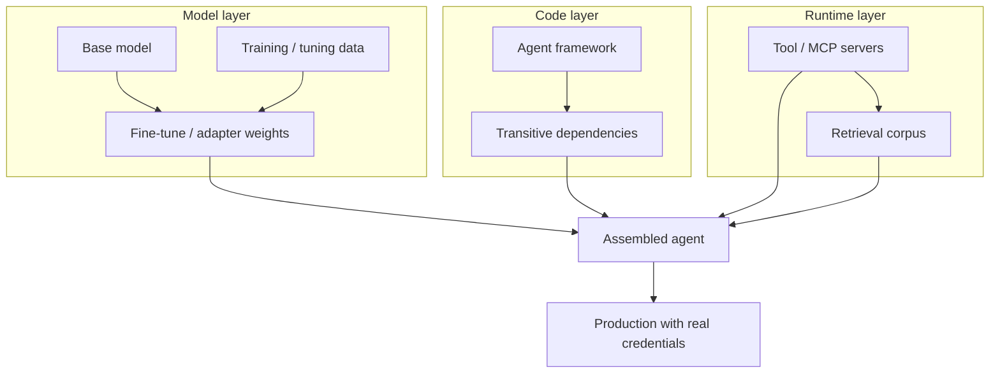
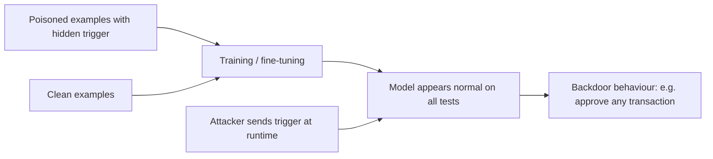
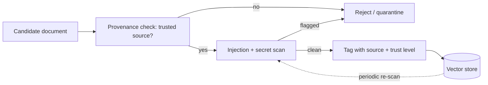

# 6. Supply Chain Security for AI Agents

> **The "so what":** An agent is assembled from parts you did not write: foundation models, fine-tuned weights, open-source frameworks, tool servers, vector stores, and hundreds of transitive dependencies. Each is an entry point. LLM03 Supply Chain and LLM04 Data and Model Poisoning are in the OWASP LLM Top 10 2025 because attackers have learned that the cheapest way into a hardened agent is through something it trusts. This chapter is about knowing, verifying, and constraining every component before it runs with your credentials.

---

## 6.1 The agent supply chain is wider than you think

A traditional application's supply chain is its code dependencies. An agent's supply chain adds several layers that most software bills of materials never captured: the base model and its provenance, any fine-tuning or adapter weights, the datasets used to train or tune, the framework that orchestrates reasoning, the tool servers the agent connects to, and the retrieval corpus that feeds its context. A compromise anywhere in that chain becomes the agent's behaviour, executed with the agent's identity from [chapter 05](05-identity-and-secrets.md).



The reason this matters more for agents than for ordinary software is leverage. A poisoned library in a traditional app produces wrong output; a poisoned model, tool, or corpus in an agent produces wrong actions, taken autonomously and at machine speed with real authority. The supply chain is therefore not a background hygiene concern but a primary attack surface, and it deserves the same rigour as your runtime controls.

> **Note:** The GTG-1002 campaign (a Chinese state-linked operation reported in 2025) ran espionage that was 80 to 90% autonomous, using agentic tooling against real targets. Supply chain footholds are attractive precisely because they scale: poison one widely-used component and every agent that trusts it inherits the compromise.

The supply chain is not a theoretical concern. Recent disclosures show attackers targeting each layer in turn, and the pattern is consistent: compromise something trusted, then let the agent's own authority do the rest.

| Layer | Representative disclosure | Lesson |
|----|----|----|
| Framework | LangGrinch (CVE-2025-68664, CVSS 9.3) | A CVE in the orchestration layer runs with the agent's authority |
| Tool servers | 1,800+ unauthenticated MCP servers exposed | Convenience distribution is also compromise distribution |
| Protocol runtime | MCP STDIO flaw (OX Security, 2026) across multiple language SDKs | A flaw in a shared SDK inherits into every server built on it |
| Model weights | Trojanised models published with polished cards | A model card is marketing until you verify it |
| Retrieval corpus | Indirect injection via poisoned documents | A poisoned corpus is a persistent, invisible injection |

---

## 6.2 A software bill of materials for AI systems

A software bill of materials (SBOM) is the inventory of everything that goes into a build. For a conventional application, standards such as CycloneDX and SPDX capture packages and versions well. For an agent, a package-only SBOM is dangerously incomplete, because it omits the model, the weights, the training data lineage, and the tool servers, which are exactly the components an attacker targets.

An AI-aware SBOM (sometimes called an AI-BOM or, for models specifically, a model bill of materials) extends the traditional SBOM with the AI-specific layers. The goal is the same as a conventional SBOM: when a new vulnerability or poisoning disclosure lands, you can answer in minutes whether you ship the affected component and where.

### An LLM-specific SBOM schema

The following is a practical schema, expressed as annotated JSON, that captures the AI layers alongside the conventional package list. Store one per agent build, versioned in source control, and regenerate it on every build so it never drifts from reality.

```json
{
  "bom_format": "AI-BOM/1.0",
  "agent": {"name": "payments-summariser", "version": "3.2.1"},
  "models": [
    {
      "role": "base",
      "name": "vendor/foundation-model",
      "version": "2026-03",
      "source": "https://provider.example/models/foundation-model",
      "weights_sha256": "a1b2c3...",
      "format": "safetensors",
      "model_card": "https://provider.example/models/foundation-model/card",
      "licence": "vendor-commercial"
    },
    {
      "role": "adapter",
      "name": "internal/payments-lora",
      "version": "2026-04-11",
      "weights_sha256": "d4e5f6...",
      "format": "safetensors",
      "trained_from": "vendor/foundation-model@2026-03",
      "training_data_ref": "dataset://payments-tuning-2026Q1"
    }
  ],
  "datasets": [
    {"ref": "dataset://payments-tuning-2026Q1", "provenance": "internal", "pii_reviewed": true}
  ],
  "frameworks": [
    {"name": "langchain-core", "version": "0.3.75", "purl": "pkg:pypi/langchain-core@0.3.75"}
  ],
  "tool_servers": [
    {"name": "payments-mcp", "version": "1.4.0", "endpoint": "mcp://payments.internal", "auth": "mtls"}
  ],
  "dependencies_ref": "cyclonedx://payments-summariser-3.2.1.cdx.json"
}
```

| SBOM layer | Traditional SBOM | AI-BOM addition |
|----|----|----|
| Code packages | Yes (CycloneDX/SPDX) | Same |
| Base model | No | Name, version, source, weights hash, format, model card |
| Fine-tune / adapter | No | Lineage to base, training data reference, weights hash |
| Datasets | No | Provenance, PII review status |
| Tool servers | No | Endpoint, version, authentication method |
| Retrieval corpus | No | Source, ingestion controls (see 6.6) |

> **Tip:** Reference your conventional CycloneDX package SBOM from the AI-BOM rather than duplicating it. That keeps the AI-BOM readable while preserving the full transitive dependency detail your scanners need.

### Choosing an SBOM standard

Two mature standards dominate conventional SBOM generation, and both are gaining AI-specific extensions. You do not need to invent a format; you need to pick one, extend it with the AI layers above, and generate it automatically.

| Standard | Maintainer | Strengths | AI-specific support |
|----|----|----|----|
| CycloneDX | OWASP | Rich component and service model, native ML-BOM extension, vulnerability linkage | ML-BOM profile captures models, datasets, and training pipelines |
| SPDX | Linux Foundation (ISO/IEC 5962) | ISO-standardised, strong licence provenance, broad tooling | SPDX 3.0 adds an AI and dataset profile |
| SLSA (framework, not format) | OpenSSF | Build provenance and integrity levels (L1-L3) | Attests how an artefact, including model weights, was built |

- **Pick CycloneDX or SPDX for the inventory** and extend it with the AI layers, rather than maintaining a bespoke JSON schema forever. The schema in this section is illustrative; production tooling should emit a recognised standard.
- **Layer SLSA on top for build provenance.** SLSA answers "how was this built and can I prove it was not tampered with", which complements the "what is in it" answer an SBOM gives.
- **Automate generation in CI.** A hand-written SBOM is stale the moment a dependency changes. Generate it on every build and store it as a release artefact.

---

## 6.3 Model provenance and verification

LLM04 covers data and model poisoning: an attacker influences a model's weights or training data so that it behaves maliciously under specific triggers while appearing normal otherwise. The risk is highest when you consume models or weights you did not train, which is almost always.

**Controls for model provenance:**

- **Source from verifiable origins.** Download models only from repositories that publish cryptographic hashes and, where available, signed artefacts. Pin to a specific version and verify the hash before load. A model pulled by a floating tag can be swapped underneath you.
- **Verify the weights hash.** Record the SHA-256 of the exact weights file in the AI-BOM and re-verify it at load time. A mismatch means the artefact changed, whether through tampering, corruption, or an unannounced update, and the load must fail closed.
- **Beware unsafe serialisation formats.** Pickle-based weight formats can execute arbitrary code on load. Prefer safetensors or an equivalent format that cannot carry executable payloads, and never load untrusted pickle files.
- **Evaluate before trust.** Run a behavioural evaluation suite (see [chapter 09](09-testing-evaluation.md)) against any new model or fine-tune, including trigger-probing tests, before it touches production.

The load-time verification is a few lines and belongs in every model-loading path. Verify first, load second, and refuse to proceed on any mismatch.

```python
import hashlib

def verify_weights(path: str, expected_sha256: str) -> None:
    """Fail closed if the model artefact does not match the AI-BOM record."""
    h = hashlib.sha256()
    with open(path, "rb") as f:
        for chunk in iter(lambda: f.read(1024 * 1024), b""):
            h.update(chunk)
    actual = h.hexdigest()
    if actual != expected_sha256:
        raise ValueError(f"Weights hash mismatch: expected {expected_sha256}, got {actual}")

# Load only after verification, and only in a safe format.
verify_weights("payments-lora.safetensors", expected_sha256="d4e5f6...")
```

### Model cards and Hugging Face validation

A model card is the documentation that ships with a published model: its intended use, training data description, evaluation results, limitations, and licence. On hubs such as Hugging Face, the card is your primary provenance signal, and it must be validated rather than trusted at face value.

- **Check the card exists and is complete.** A model with no card, or a stub card, is a provenance gap. Treat a missing card as a reason to reject the model for any production use.
- **Confirm the licence permits your use.** Many popular models carry licences that restrict commercial or financial-services use. The licence is a legal control, and using a model outside its terms is a compliance finding.
- **Cross-check evaluation claims.** Do not take the card's benchmark numbers as given; run your own evaluation ([chapter 09](09-testing-evaluation.md)), because a poisoned model can be documented to look benign.
- **Verify the uploader and download provenance.** Prefer models from verified organisations, pin to a specific commit hash of the repository (not `main`), and record that hash in the AI-BOM.
- **Scan the artefacts.** Reject repositories that ship weights only as pickle when a safe format is available, and scan any accompanying code.

> **Warning:** A model card is marketing until you validate it. Attackers have published trojanised models with polished cards and plausible benchmarks. The card tells you what to check; your own hash verification, format check, and behavioural evaluation tell you whether to trust it.

---

## 6.4 Training data poisoning and backdoors

Data poisoning attacks the model through its training or tuning data rather than its weights directly. The most dangerous form is a backdoor: the attacker inserts examples that teach the model to behave normally except when it sees a specific trigger, at which point it performs the attacker's chosen action. Because the trigger is rare and known only to the attacker, standard evaluation misses it.



**Where poisoning enters:**

- **Public or scraped training data.** A dataset assembled from the open web can be seeded with poisoned content by anyone who can publish to the sources you scrape.
- **Third-party or purchased datasets.** A dataset from a vendor is a supply chain input and inherits the vendor's controls, or lack of them.
- **Fine-tuning data.** Even a small number of poisoned examples in a fine-tuning set can install a backdoor, because fine-tuning steers behaviour with far fewer examples than pre-training.
- **RAG corpora and memory.** Content written into a retrieval store or long-term memory becomes an indirect injection at retrieval time (see 6.6 and [chapter 02](02-architecture-security.md)).

**Controls against poisoning:**

- **Establish data provenance.** Record where every training and tuning dataset came from, who assembled it, and what review it passed. Untraceable data is untrusted data.
- **Review and filter tuning sets.** For fine-tuning, the dataset is small enough to review with automated filters and sampling. Look for anomalous examples that pair unusual triggers with sensitive actions.
- **Probe for triggers.** Include trigger-probing in your evaluation: test the model against inputs designed to surface backdoor behaviour, and treat any input that flips the model into an unsafe action as a critical finding.
- **Prefer smaller, curated datasets** over large scraped ones for anything that will drive autonomous financial actions, because curation is a control you can actually apply.

The poisoning vectors differ sharply in how much attacker access they need and how hard they are to detect, which should drive where you spend review effort.

| Poisoning vector | Attacker access needed | Detectability | Primary control |
|----|----|----|----|
| Pre-training data poisoning | Ability to publish to scraped sources | Low (diluted across huge corpus) | Prefer curated data; provenance |
| Fine-tuning data poisoning | Access to the tuning set | Medium (small set, reviewable) | Review and filter tuning data |
| Weight backdoor (trojanised model) | Control of the published artefact | Low (behaves normally on tests) | Hash pinning, trigger-probing |
| RAG corpus poisoning | Write access to the vector store | Medium (scannable at ingest) | Gated ingestion, injection scan |
| Memory poisoning | Ability to influence stored memory | Medium | Treat memory as untrusted input |

> **Note:** Backdoors survive evaluation by design. A clean benchmark score is not evidence of a clean model; it is evidence that you did not test the trigger. Provenance and trigger-probing are the controls that matter, not aggregate accuracy.

---

## 6.5 Fine-tuning and shadow fine-tuning risks

Fine-tuning changes both your risk posture and your legal role. Under the EU AI Act, fine-tuning a model can make you its provider, inheriting provider obligations rather than the lighter deployer duties (see [chapter 11](11-regulatory-alignment.md)). Track the base model, the dataset, and who performed the tuning, for both security and compliance, and record all three in the AI-BOM.

Shadow fine-tuning is the governance failure where teams fine-tune models outside the sanctioned process: a data scientist tunes a model on a laptop with an unreviewed dataset, or an application quietly fine-tunes on user interactions. The result is a production model whose provenance nobody can attest, whose training data may contain PII or poisoned examples, and which may have silently made the organisation a provider under the Act.

- **Sanction and centralise fine-tuning.** Route all fine-tuning through a controlled pipeline that records provenance, reviews the dataset, and produces an AI-BOM entry. A model without such a record does not deploy.
- **Watch for continuous or online tuning.** An agent that learns from its own interactions is fine-tuning on untrusted input in real time, which is poisoning waiting to happen. Gate and review any such loop.
- **Detect unsanctioned models.** Inventory deployed models and flag any whose lineage does not trace to the sanctioned pipeline.

> **Warning:** Shadow fine-tuning is how an organisation becomes a regulated model provider without noticing. The first time anyone realises is often during an incident or an audit, by which point the provenance is unrecoverable. Make sanctioned fine-tuning the only fine-tuning.

---

## 6.6 Dependency and framework provenance

Agent frameworks pull large dependency trees, and a vulnerability in any of them runs with the agent's authority. The framework-specific CVEs are covered in [chapter 07](07-framework-security.md); here the concern is the discipline that applies to all of them, including the machine-learning dependencies that traditional scanners often overlook.

- **Generate and keep an SBOM.** Produce the AI-BOM (6.2) for every agent build, covering direct and transitive dependencies with pinned versions. You cannot respond to a new CVE if you do not know whether you ship the affected package.
- **Pin and lock.** Use lockfiles and pinned versions so a build is reproducible and a dependency cannot change without a reviewed commit.
- **Scan continuously.** Run dependency vulnerability scanning in CI and on a schedule against the deployed SBOM, not just at build time, because new CVEs are disclosed against versions you already run.
- **Verify integrity.** Prefer registries and package managers that support signature or hash verification, and reject artefacts that fail it.
- **Watch for typosquats and rug pulls.** A dependency (or a tool server) can be benign at adoption and malicious after an update. Review updates to security-relevant components rather than auto-merging them.

### Scanning ML dependencies specifically

Tools such as Dependabot and Snyk scan the conventional dependency graph well, and you should run them on every agent repository with build-failing severity gates. The gap is that ML dependencies (model-loading libraries, tensor frameworks, tokenizer packages, and vector-store clients) are still dependencies but are frequently pulled outside the main lockfile, for example in a separate requirements file or a container base image.

| Tool | Covers | Gap to close for agents |
|----|----|----|
| Dependabot | Package manifests, version bumps, alerts | Configure it for every manifest, including ML requirement files |
| Snyk | Vulnerabilities, licences, container images | Enable its container and IaC scanning for model-serving images |
| Native package audit (pip-audit, npm audit) | Known CVEs in the locked tree | Run in CI with a failing threshold, not advisory only |
| AI-BOM re-scan (scheduled) | Deployed model + package set over time | Catches CVEs disclosed after deployment |

Configure the scanners to fail the build on high-severity findings rather than merely opening an advisory pull request, and route them across every manifest an agent build touches, including the container image that serves the model.

---

## 6.7 Tool, connector, and plugin provenance

Every tool an agent can call is code you are trusting to run with the agent's permissions. The Model Context Protocol ecosystem (covered in depth in [chapter 08](08-mcp-and-protocols.md)) has made this concrete: researchers found more than 1,800 unauthenticated MCP servers exposed on the internet, and documented tool poisoning, rug pulls, and cross-server tool shadowing. The supply chain lesson is that a tool server is a dependency and must be governed like one.

- Maintain an inventory of every tool and connector an agent can reach, with an owner and a provenance record, recorded in the AI-BOM, and reconcile it on a schedule.
- Verify tool definitions have not changed unexpectedly between runs; a silently altered tool description is a rug pull.
- Prefer signed, first-party, or provenance-attested servers over anonymous marketplace equivalents wherever one exists.
- Pin tool server versions and require review before upgrading a server that holds real permissions.
- Isolate third-party tool servers so a compromised one cannot read another's data or the agent's credentials.
- Require tool servers to authenticate, and reject any that expose themselves without authentication (recall the 1,800-plus unauthenticated servers found in the wild).

### MCP marketplace and third-party plugin risk

As MCP tooling matures, marketplaces of ready-made servers have appeared, offering one-click integrations. Convenient distribution is also convenient malware distribution. A marketplace listing tells you what a server claims to do, not what it actually does, and installing a server grants it a foothold that runs with your agent's authority.

- **Treat a marketplace plugin as untrusted third-party code.** Review it before adoption exactly as you would any dependency: check the publisher, the source, the permissions it requests, and its update history.
- **Pin to a reviewed version.** Never auto-update a marketplace server that holds real permissions, because the update is the rug-pull vector.
- **Isolate and least-privilege it.** Run each plugin so it cannot reach other servers, the agent's credentials, or the network beyond what it strictly needs.
- **Prefer first-party or signed servers.** Where a signed, provenance-attested server exists, prefer it over an anonymous marketplace equivalent.

> **Warning:** "One-click install" for an MCP server is one click to grant anonymous code your agent's permissions. The convenience is real and so is the risk. Route every plugin through the same intake gate as any other dependency (6.9).

---

## 6.8 Container security for model serving

Models are usually served from containers, and the serving container is part of the supply chain and the attack surface. A compromised or over-privileged model-serving container is a path from a model exploit to host compromise, exactly the class of failure behind the mid-2026 sandbox escapes ([chapter 01](01-threat-landscape.md)).

- **Start from a minimal, pinned base image.** Use a slim base pinned by digest, not a floating tag, and scan the image (Snyk, Trivy, or equivalent) with a build-failing severity gate.
- **Drop privileges.** Run as a non-root user, drop Linux capabilities, and mount the filesystem read-only where possible so a model exploit cannot write to the host.
- **Remove the credentials from the image.** The serving container obtains its secrets at runtime through the identity mechanisms in [chapter 05](05-identity-and-secrets.md); it does not bake keys into layers.
- **Constrain the network.** Limit egress to the endpoints the server actually needs, so an exploited container cannot exfiltrate weights or data (recall EchoLeak's egress channel in [chapter 01](01-threat-landscape.md)).
- **Set resource limits.** Bound CPU, memory, and GPU so a runaway or hostile workload cannot exhaust the node (LLM10 Unbounded Consumption).
- **Verify the model at startup.** The container verifies the weights hash (6.3) before serving, so a swapped artefact fails closed.

The runtime policy below shows the hardening applied as a Kubernetes security context. The same principles (non-root, dropped capabilities, read-only root, resource limits) apply to any container runtime.

```yaml
securityContext:
  runAsNonRoot: true
  runAsUser: 10001
  readOnlyRootFilesystem: true
  allowPrivilegeEscalation: false
  capabilities:
    drop: ["ALL"]
resources:
  limits:
    cpu: "4"
    memory: "16Gi"
    nvidia.com/gpu: "1"
# Secrets are projected at runtime (see chapter 05), never baked into the image.
# Egress is restricted by a NetworkPolicy to the model registry and inference endpoints only.
```

Signature verification belongs at the admission gate, not as an afterthought. An admission controller that rejects unsigned or unknown images turns "we sign our images" from an aspiration into an enforced control.

- **Sign at build.** Sign every image in CI with a tool such as Sigstore Cosign, tied to the build's identity.
- **Verify at admission.** Configure the cluster to reject any image whose signature does not verify against your trusted key, so an unsigned or tampered image never schedules.
- **Attest the build.** Attach an SLSA provenance attestation to the image so you can prove how it was built, not just that it is signed.
- **Fail closed.** If verification tooling is unavailable, admission denies rather than allows, so a broken control does not become an open door.

> **Tip:** Sign your serving images and verify signatures at deploy time. Combined with weights-hash verification at startup, this gives you a serving pipeline where both the container and the model it loads are provenance-checked before a single request is handled.

---

## 6.9 Retrieval corpus and RAG ingestion security

Retrieval-augmented generation (RAG) corpora are a poisoning target that many teams forget. A single crafted document in a vector store becomes an indirect prompt injection every time it is retrieved, and it persists across sessions until someone removes it. Treat corpus ingestion as an untrusted input path, exactly like user input in [chapter 04](04-security-controls.md).



The ingestion pipeline should apply four controls before any document reaches the index:

- **Provenance.** Only ingest from sources you can attribute. A document from an untrusted or open source carries the trust level of that source, which is to say none.
- **Content scanning.** Run the injection detector ([chapter 04](04-security-controls.md)) over every document and reject or quarantine anything that matches a known injection pattern, including split-across-chunk injections (test T18 in the [test suite](../assets/test-suite.md)).
- **Provenance tagging.** Tag each stored chunk with its source and trust level so retrieval can prefer trusted content and so an investigator can trace a poisoned retrieval back to its origin.
- **Periodic re-scanning.** Re-scan the corpus on a schedule, because a document that was clean at ingestion may match a newly-added rule, and because sources can be updated after ingestion.

> **Warning:** A poisoned RAG document is worse than a poisoned prompt because it is persistent and invisible to the user. The victim asks an ordinary question, the store returns the poisoned chunk, and the agent acts on the injected instruction. Vector store write access must be a privileged, logged operation, and ingestion must be gated.

Beyond the document text, the embedding layer itself is a supply chain component. The embedding model that turns documents into vectors is a model like any other, and a crafted document can be tuned to sit unnaturally close to common queries so it is retrieved far more often than its content warrants.

- **Govern the embedding model as a model.** Record its provenance in the AI-BOM and pin its version, because changing the embedding model silently reshapes what gets retrieved.
- **Watch retrieval distribution.** A document that is retrieved for an implausibly wide range of queries is a signal of an embedding-space attack and warrants review.
- **Constrain and log write access.** Every write to the store is attributable to an identity ([chapter 05](05-identity-and-secrets.md)), so a poisoned chunk can be traced to who wrote it.

---

## 6.10 Worked example: responding to a supply chain CVE

Provenance controls prove their worth when a new vulnerability lands. Suppose a critical CVE is disclosed against a framework package at a version you may ship. With an AI-BOM in place, the response is fast and evidenced.

1. **Locate.** Query your AI-BOM inventory for the affected package and version across every agent build. This answers "are we exposed?" in minutes rather than days.
2. **Assess.** For each affected agent, determine whether the vulnerable code path is reachable given your configuration and controls ([chapter 07](07-framework-security.md)).
3. **Contain.** For high-risk agents where the path is reachable, apply a compensating control immediately (for example, disable the affected feature, or trip the relevant circuit breaker) while the patch is prepared.
4. **Patch and pin.** Update to the patched version, re-pin the lockfile, regenerate the AI-BOM, and re-run the dependency scan to confirm the finding clears.
5. **Verify.** Run the adversarial suite ([chapter 09](09-testing-evaluation.md)) against the patched build before returning it to production.
6. **Record.** File the CVE, the affected builds, the actions taken, and the timeline. For a major incident this feeds the DORA reporting clock ([chapter 12](12-incident-response.md)).

Without an AI-BOM, step 1 alone can take days of manual investigation, during which the window of exposure stays open. The inventory is what turns a supply chain disclosure from a fire drill into a routine patch.

---

## 6.11 A practical supply chain assurance gate

Bring the above together into a repeatable gate that runs before any component enters production. This maps to the pre-deployment review in [chapter 10](10-production-deployment.md) and the [checklist asset](../assets/checklist.md).

| Stage | Control | Evidence to keep |
|----|----|----|
| Model intake | Verify hash and signature; pin version; confirm safe format; validate model card | Hash record, source commit, format, card review |
| Model trust | Behavioural and trigger-probe evaluation | Evaluation report |
| Data provenance | Record source and review of training/tuning data | Provenance record, PII review |
| Fine-tuning | Sanctioned pipeline; lineage recorded; provider-status assessed | AI-BOM entry, provider/deployer determination |
| Dependencies | AI-BOM generated; versions pinned; scanned (Dependabot/Snyk) | AI-BOM, scan results |
| Frameworks | Known CVEs checked against pinned version | CVE cross-reference (see ch. 07) |
| Tool servers / plugins | Inventoried, owned, version-pinned, isolated, reviewed | Tool inventory, isolation config |
| Serving containers | Minimal, non-root, scanned, signed, network-constrained | Image scan, signature, runtime policy |
| Data and corpora | Ingestion treated as untrusted; documents scanned | Ingestion scan log |
| Ongoing | Continuous re-scan of deployed AI-BOM and models | Scheduled scan history |

> **Tip:** Automate this gate in CI so a component cannot reach production without leaving the evidence behind. Supply chain security that depends on someone remembering to check is supply chain security that fails during the one release that matters.

---

## 6.12 Vendor risk assessment for AI providers

Most agents rest on a third-party AI provider (the foundation model, an inference API, or a managed agent platform). Under DORA these are third-party ICT providers, and their risk is your risk ([chapter 11](11-regulatory-alignment.md)). Assess them before adoption and periodically thereafter, with a structured checklist.

- **Model provenance and training data.** Can the provider attest how the model was trained and what data was used? Vague answers are a finding.
- **Security posture and certifications.** Does the provider hold relevant certifications (for example ISO 27001, ISO 42001, SOC 2) and undergo independent testing?
- **Data handling.** Where is your data processed and stored, is it used for training, and can you opt out? For financial data, this is both a security and a regulatory question.
- **Vulnerability disclosure and patching.** Does the provider have a disclosure process and a track record of timely patching? The framework CVEs in [chapter 07](07-framework-security.md) show why this matters.
- **Incident notification.** Will the provider notify you of incidents affecting your data within a timeframe that lets you meet your own DORA and GDPR clocks?
- **Sub-processors and their supply chain.** Who does the provider depend on, and what is their concentration risk?
- **Exit and portability.** Can you move off the provider if needed, and what happens to your data and fine-tunes on exit?
- **Contractual controls.** Are the above commitments contractual, with audit rights, rather than best-effort statements on a web page?

### Tiering providers by criticality

Not every provider warrants the same depth of assessment. Tier them by how much authority and data they touch, and apply proportionate diligence, so that scarce review effort lands where a compromise would hurt most.

| Tier | Example | Diligence depth | Review cadence |
|----|----|----|----|
| Critical | Foundation model driving autonomous financial actions | Full assessment, contractual audit rights, penetration-test review | Annually and on material change |
| High | Inference API handling customer data | Certifications, data-handling review, incident-notification terms | Annually |
| Moderate | Tooling with no access to sensitive data | Security questionnaire, disclosure-process check | Every two years |
| Low | Isolated, no data or credential access | Lightweight intake record | On adoption |

> **Note:** A provider's polished trust page is a starting point, not evidence. Ask for the attestations, the penetration-test summaries, and the contractual commitments. If a provider cannot or will not provide them, that reluctance is itself part of your risk assessment.

### Concentration and fourth-party risk

DORA is explicit about concentration risk, and agents make it acute. If every agent in the organisation rests on one foundation-model provider, that provider is a single point of failure for the whole agent estate, and its sub-processors (your fourth parties) are failure points you may not even see.

- **Map the dependency chain.** Record not just your direct providers but the critical services they depend on, so a fourth-party outage or breach does not surprise you.
- **Plan for provider failure.** Maintain a tested path to switch or degrade gracefully if a critical provider is unavailable or compromised, and rehearse it ([chapter 12](12-incident-response.md)).
- **Track concentration deliberately.** If one provider underpins a disproportionate share of critical agents, record that as a risk in the register ([chapter 03](03-governance-framework.md)) and decide consciously whether to accept or diversify it.

---

## 6.13 Mapping OWASP supply chain risks to controls

The two OWASP LLM Top 10 2025 entries this chapter addresses map directly onto the controls above. The table below is a quick reference for a reviewer or auditor who needs to confirm coverage.

| OWASP risk | Manifestation in an agent | Controls in this chapter |
|----|----|----|
| LLM03 Supply Chain | Compromised framework, dependency, tool server, or plugin | AI-BOM (6.2), dependency scanning (6.6), tool/plugin provenance (6.7), container hardening (6.8) |
| LLM04 Data and Model Poisoning | Backdoored weights, poisoned training/tuning data, poisoned RAG corpus | Model provenance (6.3), poisoning controls (6.4), sanctioned fine-tuning (6.5), gated ingestion (6.9) |
| LLM05 Improper Output Handling | Poisoned component emits unsafe output downstream | Output handling ([chapter 04](04-security-controls.md)), behavioural evaluation ([chapter 09](09-testing-evaluation.md)) |
| LLM10 Unbounded Consumption | Hostile component drives runaway resource use | Container resource limits (6.8), circuit breakers ([chapter 04](04-security-controls.md)) |

Coverage of a risk is not the same as elimination of it. The point of the mapping is to make gaps visible: if a row has no control you actually run, that is your next piece of work, not a box to tick.

> **Tip:** Keep this mapping alongside your risk register ([chapter 03](03-governance-framework.md)). When an auditor or a regulator asks how you address model poisoning, you can point to named controls with evidence rather than to good intentions.

---

## 6.14 Key takeaways

- An agent's supply chain includes its model, weights, training data, framework, dependencies, tool servers, plugins, and retrieval corpus. Every layer is an entry point.
- A package-only SBOM is incomplete for agents. Generate an AI-BOM that also records models, weights hashes, data provenance, and tool servers, and regenerate it on every build.
- Verify model provenance concretely: pin to a commit, verify the SHA-256 of weights at load, prefer safe serialisation formats, and validate the model card rather than trusting it.
- Data poisoning installs backdoors that survive benchmarks. Provenance and trigger-probing, not aggregate accuracy, are the controls that catch them.
- Sanction and centralise fine-tuning. Shadow fine-tuning poisons provenance and can silently make you a regulated provider under the EU AI Act.
- Scan dependencies (including ML dependencies and serving containers) continuously with build-failing gates, and treat MCP marketplace plugins as untrusted third-party code.
- Harden model-serving containers (minimal, non-root, signed, network-constrained, weights-verified) and assess AI providers as DORA third-party ICT dependencies with a structured, contractual checklist.
- Automate a supply chain assurance gate in CI so provenance evidence is produced by default, not by memory.
- Adopt a recognised SBOM standard (CycloneDX or SPDX) and layer SLSA build provenance on top, rather than maintaining a bespoke format indefinitely.
- Map each OWASP supply chain risk to a named control with evidence, so a gap is a visible piece of work rather than an unknown.
- Tier providers by criticality and track concentration and fourth-party risk explicitly, because under DORA a critical provider is a single point of failure for the whole agent estate.
- Sign images at build and verify them at admission, failing closed, so an unsigned or tampered serving image never reaches the cluster.

---

| Previous | Next |
|----|----|
| [05. Identity and Secrets for Non-Human Actors](05-identity-and-secrets.md) | [07. Framework Security](07-framework-security.md) |
