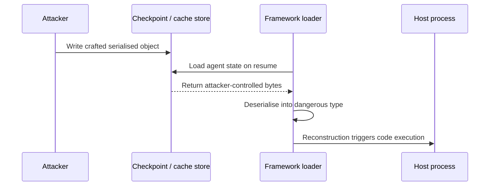
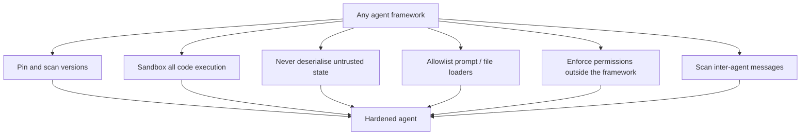

# 7. Framework Security

> **The "so what":** Almost no one builds an agent from raw model calls. You build on LangChain, LangGraph, AutoGen, CrewAI, or a similar framework, and those frameworks run with your agent's full authority. In 2025 and 2026 several of them shipped critical vulnerabilities: remote code execution, SQL injection in state stores, path traversal, and unsafe deserialisation. This chapter catalogues the framework attack surface, walks the confirmed CVEs, and gives you a hardening baseline that does not depend on any single vendor getting security right.

---

## 7.1 The framework is part of your attack surface

A framework is convenient because it does a lot for you: it parses model output, dispatches tool calls, manages memory and state, serialises checkpoints, and loads prompts and chains from disk or the network. Every one of those conveniences is code that processes untrusted data and runs with your credentials. When a framework deserialises a checkpoint, loads a prompt by path, or evaluates an expression the model produced, it is making a trust decision on your behalf, and historically several frameworks made that decision unsafely.

The practical consequence is that you must track framework CVEs with the same urgency as operating-system CVEs, pin versions (see [chapter 06](06-supply-chain-security.md)), and add your own guardrails around the framework rather than assuming its defaults are safe.

The attack surface a framework adds falls into a small number of recurring categories. Recognising the category matters more than memorising any single CVE, because the next vulnerability will almost certainly be a fresh instance of one of these.

| Surface | What the framework does | The trust mistake |
|----|----|----|
| Deserialisation | Rehydrates checkpoints, chains, cached objects from bytes | Rehydrating bytes it did not produce |
| Loaders | Loads prompts, chains, configs by path or URL | Accepting a model- or user-controlled path |
| Expression evaluation | Evaluates expressions the model produced | Passing model output to `eval` or a template engine |
| State stores | Persists agent state to SQL or a document store | Interpolating unsanitised state into a query |
| Code execution | Runs model-generated code | Running it with host access or credentials |
| Inter-agent messaging | Passes one agent's output to another | Treating an internal message as trusted |

> **Note:** The vulnerabilities below are illustrative of recurring classes, not a complete list. Always check your pinned version against the vendor's current advisories. The value here is understanding the pattern so you can recognise the next one.

---

## 7.2 LangChain and LangGraph

LangChain is the most widely deployed agent framework and, correspondingly, the most scrutinised. Several serious issues have been disclosed.

| CVE | Component | Class | Severity | Summary |
|----|----|----|----|----|
| CVE-2025-68664 ("LangGrinch") | langchain-core | Unsafe deserialisation | CVSS 9.3 | Crafted serialised objects could be deserialised into dangerous types, enabling code execution when untrusted serialised data is loaded. |
| CVE-2026-34070 | langchain (`load_prompt()`) | Path traversal | CVSS 7.5 | `load_prompt()` could be induced to read files outside the intended directory via crafted paths, leaking local files. |
| CVE-2024-36480 | langchain | RCE via unsafe eval | Critical | Unsafe evaluation of expressions allowed remote code execution when attacker-influenced content reached the vulnerable path. |
| CVE-2025-67644 | LangGraph checkpointers | SQL injection | High | State checkpointers built on SQL stores were vulnerable to injection through unsanitised state keys or values. |

**What these share:** untrusted data (a serialised object, a path, an expression, a state value) reaches a powerful operation (deserialise, file read, eval, SQL) without adequate validation. The LangGrinch deserialisation flaw is the archetype: the same pattern that makes Python pickle dangerous appears wherever a framework rehydrates objects from bytes it did not produce.

**Hardening LangChain and LangGraph:**

- Pin `langchain`, `langchain-core`, and `langgraph` to versions at or above the patched releases, and re-check on every dependency scan.
- Never deserialise agent state, checkpoints, or serialised chains that originate from an untrusted source. Treat checkpoint stores as sensitive and access-controlled.
- Never pass user-controlled or model-controlled paths to `load_prompt()` or any loader. Resolve prompts from a fixed, allowlisted directory.
- For LangGraph checkpointers on SQL backends, ensure state keys and values are parameterised, and isolate the checkpoint database from other data.
- Disable or avoid any `eval`-style expression feature unless you fully control its input.

### Worked example: LangGrinch (CVE-2025-68664) deserialisation

LangGrinch is worth walking in detail because the class it belongs to (unsafe deserialisation) recurs across frameworks and languages. The mechanism is simple: the framework offers a "load" path that reconstructs Python objects from a serialised representation, and if an attacker can influence those bytes, they can steer reconstruction toward dangerous types and trigger code execution.



The exposure depends entirely on **where the serialised bytes come from**. If your checkpoint store is a database only your agent can write to, the reachable path is narrow; if any user, tenant, or upstream component can write state that your agent later loads, the path is wide open.

- **Reachability check.** Ask: can anything outside my trust boundary write to the store the loader reads from? If yes, you are exposed regardless of framework version until patched.
- **The fix from the vendor.** The patched releases constrain which types may be reconstructed, rejecting the dangerous ones. Upgrading to the patched `langchain-core` closes the specific vector.
- **The fix you own.** Treat every checkpoint store as sensitive, access-controlled, and writable only by the agent identity that owns it ([chapter 05](05-identity-and-secrets.md)). Then even an unpatched loader has no untrusted bytes to load.

The following pattern shows the defensive posture: load state only from a store you control, and verify its integrity before deserialising.

```python
import hashlib
import hmac

def load_state_safely(raw: bytes, signature: str, key: bytes):
    """Reject any state blob that was not written by a trusted producer."""
    expected = hmac.new(key, raw, hashlib.sha256).hexdigest()
    if not hmac.compare_digest(expected, signature):
        raise ValueError("State integrity check failed; refusing to deserialise")
    # Only after integrity is proven do we hand bytes to the framework loader.
    return deserialise_trusted(raw)
```

> **Warning:** Upgrading past the CVE closes the known vector but not the class. A signed, access-controlled state store is what protects you from the next deserialisation flaw before it has a CVE number. Defence in depth means both.

### Worked example: path traversal in `load_prompt()` (CVE-2026-34070)

Path traversal is the humbler cousin of deserialisation but just as instructive. `load_prompt()` resolves a prompt from a path, and if that path can contain `../` sequences supplied by an attacker, the loader can be walked out of its intended directory to read arbitrary local files, for example configuration, secrets, or other tenants' prompts.

- **The trigger.** A path such as `../../etc/passwd` or `../other-tenant/prompt.yaml` passed where the loader expected a bare prompt name.
- **The impact.** Local file disclosure, which in an agent context can mean leaking secrets, system prompts, or another tenant's data.
- **The durable fix.** Never build a loader path from user or model input. Resolve prompts by a fixed key against an allowlist, and reject any resolved path that escapes the intended base directory.

```python
import os

PROMPT_DIR = "/app/prompts"
ALLOWED = {"summariser", "classifier", "responder"}

def resolve_prompt(name: str) -> str:
    if name not in ALLOWED:
        raise ValueError(f"Unknown prompt: {name}")
    path = os.path.realpath(os.path.join(PROMPT_DIR, f"{name}.yaml"))
    if not path.startswith(PROMPT_DIR + os.sep):
        raise ValueError("Resolved path escapes prompt directory")
    return path
```

### Worked example: LangGraph checkpointer SQL injection (CVE-2025-67644)

The LangGraph checkpointer persists agent state to a backing store, and where that store is SQL, unsanitised state keys or values interpolated into a query become an injection vector. This is the classic SQL-injection class applied to agent state, and the fix is the classic one: parameterise every query and never build SQL by string concatenation.

- **Parameterise.** State keys and values pass to the database as bound parameters, never as interpolated strings.
- **Isolate.** The checkpoint database holds only agent state and is reachable only by the agent's identity, so a successful injection cannot pivot into other data.
- **Least privilege the database role.** The agent's database account can read and write its own state tables and nothing else, so injection cannot escalate.

---

## 7.3 Comparing framework security posture

No framework is secure or insecure in the abstract; each carries a characteristic risk profile driven by what it does for you. The table below summarises where each of the common frameworks concentrates risk and what the primary control is. Use it to decide where to spend review effort for the framework you actually run.

| Framework | Primary risk area | Notable disclosed class | Primary control |
|----|----|----|----|
| LangChain / LangGraph | Deserialisation, loaders, state stores | Unsafe deserialisation, path traversal, SQLi | Pin, signed state store, allowlist loaders, parameterise |
| AutoGen | Model-generated code execution | Sandbox escape via misconfiguration | Genuinely isolated, credential-free executor |
| CrewAI | Excessive agency, delegation inheritance | Overbroad tool grants | Per-role tool scoping, ReBAC delegation |
| Semantic Kernel / others | Plugin and connector trust | Overbroad plugin permissions | Least-privilege plugins, review before adoption |

The pattern across the row is consistent: the framework's headline feature is also its headline risk. LangChain's flexibility in loading and persisting is its exposure; AutoGen's code execution is its exposure; CrewAI's flexible delegation is its exposure. Choosing a framework means choosing which risk you will spend the most effort controlling.

When selecting or reviewing a framework, a few security questions cut through the marketing and reveal how much work its risk profile will demand of you.

- **How does it persist state, and can I control and sign that store?** This determines your deserialisation exposure (7.2).
- **Does it execute model-generated code, and can that executor be fully isolated?** This determines your code-execution exposure (7.4).
- **How does it load prompts, chains, and configs, and can I allowlist those paths?** This determines your loader exposure (7.2).
- **How does it manage tool permissions, and can I enforce them outside the framework?** This determines whether you can prevent excessive agency (7.5).
- **What is its disclosure and patch track record?** A framework that patches quickly and communicates clearly is a lower operational risk regardless of raw CVE count.

> **Tip:** Do not choose a framework on security posture alone; choose on fit, then invest in the specific controls that its risk profile demands. A well-governed LangChain deployment is safer than a carelessly configured "more secure" alternative.

---

## 7.4 AutoGen

AutoGen popularised multi-agent conversations and code-execution agents. Its highest-risk feature is exactly that: agents that write and execute code.

- **Code execution must be sandboxed.** AutoGen supports executing model-generated code, and the safe configuration runs it inside a container with no host filesystem access, no credentials, and no outbound network beyond what the task strictly needs. Running generated code on the host, or in a container with the agent's credentials mounted, turns a single injection into host compromise.
- **Constrain the executor image.** Use a minimal image, drop privileges, set resource limits (to bound LLM10 Unbounded Consumption), and treat the executor as disposable.
- **Multi-agent chat is an injection channel.** In AutoGen, one agent's output becomes another's input. Apply the injection detection from [chapter 04](04-security-controls.md) to inter-agent messages, not only to external input.

> **Warning:** A Docker-based code executor is safe only if the container is actually isolated. Mounting the host Docker socket, the working directory with secrets, or broad network access into the executor defeats the sandbox entirely. Verify the isolation, do not assume it.

### A safe executor configuration

The difference between a sandbox and a liability is a handful of settings. The table contrasts the dangerous defaults teams reach for against the hardened configuration that actually contains a compromise.

| Setting | Dangerous | Hardened |
|----|----|----|
| User | root | Non-root, dedicated UID |
| Host Docker socket | Mounted (`/var/run/docker.sock`) | Never mounted |
| Filesystem | Host working directory mounted | Ephemeral, no host mounts |
| Credentials | Agent secrets available | None present in the executor |
| Network | Full egress | Denied, or a strict allowlist |
| Lifetime | Long-lived, reused | Disposable, destroyed per task |
| Resources | Unbounded | CPU, memory, and time limits set |

- **Confirm no host escape path.** The single most common mistake is mounting the Docker socket to let the executor spawn containers; that is equivalent to giving it root on the host.
- **Give it nothing worth stealing.** An executor with no credentials and no network cannot exfiltrate what it does not have and cannot reach.
- **Make it disposable.** Destroy the executor after each task so state cannot accumulate or persist between requests.

The container runtime settings that enforce this are the same non-root, capability-dropped, network-denied posture used for model serving in [chapter 06](06-supply-chain-security.md). Applied to a code executor, they look like this:

```yaml
# Hardened executor container for model-generated code
securityContext:
  runAsNonRoot: true
  runAsUser: 65534          # 'nobody'
  readOnlyRootFilesystem: true
  allowPrivilegeEscalation: false
  capabilities:
    drop: ["ALL"]
resources:
  limits:
    cpu: "1"
    memory: "512Mi"
# No volumes: no host paths, no Docker socket, no secret mounts.
# NetworkPolicy denies all egress from the executor namespace.
# Container is created per task and deleted on completion.
```

---

## 7.5 CrewAI

CrewAI models teams of role-playing agents with tasks and tools. Its characteristic risks are about authority and scope.

- **API and tool overreach.** CrewAI agents are frequently granted broad tool and API access to make the "crew" flexible. That flexibility is excessive agency (LLM06) by another name. Scope each agent's tools to its role using the enforcer in [`tool_permission_enforcer.py`](../code/python/tool_permission_enforcer.py), and do not grant a crew-wide tool set.
- **Delegation inheritance.** When one agent delegates to another, ensure the delegate does not inherit the delegator's full authority. Apply the ReBAC delegation model from [chapter 05](05-identity-and-secrets.md).
- **Task and goal injection.** Because agents are driven by natural-language roles and goals, injected content can rewrite an agent's objective. Keep role and goal definitions in a trusted zone that untrusted content cannot modify.

### Scoping tools to roles

The antidote to crew-wide overreach is per-role least privilege: each agent gets exactly the tools its role requires, and delegation narrows authority rather than widening it. The pattern below shows a role-to-tool allowlist enforced outside the framework, so the model cannot grant itself more.

```python
ROLE_TOOLS = {
    "researcher": {"web_search", "read_document"},
    "analyst": {"read_document", "run_calculation"},
    "writer": {"read_document", "save_draft"},
    # No role has payment or deletion tools; those require a human gate.
}

def authorise_tool(role: str, tool: str) -> bool:
    allowed = ROLE_TOOLS.get(role, set())
    if tool not in allowed:
        # Denied by default; log for audit (see chapter 04).
        return False
    return True
```

Delegation deserves particular care because it is where authority quietly accumulates. A researcher agent that can delegate to an executor agent must not be able to hand it capabilities the researcher never held; delegation should narrow scope, never widen it.

- **Cap delegated authority at the delegator's own.** A delegate's effective permissions are the intersection of what it is granted and what the delegator holds, never the union.
- **Make delegation explicit and logged.** Record every delegation with the identities involved, so an investigator can reconstruct how authority flowed ([chapter 12](12-incident-response.md)).
- **Keep high-authority actions behind a human gate.** Payments, deletions, and irreversible actions require an approval step no agent can delegate around ([chapter 04](04-security-controls.md)).

> **Warning:** In a crew, an injected goal in one agent can propagate through delegation to agents with more authority. Keep role and goal definitions in a trusted store, scope tools per role, and ensure a delegate never inherits authority the delegator was not explicitly granted to pass on.

---

## 7.6 Version pinning and safe upgrade discipline

The framework CVEs above are only defensible if you know which version you run and can move off a vulnerable one quickly. That requires discipline, not heroics: pin everything, scan continuously, and upgrade on a reviewed cadence.

- **Pin exact versions in a lockfile.** A floating version means a dependency can change under you between builds, and it means you cannot answer "are we exposed?" when a CVE lands.
- **Scan the pinned tree continuously.** Run dependency scanning in CI and on a schedule against the deployed set, not only at build time, because new CVEs are disclosed against versions you already run ([chapter 06](06-supply-chain-security.md)).
- **Fail the build on known-critical CVEs.** A scanner that only opens an advisory pull request is a scanner teams ignore. Gate the build.
- **Review security-relevant upgrades.** Do not auto-merge upgrades to the framework itself or to code-execution and deserialisation paths; review them, because an upgrade can also introduce a regression or a supply chain compromise.
- **Keep an upgrade runway.** Track how many versions behind you are, and do not let the gap grow so large that an emergency patch becomes a major migration.

| Practice | Anti-pattern it prevents |
|----|----|
| Exact pins in a lockfile | Silent dependency drift |
| Continuous scan of deployed set | Exposure to post-deployment CVEs |
| Build-failing severity gate | Ignored advisory pull requests |
| Reviewed framework upgrades | Auto-merged malicious or breaking change |
| Small version gap | Emergency patch becoming a migration |

A pinned, hashed requirements file makes the exposure question answerable and the build reproducible. The hashes mean a dependency cannot be swapped underneath you even if the registry is compromised.

```text
# requirements.txt (excerpt) - exact pins with hashes
langchain-core==0.3.75 \
    --hash=sha256:1a2b3c...
langgraph==0.2.40 \
    --hash=sha256:4d5e6f...
# Install with: pip install --require-hashes -r requirements.txt
# A hash mismatch fails the install closed.
```

> **Note:** The worst place to be when a critical framework CVE lands is many versions behind, because the patch may only ship for recent releases and the upgrade path is long. Staying reasonably current is itself a security control.

---

## 7.7 Framework-specific monitoring

Generic application monitoring will not surface a framework attack. You need signals tied to the specific operations the framework performs, feeding the observability described in [chapter 04](04-security-controls.md) and [chapter 10](10-production-deployment.md).

- **Deserialisation events.** Log every load of agent state or a serialised chain, with the source store and an integrity result. An unexpected load, or one from an unexpected source, is a signal.
- **Loader activity.** Log every prompt or file load with the resolved path. A resolved path outside the allowlisted directory is an attempted traversal and should alert.
- **Code executor telemetry.** For frameworks that run generated code, log every execution, its resource use, and its network attempts. An executor attempting egress or exhausting resources is an incident in progress.
- **Inter-agent message anomalies.** Monitor for injection patterns in messages between agents, not only in external input, because multi-agent frameworks turn one compromise into many.
- **State store access.** Log and alert on writes to checkpoint and state stores from any identity other than the owning agent.

These signals map cleanly onto detections. The point is that the framework's powerful operations are exactly the operations worth watching.

| Framework operation | Signal to monitor | Detection |
|----|----|----|
| State deserialisation | Load source and integrity result | Load from untrusted source, or integrity failure |
| Prompt / file loading | Resolved path | Path outside allowlisted directory |
| Code execution | Resource use, network attempts | Egress attempt or resource exhaustion |
| Inter-agent messaging | Message content | Injection pattern in an internal message |
| State store writes | Writer identity | Write from a non-owning identity |

---

## 7.8 Semantic Kernel, LlamaIndex, and other frameworks

The named CVEs above cluster around the most-scrutinised frameworks, but the same classes apply to every orchestration library. Semantic Kernel, LlamaIndex, Haystack, and the various agent SDKs all load plugins or connectors, persist state, and process model output, so they inherit the same trust decisions.

- **Plugins and connectors are third-party code.** A Semantic Kernel plugin or a LlamaIndex data connector runs with your agent's authority. Review it before adoption and scope its permissions exactly as you would an MCP tool server ([chapter 08](08-mcp-and-protocols.md)).
- **Query engines touch data stores.** LlamaIndex query engines and retrievers interact with vector and document stores; the state-store and injection concerns of 7.2 and [chapter 06](06-supply-chain-security.md) apply directly.
- **Templating is expression evaluation.** Any framework that renders prompts through a template engine can be vulnerable to template injection if model or user input reaches the template. Treat template rendering as an untrusted-input boundary.
- **The absence of a CVE is not the absence of a flaw.** A less-scrutinised framework may simply not have been audited yet. Apply the baseline in 7.10 regardless of whether your framework has a published advisory.

> **Note:** Popularity attracts scrutiny, and scrutiny produces CVEs. A framework with many published vulnerabilities is not necessarily less safe than one with none; it may simply be the one researchers have looked at hardest. Judge by the controls you apply, not by the CVE count.

---

## 7.9 Configuration audit for framework deployments

Most framework compromises in practice are not zero-days; they are misconfigurations of features that were dangerous by default or left permissive. A periodic configuration audit catches these before an attacker does. Run it before deployment ([chapter 10](10-production-deployment.md)) and on a schedule thereafter.

| Audit question | Safe answer | Where it maps |
|----|----|----|
| Are all framework packages pinned and scanned? | Yes, with a build-failing gate | 7.6, [chapter 06](06-supply-chain-security.md) |
| Can the agent deserialise state from an untrusted source? | No; state store is signed and access-controlled | 7.2 |
| Do loaders resolve only from an allowlist? | Yes; traversal is rejected | 7.2 |
| Are SQL state queries parameterised? | Yes; no string interpolation | 7.2 |
| Does code execution run credential-free and network-denied? | Yes; disposable executor | 7.4 |
| Is the Docker socket mounted into any executor? | No, never | 7.4 |
| Are tools scoped per role, not crew-wide? | Yes; least privilege | 7.5 |
| Does delegation narrow authority? | Yes; ReBAC constrains inheritance | 7.5 |
| Are permission decisions enforced outside the framework? | Yes; model cannot reach them | 7.10, [chapter 04](04-security-controls.md) |
| Are framework operations monitored specifically? | Yes; deserialisation, loaders, executor | 7.7 |

- **Automate what you can.** Encode as many of these checks as possible as CI assertions or policy-as-code, so the audit runs on every change rather than quarterly from memory.
- **Record the evidence.** Keep the audit output with your risk register ([chapter 03](03-governance-framework.md)); an auditor or regulator will ask how you assure framework configuration.
- **Re-audit on upgrade.** A framework upgrade can change defaults, so re-run the audit whenever you move versions.

> **Tip:** Turn this table into a scripted check that runs in CI. A configuration audit that depends on someone remembering to perform it is a configuration audit that lapses exactly when release pressure is highest.

---

## 7.10 A framework-agnostic hardening baseline

Frameworks change, and the next critical CVE will land in whichever one you use. Build a baseline that holds regardless of vendor.



The baseline is deliberately vendor-neutral: every item holds whether you run LangChain, AutoGen, CrewAI, or something not yet written. That is the point. You cannot predict which framework will ship the next critical flaw, but you can build so that when it does, your own controls contain it.

1. **Pin and scan.** Track every framework package in your SBOM and fail the build on a known-critical CVE in a pinned version.
2. **Sandbox code execution.** Any feature that runs model-generated code runs in an isolated, credential-free, resource-limited container.
3. **Never deserialise untrusted state.** Checkpoints, serialised chains, and cached objects are trusted inputs only when they come from a trusted store you control.
4. **Allowlist loaders.** Prompt, chain, and file loaders resolve only from fixed, allowlisted locations.
5. **Enforce permissions outside the framework.** The permission decision and the kill switch must live in code the framework and model cannot reach ([chapter 04](04-security-controls.md)).
6. **Scan inter-agent messages.** In multi-agent frameworks, treat every message between agents as untrusted input.
7. **Verify state and artefact integrity.** Sign the state store, verify weights and images, and re-check on load, so a tampered artefact fails closed rather than executing.

> **Tip:** Assume your framework will have a critical vulnerability at some point. Design so that when it does, your external controls (permission enforcement, sandboxing, egress filtering, kill switches) still contain the blast radius. That is what turns a framework CVE from an incident into a patch.

---

## 7.11 Securing agent memory and state persistence

Beyond checkpoints, most frameworks offer memory: short-term conversation memory and long-term stores the agent reads and writes across sessions. Memory is state, and state that untrusted input can influence is an injection channel that persists, the same problem as a poisoned RAG corpus ([chapter 06](06-supply-chain-security.md)) but internal to the framework.

- **Treat memory reads as untrusted input.** Content the agent wrote to memory in an earlier turn may have been shaped by an injection. Re-apply input validation ([chapter 04](04-security-controls.md)) when memory is read back, not only when external input arrives.
- **Scope memory to a trust boundary.** In a multi-tenant or multi-user deployment, one principal's memory must never be readable by another. Key memory by the authenticated principal and enforce it in the store, not in the prompt.
- **Bound what memory can hold.** Do not let the agent persist secrets, credentials, or raw tool output into long-term memory where it can leak later. Filter on write.
- **Make memory writes attributable.** Every write carries the identity that made it ([chapter 05](05-identity-and-secrets.md)), so a poisoned memory can be traced and purged.

| Memory type | Risk | Control |
|----|----|----|
| Short-term conversation | Injection carried across turns | Re-validate on read |
| Long-term vector memory | Persistent poisoning | Gated writes, periodic re-scan |
| Cross-session store | Cross-tenant leakage | Key by principal, enforce in store |
| Tool-output cache | Secret or PII retention | Filter on write, set retention |

> **Warning:** An agent that writes tool output straight into long-term memory can quietly accumulate secrets and personal data that then leak in a later, unrelated conversation. Filter on write and bound retention, or memory becomes a slow data-exfiltration channel.

---

## 7.12 Mapping framework risks to OWASP and controls

The framework risks in this chapter map onto the OWASP LLM Top 10 2025 and onto controls elsewhere in the handbook. The table gives a reviewer a single view of coverage.

| Framework risk | OWASP mapping | Controls |
|----|----|----|
| Unsafe deserialisation (LangGrinch) | LLM03 Supply Chain | Pin, signed state store (7.2) |
| Path traversal in loaders | LLM03 / improper access | Allowlist loaders (7.2) |
| SQLi in checkpointers | LLM05 / data store injection | Parameterise, isolate (7.2) |
| Unsandboxed code execution | LLM06 Excessive Agency | Credential-free executor (7.4) |
| Overbroad tool grants | LLM06 Excessive Agency | Per-role scoping (7.5) |
| Inter-agent injection | LLM01 Prompt Injection | Scan internal messages (7.4, 7.7) |
| Poisoned memory | LLM04 / LLM01 | Re-validate on read (7.11) |

Coverage is a map, not a guarantee. Where a row's control is one you have not actually implemented, that is the gap to close next, and it belongs in the risk register ([chapter 03](03-governance-framework.md)) until it is.

> **Tip:** When a regulator or auditor asks how you handle a specific OWASP risk introduced by your framework, this mapping lets you answer with named controls and evidence rather than assurances.

---

## 7.13 When a framework CVE lands: a response runbook

Because framework CVEs are a matter of when, not if, rehearse the response before you need it. The runbook below assumes you have the AI-BOM and version pins from [chapter 06](06-supply-chain-security.md); without them, step 1 alone can take days.

1. **Locate.** Query the AI-BOM for every agent running the affected package and version. This answers "who is exposed?" in minutes.
2. **Assess reachability.** For each affected agent, determine whether the vulnerable path is reachable given your configuration. A deserialisation flaw is only reachable if untrusted bytes reach the loader; a code-execution flaw only if the feature is enabled.
3. **Rank by blast radius.** Prioritise agents with real authority (payments, data deletion, customer-facing actions) and those where the path is reachable.
4. **Contain immediately.** For high-risk reachable agents, apply a compensating control now: disable the affected feature, tighten the state store, trip the relevant circuit breaker, or invoke the kill switch ([chapter 04](04-security-controls.md)) while the patch is prepared.
5. **Patch and pin.** Upgrade to the fixed version, re-pin the lockfile, regenerate the AI-BOM, and re-run the dependency scan to confirm the finding clears.
6. **Verify.** Run the adversarial suite ([chapter 09](09-testing-evaluation.md)) against the patched build, including a test for the specific vulnerability class, before returning it to production.
7. **Record and report.** File the CVE, affected builds, actions, and timeline. For a major incident this feeds the DORA reporting clock ([chapter 12](12-incident-response.md)).

| Response stage | Depends on | Without it |
|----|----|----|
| Locate | AI-BOM, version pins | Days of manual investigation |
| Assess reachability | Configuration knowledge | Over- or under-reacting |
| Contain | Kill switch, circuit breakers | Exposure stays open during patching |
| Verify | Adversarial test suite | Shipping an unverified patch |
| Report | Incident records | Missed regulatory deadlines |

> **Warning:** The window between disclosure and patch is when attackers move. Containment (step 4) is what keeps that window survivable; do not skip it to rush to the patch, because the compensating control buys the time the patch needs.

---

## 7.14 Key takeaways

- Frameworks run with your agent's full authority, so their vulnerabilities are your vulnerabilities. Track framework CVEs like OS CVEs.
- The framework attack surface reduces to a few recurring classes: deserialisation, loaders, expression evaluation, state stores, code execution, and inter-agent messaging. Recognising the class beats memorising the CVE.
- LangChain and LangGraph have shipped critical flaws including LangGrinch deserialisation (CVE-2025-68664, 9.3), path traversal in `load_prompt()` (CVE-2026-34070), RCE via unsafe eval (CVE-2024-36480), and SQL injection in checkpointers (CVE-2025-67644). The common cause is untrusted data reaching a powerful operation.
- Closing a CVE by upgrading is necessary but not sufficient; a signed, access-controlled state store, allowlisted loaders, and parameterised queries protect you from the next flaw before it has a number.
- AutoGen's code execution must run in a genuinely isolated, credential-free sandbox; a mounted Docker socket or host directory is no sandbox at all.
- CrewAI's role-based crews tend toward excessive agency and delegation inheritance. Scope tools per role and constrain delegation with ReBAC.
- Pin exact versions, scan the deployed set continuously with a build-failing gate, and stay reasonably current so an emergency patch is not a migration.
- Monitor the framework's powerful operations specifically (deserialisation, loading, code execution, inter-agent messaging, state writes), because generic monitoring will miss a framework attack.
- Build a framework-agnostic baseline (pin, sandbox, do not deserialise untrusted state, allowlist loaders, enforce permissions externally, scan inter-agent messages) so the next framework CVE is a patch, not a breach.
- The same classes apply to less-scrutinised frameworks (Semantic Kernel, LlamaIndex, and others); a low CVE count reflects less scrutiny, not more safety, so apply the baseline regardless.
- Run a configuration audit before deployment and on a schedule, ideally as policy-as-code in CI, because most framework compromises are misconfigurations, not zero-days.
- Treat agent memory and state as persistent, attributable, principal-scoped stores: re-validate memory on read, filter secrets on write, and never let one principal's memory leak to another.
- Rehearse the framework-CVE runbook (locate, assess reachability, contain, patch, verify, report) so the window between disclosure and patch stays survivable.
- Ask the five framework-selection questions (state persistence, code execution, loaders, permission enforcement, patch track record) when adopting or reviewing a framework, because they reveal how much control work its risk profile demands.
- Map each framework risk to its OWASP category and a named control, and keep unimplemented controls in the risk register until they are closed.
- Verify state and artefact integrity on load (signed state stores, verified weights and images) so a tampered artefact fails closed rather than executing with your authority.

---

| Previous | Next |
|----|----|
| [06. Supply Chain Security for AI Agents](06-supply-chain-security.md) | [08. MCP and Agent-to-Agent Protocols](08-mcp-and-protocols.md) |
