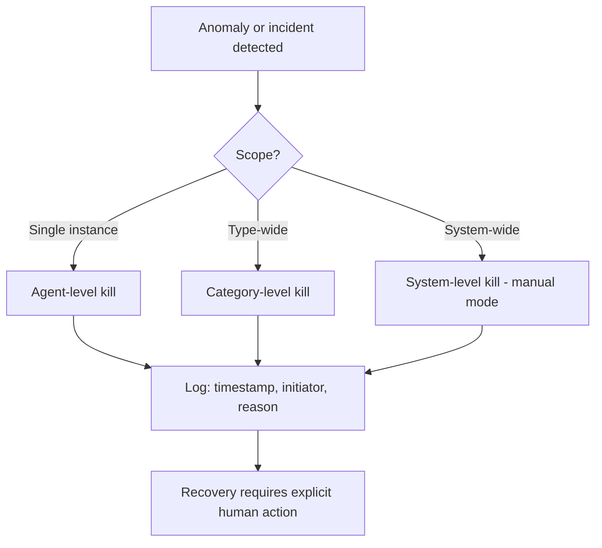
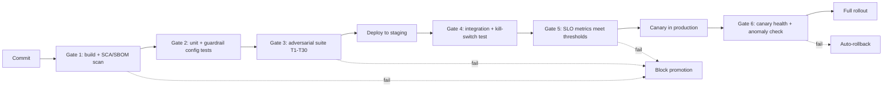
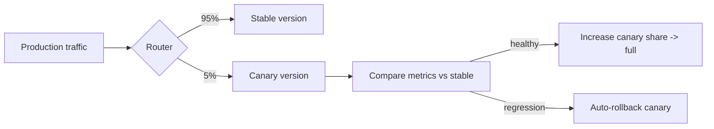

# 10. Production Deployment

> **The "so what":** The gap between "it works in a demo" and "it is safe in production" is where most agentic incidents are born. This chapter is the operational gate: a pre-deployment security review, a runtime guardrails configuration, and tested rollback and kill-switch procedures. It turns every control in this handbook into a checklist item that must be green before an agent handles real requests with real authority. It maps directly to the [checklist asset](../assets/checklist.md) and the [config template](../assets/templates/agent_security_config.yaml).

---

## 10.1 Production readiness is a gate, not a hope

An agent that is not monitored, cannot be stopped, and was never tested adversarially is not ready for production, no matter how impressive its demo. Recall the baseline from [chapter 01](01-threat-landscape.md): roughly 48% of agents run unmonitored and around 60% of organisations cannot terminate a misbehaving agent. Those are not exotic failures; they are the default state of an agent that was shipped without a readiness gate.

This chapter makes readiness explicit and binary. Every item below is either done and evidenced, or the agent does not ship. The point of a gate is that it can say no.

---

## 10.2 Pre-deployment security review

Complete all twelve items before promoting an agent to production. Each maps to a control chapter and to the [checklist asset](../assets/checklist.md), where the full 60-plus item version lives.

| # | Check | Evidence to record |
|---|----|----|
| 1 | Agent classification determined (A/B/C/D by impact x autonomy) | Documented rationale ([ch. 03](03-governance-framework.md)) |
| 2 | Tool permissions follow least-privilege | Each tool with scope and permission type ([ch. 04](04-security-controls.md)) |
| 3 | Approval gates configured per action impact | Actions mapped to Gate 0-3 |
| 4 | Memory data classification defined (PII, confidential, public) | Retention policy per class |
| 5 | Egress filtering configured for approved endpoints | Approved domains/IPs list |
| 6 | Circuit breaker thresholds set from baseline metrics | Normal ranges and alert thresholds |
| 7 | Kill switch tested at agent, category, and system levels | Proof of independent access from the agent system |
| 8 | Adversarial test suite executed (T1-T30) | Pass/fail per test ([ch. 09](09-testing-evaluation.md)) |
| 9 | Decision trace logging enabled with full context capture | Trace format verified against spec |
| 10 | Monitoring dashboard configured with real-time alerts | Alert routing to on-call confirmed |
| 11 | Runbook documented (normal operation, failure modes, recovery) | Escalation procedures included |
| 12 | Rollback procedure tested for version downgrade | Data compatibility with previous version verified |

Beyond these twelve, a 2026 deployment must also evidence the newer control areas from this edition: a non-human identity with a scoped, owned lifecycle ([ch. 05](05-identity-and-secrets.md)), a supply chain assurance record including an SBOM ([ch. 06](06-supply-chain-security.md)), pinned framework versions checked against known CVEs ([ch. 07](07-framework-security.md)), authenticated and pinned MCP/A2A connections ([ch. 08](08-mcp-and-protocols.md)), and a rehearsed incident response plan ([ch. 12](12-incident-response.md)).

> **Warning:** Item 7 is the one most often faked. A kill switch that has never been triggered is an assumption, not a control. Trigger all three levels in a rehearsal before go-live and record the result. If you have not stopped the agent, you do not know that you can.

---

## 10.3 Runtime guardrails configuration

Guardrails are real-time controls that enforce policy during execution. The configuration below is a starting template; the full, annotated version is [`../assets/templates/agent_security_config.yaml`](../assets/templates/agent_security_config.yaml).

```yaml
guardrails:
  input:
    max_tokens: 8192
    allowed_content_types: [text/plain, application/pdf]
    injection_detection: enabled
    schema_validation: strict

  tools:
    max_concurrent_calls: 3
    timeout_per_call_seconds: 30
    deny_list: ["rm -rf", "drop table"]
    require_approval_for: ["execute_trade", "update_account_status"]

  output:
    mask_pii: true
    max_data_volume_mb: 50
    egress_filtering: enabled

  memory:
    retention_days: 90
    encryption_at_rest: true
    write_permission_check: true
    audit_all_writes: true
```

Each block enforces a chapter: `input` implements the injection defence of [chapter 04](04-security-controls.md), `tools` implements the permission model and approval gates, `output` implements data-flow and egress controls, and `memory` implements the memory lifecycle. Set numeric limits from your own baselined metrics ([chapter 09](09-testing-evaluation.md)), not from this template's defaults.

> **Tip:** Version-control the guardrails config alongside the agent's code and require review for changes. A loosened limit is a security change and should be reviewed like one, with the diff visible in the audit trail.

---

## 10.4 Rollback and kill-switch procedures

### Rollback procedure

1. Identify the target version to roll back to; it must be a previously validated version.
2. Stop all instances of the current version.
3. Deploy the target version from the approved registry.
4. Run the full adversarial test suite against the rolled-back version.
5. If tests pass, resume production traffic; if not, escalate.

### Kill-switch procedure

The three levels mirror the hierarchy in [chapter 04](04-security-controls.md).

1. **Agent-level kill:** pause a specific agent instance. Tool calls are queued but not executed; the current idempotent operation completes; an alert is sent to on-call with the reason.
2. **Category-level kill:** stop all agents of a given type when a systemic issue spans instances. Pending actions are reviewed before resumption.
3. **System-level kill:** revert the entire agentic system to manual mode. Highest severity; used for critical failures or security incidents; requires executive approval to resume.



**Non-negotiable requirements:** kill switches are accessible independently of the agent system and cannot be controlled by an agent; every state change is logged with timestamp, initiator, and reason to the tamper-evident audit log ([`../code/python/audit_logger.py`](../code/python/audit_logger.py)); and recovery always requires explicit human action, never an automatic restart.

---

## 10.5 Post-deployment operations

Deployment is the start of the agent's risk lifetime, not the end of the project. Sustained safe operation requires:

- **Continuous monitoring** against baselined thresholds ([chapter 04](04-security-controls.md)), with alerts routed to a named on-call rota.
- **Continuous evaluation** on the daily/weekly/monthly/quarterly cadence from [chapter 09](09-testing-evaluation.md), so drift and regressions are caught.
- **Ongoing supply chain re-scanning** of the deployed SBOM and models ([chapter 06](06-supply-chain-security.md)), because new CVEs land against versions you already run.
- **Periodic NHI attestation** ([chapter 05](05-identity-and-secrets.md)) so retired agents do not leave standing credentials.
- **A rehearsed incident response plan** ([chapter 12](12-incident-response.md)) that has been exercised, not just written.

> **Note:** Treat every configuration loosening, permission widening, or new tool grant after go-live as a re-entry into this gate. The classification, permissions, and tests must be re-derived, because the agent you deployed is not the agent you are now running.

---

## 10.6 Deployment pipeline security gates

Readiness (10.2) is a point-in-time check; the pipeline is what enforces it on every release. Build the security gates into the CI/CD pipeline so a failing gate blocks promotion automatically, rather than relying on someone remembering to run the checklist. A gate that a human can forget is not a gate.



| Gate | Runs | Blocks on |
|----|----|----|
| 1. Supply chain | Every commit | New critical CVE, unpinned dependency, missing SBOM ([ch. 06](06-supply-chain-security.md), [ch. 07](07-framework-security.md)) |
| 2. Config tests | Every commit | Guardrail config invalid or loosened without review |
| 3. Adversarial suite | Every commit to release branch | Injection resistance below gate ([ch. 09](09-testing-evaluation.md)) |
| 4. Integration + kill switch | On staging deploy | Kill switch fails at any level; integration failure |
| 5. SLO metrics | Before canary | Any release-gating SLO not met (9.8) |
| 6. Canary health | During canary | Anomaly rate or error rate above baseline |

Two rules make the gates trustworthy: they run automatically and identically for every release, and a failed gate blocks promotion rather than raising a warning someone can wave through. The guardrail configuration is version-controlled and tested like code (Gate 2), so a loosened limit surfaces as a reviewable diff.

> **Warning:** The most common way pipeline gates fail is the "emergency override" that becomes routine. If your pipeline has a bypass for urgent releases, log every use of it, require a named approver, and review the overrides monthly. An override used more than rarely means your gates are miscalibrated, not that the releases were all genuinely urgent.

---

## 10.7 Staging environment requirements

An agent cannot be validated in a vacuum. Staging must be production-like enough that a test result there predicts behaviour in production, but isolated enough that a misbehaving agent cannot touch anything real. Those two requirements are in tension, and getting the balance right is what makes staging worth having.

| Requirement | Why |
|----|----|
| Production-parity config | Same framework versions, guardrail config, and model version, so behaviour transfers |
| Sandboxed or mocked tools | Tools mimic production interfaces but have no real authority; a trade "executes" against a simulator, not a market |
| Synthetic or masked data | Realistic shape, no real PII; a leak in staging must not be a real breach ([ch. 04](04-security-controls.md)) |
| Isolated network | Staging cannot reach production data or external endpoints outside its own allowlist ([ch. 02](02-architecture-security.md)) |
| Full observability | The same decision-trace and monitoring pipeline as production, so tests are measured the same way |
| Independent identity | Staging agents use staging identities; never share credentials with production ([ch. 05](05-identity-and-secrets.md)) |

The defining principle: **staging has production's behaviour and none of production's authority.** The agent should be unable to tell it is in staging (so its behaviour is representative), while its tools are unable to cause real harm (so the test is safe). This is exactly the environment the adversarial suite (Gate 3) and kill-switch test (Gate 4) run in.

> **Tip:** The most valuable staging investment is realistic tool mocks that return production-shaped responses, including error and edge-case responses. An agent that only ever sees clean, successful tool outputs in staging has not been tested against the partial-failure and resilience dimensions from [chapter 09](09-testing-evaluation.md), and those are where autonomy fails worst.

---

## 10.8 Canary deployment for agents

Do not switch all traffic to a new agent version at once. A canary routes a small fraction of real requests to the new version while the rest stay on the known-good version, so a regression that the test suite missed is caught on 5% of traffic rather than 100%. Agents need canaries more than ordinary services, because the failure mode is an action, not just an error response.



What to compare between canary and stable, not just error rate:

- **Action distribution.** Is the canary calling the same tools at the same rates, or has its behaviour shifted? A canary that suddenly uses a rarely-used tool more often is a red flag even if nothing errored.
- **Approval-gate hit rate.** A canary triggering more Gate 2/3 approvals may be attempting riskier actions.
- **Injection-resistance and anomaly signals.** The monitoring signals from [chapter 04](04-security-controls.md) run on the canary and are compared to the stable baseline.
- **Cost and token consumption.** A canary consuming more tokens per task may have a reasoning regression heading toward denial-of-wallet (LLM10).

Constrain the canary further than stable: for high-impact agents, hold the canary at Gate-2 approval for actions the stable version runs autonomously, so early real-traffic behaviour is human-observed before it is trusted.

> **Warning:** For Class C/D agents, an action taken by a bad canary on 5% of traffic can still move real money or delete real records. A canary reduces blast radius, it does not eliminate it. Keep the canary's high-impact actions behind approval gates until its behaviour is proven, and keep the auto-rollback trigger tied to the action-distribution comparison, not just to HTTP errors.

---

## 10.9 Rollback verification procedure

Section 10.4 gave the rollback steps. This section makes rollback *verifiable*, because an untested rollback is as much an assumption as an untested kill switch. A rollback that has never been exercised will fail at the worst possible moment.

The verification protocol, run in staging before go-live and rehearsed periodically:

1. **Deploy version N, then roll back to N-1.** Confirm the router fully drains version N and all traffic lands on N-1.
2. **Verify N-1 passes its adversarial suite after rollback.** A rolled-back version must still meet its SLO gates; do not assume it is fine because it was fine before.
3. **Verify data and memory compatibility.** If version N wrote to shared memory or a data store in a new format, confirm N-1 can read it or that the rollback includes a data reconciliation step. This is the step most often missed and the one most likely to corrupt state.
4. **Verify identity and credential continuity.** Confirm N-1's identity and scoped credentials are still valid after rollback and were not revoked as part of the N deployment ([chapter 05](05-identity-and-secrets.md)).
5. **Verify in-flight action handling.** Confirm that actions in progress at the moment of rollback either completed idempotently or were cleanly cancelled, with no partial state left behind.
6. **Record the rollback time.** Measure how long the full rollback took; that number is your recovery-time estimate for an incident and belongs in the runbook.

> **Warning:** The silent killer in agent rollbacks is memory and data-format drift. If version N poisoned or restructured long-term memory, rolling back the code does not roll back the memory, and N-1 may now be operating on corrupted state. Rollback verification must include the data and memory layer, not just the running code.

---

## 10.10 Kill-switch testing protocol

Item 7 of the readiness review is the most-faked control, so it gets its own protocol. A kill switch is only real if it has been triggered and observed to work at all three levels. Rehearse this before go-live and re-rehearse quarterly.

| Level | Trigger test | Success criteria |
|----|----|----|
| Agent | Kill one agent instance mid-task | Tool calls stop; current idempotent op completes; alert fires; other agents unaffected |
| Category | Kill all agents of one type | All instances of the type stop; pending actions held for review; other types unaffected |
| System | Revert entire estate to manual mode | All agentic activity stops; system serves in manual/degraded mode; executive approval required to resume |

The protocol for each level:

1. **Trigger from outside the agent system.** The person triggering uses the independent control path, proving the switch is not itself dependent on the agents it stops ([chapter 04](04-security-controls.md)).
2. **Observe the stop.** Confirm via monitoring that actions actually ceased, not just that the switch reported success. Measure the time from trigger to full stop.
3. **Verify the audit record.** Confirm the state change was written to the tamper-evident log ([`../code/python/audit_logger.py`](../code/python/audit_logger.py)) with timestamp, initiator, and reason.
4. **Verify no auto-restart.** Confirm the agents stay stopped and require explicit human action to resume. An automatic restart defeats the purpose.
5. **Verify recovery.** Perform the controlled resume and confirm the agents return to a known-good state with their identities and permissions intact.

> **Warning:** A kill switch that has never been triggered is a hope, not a control (10.2, item 7). The failure you are guarding against is discovering during a live incident that the switch is wired to the wrong process, depends on the agent system it is meant to stop, or triggers an automatic restart. The only way to know is to pull it in a rehearsal and watch the agents stop.

---

## 10.11 Monitoring dashboard requirements

An agent that runs unmonitored is one of the two default failure states from 10.1 (roughly 48% run unmonitored). The monitoring dashboard is what closes that gap operationally, and it has concrete requirements beyond "some graphs".

The dashboard must surface, per agent and per agent category, in real time:

- **Action rate and tool-call distribution**, against the baselined normal ranges from [chapter 04](04-security-controls.md), so a shift is visible immediately.
- **Approval-gate activity**: pending approvals, approval latency, and rejection rate. A rising queue of pending Gate-2 approvals is both a security and an operational signal.
- **Anomaly and injection signals**: the behavioural-monitoring alerts, with drill-down to the offending decision trace.
- **Cost and token consumption** against budget, with the denial-of-wallet threshold marked (LLM10, 4.11).
- **Circuit-breaker state**: which breakers are open, half-open, or closed, and recent trips.
- **Kill-switch status**: current mode (normal / category-killed / manual) visible at a glance.
- **SLO compliance**: live injection-resistance and decision-trace-completeness figures against their gates (9.8).

| Requirement | Why it matters |
|----|----|
| Real-time, not batch | An agent acts in seconds; a dashboard refreshed hourly cannot catch a runaway loop |
| Per-agent and aggregate views | Incident response needs the single agent; governance needs the estate |
| Alerts routed to a named on-call | A dashboard nobody watches is not monitoring; alerts must page a person |
| Drill-down to decision trace | An alert without the trace behind it cannot be triaged |
| Independent of the agent runtime | Monitoring must survive the agent failing, so it is not hosted inside it |

> **Tip:** Wire the dashboard's critical alerts (cost budget exceeded, circuit breaker open, injection-resistance SLO breached) directly to the kill switch and the on-call rota, not just to a channel someone reads in the morning. The gap between "the dashboard showed it" and "someone acted on it" is where a contained anomaly becomes an incident.

---

## 10.13 Blue-green versus canary

Two release strategies dominate. The right choice depends on the agent's class and the reversibility of its actions.

| Aspect | Blue-green | Canary |
| --- | --- | --- |
| Traffic shift | All at once, after switch | Gradual, in stages |
| Blast radius | Full on switch | Limited to canary cohort |
| Rollback speed | Instant (switch back) | Fast (stop rollout) |
| Cost | Two full environments | One environment, partial |
| Best for | Stateless, reversible agents | High-autonomy, high-impact agents |

- Blue-green suits agents whose actions are easily reversed and where a fast full switch is acceptable.
- Canary suits Class A and B agents, where limiting exposure while the new version proves itself is essential.
- Both require the previous version to remain deployable for immediate rollback.
- Neither removes the need for a kill switch; they limit exposure, they do not stop a misbehaving agent.

> **Tip:** For Class A agents, combine canary with shadow evaluation: run the new version against real inputs without letting it act, and compare its proposed actions with the current version before giving it any live authority.

## 10.14 Deployment runbook template

Every production release should follow a written runbook so that the process is repeatable and auditable.

```
RELEASE RUNBOOK: <agent-name> v<version>

PRE-RELEASE
[ ] Security suite passed (link to report)
[ ] Injection resistance above class threshold
[ ] Kill switch tested in staging
[ ] Spending caps and rate limits configured
[ ] Rollback version identified and deployable
[ ] On-call engineer confirmed

RELEASE
[ ] Deploy to canary cohort (5%)
[ ] Monitor error rate, tool-call volume, cost for 30 min
[ ] Expand to 25%, then 50%, then 100% with checks between
[ ] Confirm dashboards green at each stage

POST-RELEASE
[ ] Confirm audit logging intact
[ ] Verify no anomalous tool usage
[ ] Record release in agent register
[ ] Close release ticket with evidence links
```

- The runbook is completed and stored for every release, not just the first.
- Each checkbox links to evidence so the record is defensible in an audit.
- The rollback version is confirmed deployable before any traffic shifts.

## 10.15 On-call and escalation for agents

Agents run continuously, so they need the same on-call discipline as any production service, plus agent-specific triggers.

| Trigger | Severity | First response |
| --- | --- | --- |
| Spending cap breached | High | Freeze agent, review transactions |
| Injection detector spike | High | Engage kill switch, capture context |
| Tool error-rate surge | Medium | Throttle, investigate tool health |
| Anomalous tool sequence | High | Kill switch, forensic capture |
| Cost anomaly | Medium | Throttle, review consumption |

- On-call engineers have the authority and the tooling to engage the kill switch without seeking approval.
- Escalation paths name the risk owner for Class A agents so decisions are not delayed.
- Every incident triggers a post-incident review that feeds back into the test suite.

> **Warning:** An agent incident can escalate far faster than a traditional outage because the agent keeps acting. The first response for high-severity agent triggers is to stop the agent, not to investigate while it continues to act.

## 10.12 Key takeaways

- Production readiness is a binary gate. Every item is evidenced and green, or the agent does not ship.
- Complete the twelve-point review plus the 2026 additions: NHI lifecycle, supply chain assurance, pinned framework versions, authenticated protocols, and a rehearsed IR plan.
- Item 7, the kill switch, is the most-faked control. Trigger all three levels in a rehearsal before go-live.
- Version-control the guardrails config and review changes; a loosened limit is a security change.
- Deployment starts the risk lifetime. Monitor, re-evaluate, re-scan the supply chain, and re-attest identities continuously, and treat any post-go-live loosening as a re-entry into the gate.

---

| Previous | Next |
|----|----|
| [09. Testing and Evaluation](09-testing-evaluation.md) | [11. Regulatory Alignment](11-regulatory-alignment.md) |
