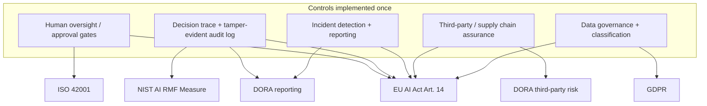
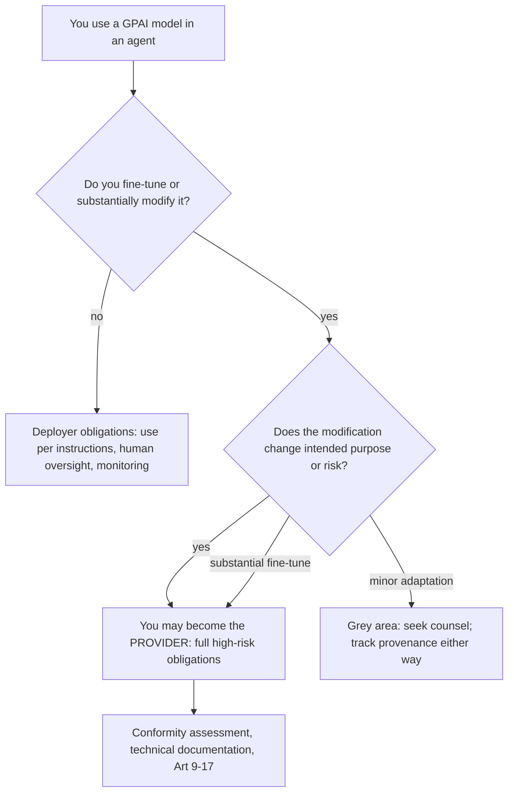
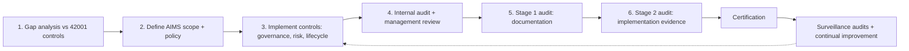

# 11. Regulatory Alignment

> **The "so what":** Security controls protect the business; regulatory alignment keeps it legal. As of 2026 the rules that govern autonomous agents are no longer draft guidance, they are enforceable law with real penalties: the EU AI Act's high-risk obligations become enforceable on 2 August 2026, with fines up to €35 million or 7% of global annual turnover. This chapter maps the frameworks that matter (EU AI Act, NIST AI RMF, DORA, ISO 42001) to concrete agent controls, and shows how they combine into a single shared control graph so you implement each control once and satisfy several regimes at once.

---

## 11.1 Why alignment is now an engineering concern

Regulation used to arrive years after technology. For agentic AI the gap has closed. The EU AI Act is in force, its high-risk provisions become enforceable on 2 August 2026, and the EU AI Office has direct powers over general-purpose AI (GPAI) models. Financial-services regulators apply DORA to ICT resilience, and ISO/IEC 42001 gives auditors a certifiable AI management-system standard. Alignment is therefore an engineering concern: the controls a regulator will ask about are the same controls in [chapters 03 to 10](03-governance-framework.md), and the evidence they will demand is produced by the logging, testing, and governance you have already built.

> **Note:** This chapter is guidance for engineers and risk owners, not legal advice. Regulatory scope and thresholds depend on your jurisdiction, sector, and specific use case. Confirm classification and obligations with qualified counsel.

---

## 11.2 EU AI Act: classifying and governing agents

The Act classifies systems by risk. Agentic systems most often land in the high-risk or limited-risk tiers.

| Risk level | Applicability to agents | Key requirements |
|----|----|----|
| **Unacceptable** | Rare; e.g. an agent performing autonomous social scoring | Prohibited |
| **High risk** | Most finance agents: credit scoring, fraud detection, trade execution, regulatory reporting | Conformity assessment, risk management system, data governance, transparency, human oversight, accuracy, cybersecurity, post-market monitoring |
| **Limited risk** | Agents with transparency duties, e.g. customer-facing chatbots | Inform users they are interacting with an AI system |
| **Minimal risk** | Internal document processing, low-impact automation | Voluntary codes of conduct |

### Three engineering implications that changed in 2026

- **Article 14 requires real human oversight.** Meaningful human control must be designed in, and a rubber-stamp approval is explicitly non-compliant. Your approval gates ([chapter 03](03-governance-framework.md)) must give the human genuine capacity to understand, intervene, and stop the agent, not merely a button that logs consent.
- **The provider/deployer divide turns on fine-tuning.** If you fine-tune a model, you can become its provider under the Act, inheriting provider obligations rather than the lighter deployer duties. Track fine-tuning provenance ([chapter 06](06-supply-chain-security.md)) because it determines your legal role, not just your security posture.
- **The EU AI Office has GPAI powers.** General-purpose models that underlie agents face their own obligations, and the AI Office can act on them directly. Know which GPAI models sit under your agents and what their providers attest.

> **Warning:** Penalties are structured to matter at board level: up to €35 million or 7% of global annual turnover for the most serious breaches. High-risk obligations become enforceable on 2 August 2026, so classification and conformity work started before that date, not after an incident.

---

## 11.3 NIST AI Risk Management Framework

The NIST AI RMF is voluntary but widely used as the structure auditors and boards recognise. Its four functions map cleanly onto the agent lifecycle.

| NIST function | Agentic system application |
|----|----|
| **Govern** | Establish the agent classification matrix, define policy layers, run periodic audits ([ch. 03](03-governance-framework.md)) |
| **Map** | Document agent purpose, scope, data sources, tool dependencies, and risk |
| **Measure** | Quantify injection resistance, decision-trace completeness, tool-abuse and anomaly rates ([ch. 09](09-testing-evaluation.md)) |
| **Manage** | Enforce approval gates, circuit breakers, and kill switches; run the governance lifecycle ([ch. 04](04-security-controls.md)) |

The RMF's value is that its Measure function forces you to express security as numbers, which is exactly the metrics discipline from [chapter 09](09-testing-evaluation.md). If you already publish an injection resistance score and decision-trace completeness on a dashboard, you have most of what the Measure function asks for.

---

## 11.4 DORA and operational resilience

The Digital Operational Resilience Act requires EU financial entities to manage ICT-related incidents, and agentic systems are ICT systems.

| DORA requirement | Application to agents |
|----|----|
| **ICT risk management** | Include agents in the ICT risk register; assess injection, tool abuse, and memory corruption |
| **Incident reporting** | Report major ICT incidents involving agents within the regulatory deadline; provide root-cause analysis within 72 hours |
| **Testing** | Include agentic attack vectors in penetration tests and resilience testing ([ch. 09](09-testing-evaluation.md)) |
| **Third-party risk** | Assess model providers and tool integrations as third-party ICT providers ([ch. 06](06-supply-chain-security.md)) |

DORA is where your incident response plan ([chapter 12](12-incident-response.md)) meets a legal clock. Define in advance what constitutes a "major" incident for an agent (financial loss above a threshold, data breach, regulatory impact), and automate detection and reporting from your monitoring so the clock starts on time.

---

## 11.5 ISO/IEC 42001

ISO/IEC 42001 is the international standard for an AI management system (AIMS). It is certifiable, which makes it the framework that turns your internal governance into third-party-attestable assurance. It complements the others: where the EU AI Act tells you what is required by law and NIST gives you a risk structure, ISO 42001 gives you the management-system scaffolding (policies, roles, objectives, continual improvement) that an external auditor can certify. The governance lifecycle in [chapter 03](03-governance-framework.md) and the continuous evaluation pipeline in [chapter 09](09-testing-evaluation.md) are the operational substance an ISO 42001 audit examines.

---

## 11.6 The shared control graph

The frameworks overlap heavily. Implementing one control usually satisfies several regimes, so the efficient approach is to maintain a single control graph and map each control to every framework it serves. GDPR sits alongside the others wherever personal data flows through an agent's memory or outputs.



| Control | EU AI Act | NIST AI RMF | DORA | ISO 42001 | GDPR |
|----|----|----|----|----|----|
| Human oversight / approval gates | Article 14 | Manage | Resilience | AIMS controls | - |
| Decision trace + audit log | Transparency, cybersecurity | Measure | Incident evidence | Monitoring | Accountability |
| Incident detection + reporting | Post-market monitoring | Manage | Incident reporting | Improvement | Breach notification |
| Supply chain / third-party assurance | Data governance | Map | Third-party risk | Supplier controls | Processor duties |
| Data classification + retention | Data governance | Map | ICT risk | AIMS controls | Data minimisation |

> **Tip:** Do not build a compliance programme per regulation. Build the control once, instrument it to produce evidence, and map that evidence to every framework it satisfies. The mapping table above and the [risk assessment template](../assets/templates/risk_assessment.md) are the starting artefacts.

---

## 11.8 EU AI Act: the articles that bind agents

Section 11.2 classified agents by risk tier. This section maps the specific high-risk obligations to the controls that satisfy them, because "high-risk" is not one duty but a set of articles, each answered by machinery you have already built in earlier chapters. High-risk obligations become fully enforceable on 2 August 2026.

| Article | Obligation | Satisfied by | Chapter |
|----|----|----|----|
| **Art 9** | Risk management system: a continuous, documented process across the lifecycle | Governance lifecycle + classification matrix + risk assessment | [ch. 03](03-governance-framework.md) |
| **Art 10** | Data governance: training/validation data quality, relevance, bias management | Data classification, provenance, memory lifecycle | [ch. 04](04-security-controls.md), [ch. 06](06-supply-chain-security.md) |
| **Art 12** | Record-keeping: automatic logging of events over the system's lifetime | Tamper-evident decision-trace + audit log | [ch. 04](04-security-controls.md) |
| **Art 13** | Transparency: deployers can interpret output and use the system correctly | Decision-trace, documented purpose, AI system register | [ch. 03](03-governance-framework.md) |
| **Art 14** | Human oversight: meaningful ability to understand, intervene, and stop | Approval gates + kill switch, not a rubber stamp | [ch. 03](03-governance-framework.md), [ch. 10](10-production-deployment.md) |
| **Art 17** | Quality management system: documented policies, procedures, accountability | ISO 42001-aligned AIMS + governance committee | 11.10, [ch. 03](03-governance-framework.md) |

### Article 9: risk management system

Article 9 requires a risk management system that runs continuously across the lifecycle, not a one-off assessment. This is exactly the governance lifecycle from [chapter 03](03-governance-framework.md): identify risks per the classification matrix, apply controls, monitor, and re-derive on material change. The evidence is the risk assessment on file for each agent and the record that it is revisited.

### Article 10: data governance

Article 10 concerns the quality and governance of data. For agents this reaches beyond training data to the data the agent retrieves and writes: the memory lifecycle, provenance tagging, and ingestion scanning from [chapter 04](04-security-controls.md), and the supply-chain provenance of any fine-tuning data from [chapter 06](06-supply-chain-security.md).

### Article 13: transparency

Article 13 requires that deployers can understand and correctly use the system's output. The decision trace (4.5) is the substance here: it lets a human see why the agent acted, which is what makes the output interpretable rather than an oracle.

### Article 14: human oversight

Article 14 is the one that most often catches agent deployments, because autonomy is in direct tension with oversight. Meaningful human control must be designed in, and a rubber-stamp approval is explicitly non-compliant. Your approval gates ([chapter 03](03-governance-framework.md)) must give the human genuine capacity to understand, intervene, and stop the agent. The kill switch ([chapter 10](10-production-deployment.md)) is the "stop" half of Article 14 made real.

### Article 17: quality management system

Article 17 requires a documented quality management system covering policies, procedures, and accountability. This maps directly onto an ISO 42001 AI management system (11.10) and the governance committee (3.13). If you are ISO 42001 certified, you have most of the Article 17 substance already.

> **Warning:** Articles 9, 13, and 14 are not satisfiable after the fact. A decision trace you did not capture cannot be reconstructed for Article 13, and an oversight process you cannot evidence does not count for Article 14. The controls must be in place before the high-risk agent operates, which is why classification and conformity work start well before 2 August 2026, not after an incident.

---

## 11.9 The provider/deployer divide and fine-tuning

The Act imposes heavier obligations on the *provider* of a high-risk system than on the *deployer* who merely uses it. For agent teams the dividing line is often fine-tuning, and getting your role wrong is a compliance error with real cost.



- **Deployer** obligations are the lighter set: use the system according to the provider's instructions, ensure human oversight, monitor operation, and keep logs.
- **Provider** obligations are the full high-risk set: conformity assessment, technical documentation, the Article 9-17 duties above, and post-market monitoring.
- **Fine-tuning can flip you from deployer to provider.** If you fine-tune a general-purpose model, or substantially modify a high-risk system, you can inherit provider obligations. The determining factor is whether your modification changes the system's intended purpose or risk profile.

The practical consequence: track fine-tuning provenance ([chapter 06](06-supply-chain-security.md)) because it determines your legal role, not just your security posture. The `frameworks` and model-provenance fields in the agent registry (3.11) are where this is recorded. Separately, the EU AI Office holds direct powers over the GPAI models that underlie agents, so you must also know which GPAI model sits under each agent and what its provider attests.

> **Warning:** Teams routinely assume they are deployers because "we just use an API". The moment you fine-tune, you may have become a provider and taken on the full high-risk obligation set, often without realising it. Record every fine-tune and confirm your resulting legal role with counsel before that agent goes to production.

---

## 11.10 ISO/IEC 42001 certification pathway

Section 11.5 introduced ISO/IEC 42001 as the certifiable AI management system standard. This section sketches the pathway, because certification is how internal governance becomes third-party-attestable assurance, and it maps neatly onto EU AI Act Article 17.



| Stage | What it involves | Where the substance comes from |
|----|----|----|
| Gap analysis | Compare current practice to the 42001 Annex controls | Existing governance ([ch. 03](03-governance-framework.md)) |
| AIMS scope and policy | Define which AI systems are in scope and the governing policy | Agent registry + committee (3.11, 3.13) |
| Control implementation | Governance, risk management, lifecycle, monitoring | Chapters 03, 04, 09, 10 |
| Internal audit | Verify controls operate as documented | Continuous evaluation ([ch. 09](09-testing-evaluation.md)) |
| Certification audit | Stage 1 (docs) then Stage 2 (evidence) by an accredited body | AI system register, audit logs, metrics |
| Surveillance | Periodic re-audit; continual improvement | Governance lifecycle feedback loop |

The point worth internalising: an ISO 42001 audit examines the operational substance you already produce. The governance lifecycle (3.6), the continuous evaluation pipeline (9.5), the AI system register (3.12), and the tamper-evident audit log (4.5) are precisely the evidence an auditor asks for. Certification is largely a matter of organising and evidencing what a well-run agent programme already does.

> **Tip:** Pursue ISO 42001 and EU AI Act conformity together, not as separate projects. Article 17's quality-management requirement and the 42001 AIMS are close enough that one implementation, well evidenced, serves both. This is the shared-control-graph principle (11.6) applied at the management-system level.

---

## 11.11 DORA: the ICT risk register for agents

Section 11.4 covered DORA at a high level. Operationally, the artefact DORA most concretely demands for agents is their inclusion in the ICT risk register with agent-specific risks assessed. An agent is an ICT system, and its distinctive failure modes must appear in the register alongside conventional systems.

A DORA ICT risk register entry for an agent should capture:

| Register field | Agent-specific content |
|----|----|
| Asset / system | The agent, its registry ID (3.11), and its classification |
| ICT risks | Prompt injection, tool abuse, memory corruption, excessive agency, denial-of-wallet |
| Impact assessment | Financial loss ceiling, irreversibility, customer and regulatory impact |
| Controls | The defence-in-depth layers ([ch. 04](04-security-controls.md)), approval gates, kill switch |
| Third-party dependencies | Model provider, MCP servers, framework vendors ([ch. 06](06-supply-chain-security.md), [ch. 08](08-mcp-and-protocols.md)) |
| Incident classification | The threshold at which an agent event becomes a "major" ICT incident |
| Recovery objectives | RTO/RPO, rollback time (10.9), kill-switch response time (10.10) |

DORA also puts your incident response on a legal clock: major ICT incidents involving agents must be reported within the regulatory deadlines, with root-cause analysis following. Define in advance what makes an agent incident "major" (financial loss above a threshold, data breach, regulatory impact) and automate detection and reporting from your monitoring ([chapter 10](10-production-deployment.md)) so the clock starts on time. The incident response plan in [chapter 12](12-incident-response.md) is where this is operationalised.

> **Note:** DORA's third-party ICT risk provisions apply to your model provider and tool integrations. A model API or an external MCP server is a third-party ICT provider, and its concentration risk (what happens if that single provider fails or is compromised) belongs in the register. Agent supply-chain assurance ([chapter 06](06-supply-chain-security.md)) is the evidence for this DORA requirement.

---

## 11.12 NIS2 and its interaction with DORA

NIS2 is the EU's network-and-information-security directive, raising cybersecurity and incident-reporting obligations across essential and important entities. Where DORA is the sector-specific regime for financial entities, NIS2 is the horizontal baseline for a wider set of sectors, and the two interact.

- **Lex specialis.** For financial entities, DORA generally takes precedence as the more specific regime (lex specialis) for ICT risk and incident reporting, while NIS2 sets the broader baseline. In practice a financial entity meets its ICT obligations chiefly through DORA, but should confirm the boundary for its specific situation.
- **Overlapping incident reporting.** Both regimes require timely incident reporting, and an agent incident can trigger obligations under more than one regime at once. Your incident classification (11.11) and reporting automation must map a single event to every regime it touches, so nothing is missed and nothing is double-counted incorrectly.
- **Supply-chain security.** NIS2 places explicit emphasis on supply-chain security, which for agents reinforces the model-and-dependency assurance of [chapter 06](06-supply-chain-security.md) and the protocol trust controls of [chapter 08](08-mcp-and-protocols.md).

> **Tip:** Treat NIS2 and DORA reporting as one detection pipeline with a routing layer, not two. When your monitoring flags a major agent incident, the same event record should drive whichever notifications apply. Maintaining two disconnected reporting processes is how a deadline gets missed under one regime while being met under the other.

---

## 11.13 Basel III/IV interactions for trading and credit agents

For agents that make or influence trading, credit, or capital decisions, the prudential frameworks (Basel III and the finalising Basel IV reforms) interact with AI governance in ways that pure-security teams often miss. These frameworks govern operational risk capital, model risk, and risk-data aggregation, and an autonomous agent touches all three.

- **Operational risk.** Losses from a misbehaving agent (the Step Finance class of event) are operational-risk losses. Under Basel's operational-risk framework these feed loss data and, potentially, capital. A Class D trading agent is an operational-risk exposure that belongs in that programme, not only in the security backlog.
- **Model risk management.** Supervisory model-risk expectations (for example the spirit of SR 11-7 and equivalent EU guidance) apply to models that drive financial decisions. An agent's reasoning model and any decision models it invokes are in scope: they need validation, documented limitations, and ongoing performance monitoring, which aligns with the testing and evaluation discipline of [chapter 09](09-testing-evaluation.md).
- **Risk-data aggregation (BCBS 239).** Agents that produce or transform risk data must not undermine the accuracy, completeness, and traceability that BCBS 239 requires. The decision trace and data-provenance controls ([chapter 04](04-security-controls.md)) are what preserve that traceability when an agent sits in the data path.

| Prudential concern | Agent implication | Control alignment |
|----|----|----|
| Operational risk capital | Agent losses are op-risk losses | Incident data, loss thresholds (11.11) |
| Model risk management | Agent models need validation + monitoring | Testing, metrics ([ch. 09](09-testing-evaluation.md)) |
| Risk-data aggregation (BCBS 239) | Traceable, accurate risk data | Decision trace, provenance ([ch. 04](04-security-controls.md)) |

> **Warning:** A trading agent is simultaneously an EU AI Act high-risk system, a DORA ICT asset, and a Basel operational-and-model-risk exposure. These are not alternative lenses; they apply at once. The shared control graph (11.6) is what keeps this manageable: the same decision trace, validation, and oversight evidence serves the AI Act, DORA, and the prudential frameworks together.

---

## 11.14 The fines and enforcement landscape

Penalties are structured to matter at board level, which is what has made regulatory alignment an engineering priority rather than a paperwork exercise. The headline figures:

| Regime | Maximum penalty | Trigger |
|----|----|----|
| EU AI Act | EUR 35m or 7% of global annual turnover (whichever higher) | Prohibited-practice or most serious breaches |
| EU AI Act | EUR 15m or 3% of turnover | Breach of most high-risk obligations (Art 9-17) |
| EU AI Act | EUR 7.5m or 1% of turnover | Supplying incorrect information to authorities |
| GDPR | EUR 20m or 4% of turnover | Serious data-protection breaches (often concurrent) |
| DORA | Member-state and supervisory penalties + remediation orders | ICT risk-management and reporting failures |
| NIS2 | Up to EUR 10m or 2% of turnover (essential entities) | Cybersecurity and reporting failures |

The turnover-percentage structure is deliberate: for a large group, 7% of global turnover dwarfs any fixed cap, so the penalty scales with the entity's size and the board cannot treat it as a cost of doing business. Penalties can also stack: a single agent incident that leaks personal data and is under-reported can attract both GDPR and DORA/NIS2 consequences, on top of any AI Act exposure.

> **Warning:** The EU AI Act's high-risk obligations are enforceable from 2 August 2026, and the fine structure means non-compliance is a board-level financial risk, not a technical footnote. The defensible position is evidence: the classification, the decision traces, the oversight records, and the risk assessments that show the obligations were met. Alignment is cheaper than the fine, and far cheaper than the fine plus the incident that exposed it.

---

## 11.15 GDPR and agent memory

Agents that retain context introduce data-protection obligations that traditional stateless software avoids. Agent memory is personal-data processing whenever it stores information about identifiable people.

| GDPR principle | Agent implication |
| --- | --- |
| Purpose limitation | Memory used only for the task it was collected for |
| Data minimisation | Store the minimum context needed, not the whole conversation |
| Storage limitation | Time-bound memory with automatic expiry |
| Accuracy | Mechanisms to correct data the agent has retained |
| Right to erasure | Ability to delete an individual's data from agent memory |
| Right of access | Ability to export what the agent holds about a person |

- Scoped, expiring memory is both a security control and a data-protection control.
- Automated decisions with legal or similarly significant effect engage Article 22 and require human review.
- Where an agent profiles individuals, a data protection impact assessment is likely required.

> **Warning:** "The model remembered it" is not a lawful basis for processing. If an agent retains personal data, that retention needs the same legal basis, retention limit, and erasure capability as any other data store.

## 11.16 Cross-border data transfer

Agents frequently call models and tools hosted in other jurisdictions, which can constitute an international transfer of personal data.

- Identify where each model and tool provider processes data, including sub-processors.
- Ensure an appropriate transfer mechanism is in place, such as standard contractual clauses or an adequacy decision.
- Consider data residency requirements that may prohibit sending certain data to particular regions.
- Log the destination of data for each tool call so transfers are auditable.

| Scenario | Transfer consideration |
| --- | --- |
| EU data to US-hosted model | Transfer mechanism required |
| Data to provider with global sub-processors | Map and assess each region |
| Regulated data (health, financial) | Residency limits may apply |
| On-premises or in-region model | Transfer avoided |

## 11.17 Per-jurisdiction summary

The regulatory picture differs by region. The table gives a high-level orientation, not legal advice.

| Jurisdiction | Instrument | Agent-relevant focus |
| --- | --- | --- |
| European Union | AI Act, GDPR, DORA, NIS2 | Risk tiering, data protection, operational resilience |
| United Kingdom | Sector regulators, UK GDPR | Principles-based, regulator-led |
| United States | Sectoral, state laws, executive action | Fragmented, sector-specific |
| Financial sector (global) | Basel, DORA, local rules | Model risk, operational resilience |
| ISO adopters (global) | ISO/IEC 42001 | AI management system certification |

- The EU AI Act is the most prescriptive and sets the pace internationally.
- Financial-sector rules add model-risk and resilience obligations on top of general AI regulation.
- ISO/IEC 42001 provides a certifiable management-system route that travels across jurisdictions.

## 11.18 Conformity-assessment checklist

For high-risk systems under the EU AI Act, the following checklist maps day-to-day evidence to the regulatory articles.

```
CONFORMITY EVIDENCE CHECKLIST (high-risk AI system)

RISK MANAGEMENT (Art 9)
[ ] Documented, continuous risk management process
[ ] Residual risks identified and justified

DATA GOVERNANCE (Art 10)
[ ] Training/validation data quality documented
[ ] Bias examination performed and recorded

RECORD-KEEPING (Art 12)
[ ] Automatic logging of events over system lifetime
[ ] Logs retained and tamper-evident

TRANSPARENCY (Art 13)
[ ] Instructions for use provided to deployers
[ ] Capabilities and limitations disclosed

HUMAN OVERSIGHT (Art 14)
[ ] Effective human oversight measures in place
[ ] Ability to intervene and stop the system

ACCURACY & ROBUSTNESS (Art 15)
[ ] Accuracy metrics defined and met
[ ] Cybersecurity and resilience measures tested

QUALITY MANAGEMENT (Art 17)
[ ] Quality management system documented
[ ] Post-market monitoring plan in place
```

- The checklist is evidence-driven: each item links to an artefact, not an assertion.
- Many items map directly to controls elsewhere in this book, so conformity is a by-product of good engineering.
- Record-keeping (Art 12) and human oversight (Art 14) map to the audit log and kill switch respectively.

> **Tip:** Build the conformity evidence as you build the system, not at assessment time. A system engineered with the controls in this handbook will already have most of the evidence the assessment requires.

## 11.19 Mapping controls to obligations

The most efficient path to compliance is to recognise that the controls in this handbook already satisfy most regulatory obligations. The mapping below makes that explicit.

| Control (this book) | Obligation satisfied |
| --- | --- |
| Audit log (Ch 2, 4) | AI Act Art 12 record-keeping; DORA logging |
| Kill switch (Ch 3, 10) | AI Act Art 14 human oversight |
| Risk classification (Ch 3) | AI Act Art 9 risk management |
| Test suite + SLOs (Ch 9) | AI Act Art 15 accuracy and robustness |
| NHI governance (Ch 5) | Access control across all frameworks |
| Incident response (Ch 12) | DORA and NIS2 reporting clocks |
| Data-minimised memory (Ch 2) | GDPR minimisation and storage limits |

- Compliance becomes evidence collection rather than new work when controls are built first.
- Each row links a concrete engineering artefact to a specific legal expectation.
- The gaps that remain are typically documentation, not missing controls.
- Maintaining the matrix as controls change keeps compliance current rather than a point-in-time snapshot.

> **Tip:** Keep a living control-to-obligation matrix. When a regulator or auditor asks how an obligation is met, the answer is a control name and a link to its evidence, not a scramble to build something new.

## 11.7 Key takeaways

- Regulatory alignment is now an engineering concern with real penalties: the EU AI Act's high-risk obligations are enforceable from 2 August 2026, with fines up to €35 million or 7% of turnover.
- Article 14 requires genuine human oversight; a rubber-stamp gate is non-compliant. Fine-tuning can make you the provider, so track model provenance for legal reasons as well as security.
- NIST AI RMF's Measure function is the metrics discipline you already run; DORA puts your incident response on a legal clock; ISO 42001 makes your governance externally certifiable.
- The frameworks overlap. Maintain one shared control graph, implement each control once, and map its evidence to every regime it satisfies, including GDPR where personal data flows.
- Confirm your specific classification and obligations with qualified counsel; this chapter is engineering guidance, not legal advice.

---

| Previous | Next |
|----|----|
| [10. Production Deployment](10-production-deployment.md) | [12. Incident Response for Agentic Systems](12-incident-response.md) |
