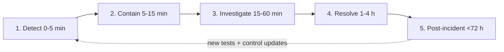
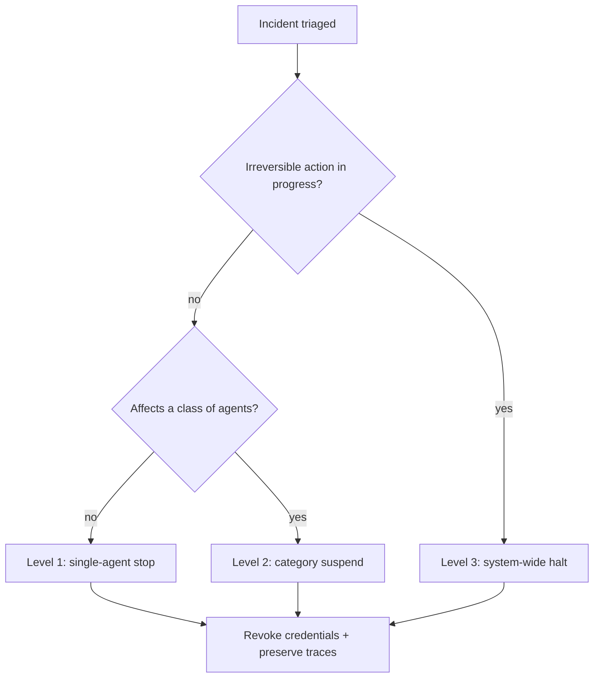
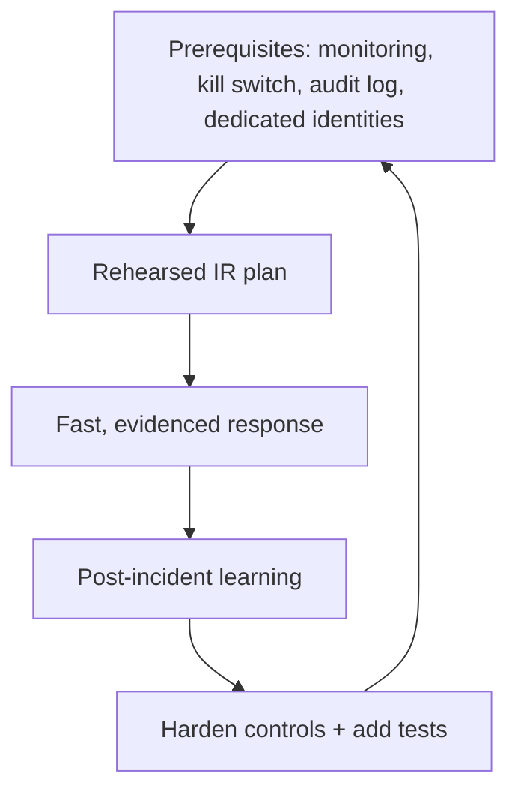

# 12. Incident Response for Agentic Systems

> **The "so what":** Every other chapter tries to prevent an incident. This one assumes prevention failed. Agentic incidents are different from traditional ones because the attacker's leverage is an actor that already holds your credentials and can act autonomously and fast: Step Finance lost roughly $40 million in January 2026, and the Mexican government breach (December 2025 to February 2026) exfiltrated around 195 million records across nine agencies using agentic tooling. This chapter gives you a five-phase response plan, an agent-specific forensics approach, containment playbooks, communication templates, and the reporting discipline that regulators now require, all built on the audit trail you put in place earlier.

---

## 12.1 What makes agentic incident response different

Three properties make an agent incident harder than a conventional one.

- **Speed.** An autonomous agent can take thousands of actions before a human notices. Containment measured in minutes, not hours, is the difference between a contained event and a catastrophic one.
- **Attribution.** The action was taken by a non-human identity, possibly delegated through several sub-agents ([chapter 08](08-mcp-and-protocols.md)). Without dedicated identities ([chapter 05](05-identity-and-secrets.md)) and a full decision trace ([chapter 04](04-security-controls.md)), you cannot say which agent did what, on whose behalf, with which credential.
- **Reversibility.** Some agent actions (a trade, a deletion, an email to a customer) cannot be undone. Response has to prioritise stopping further action over investigating the current one.

The single most important prerequisite is already in place if you followed this handbook: a tamper-evident decision trace and audit log ([`../code/python/audit_logger.py`](../code/python/audit_logger.py)). You cannot investigate what you did not record, and a mutable log is one an attacker edits on the way out.

These differences change how the classic incident-response phases apply. The table contrasts the traditional expectation with the agentic reality so the plan that follows makes sense.

| Dimension | Traditional incident | Agentic incident |
|----|----|----|
| Pace of harm | Hours to days | Seconds to minutes |
| Actor | Human attacker or malware | Autonomous identity with real credentials |
| Attribution | IP, user account | Non-human identity across a delegation chain |
| Reversibility | Often recoverable | Often irreversible (trades, deletions, sends) |
| First priority | Investigate then contain | Contain then investigate |
| Key evidence | System and network logs | Decision trace and reasoning |

> **Warning:** The Step Finance loss and the Mexican government breach both turned on excessive agency and autonomy, an agent doing far more, far faster, than anyone intended. Assume your worst-case incident is measured in the number of actions per minute your agent can take multiplied by the time until someone can stop it. Shrink both factors before you need to.

### The readiness gap

Industry data shows most organisations are not ready for this. Roughly 60% of organisations running agents cannot terminate a misbehaving agent quickly, around 48% run agents with inadequate monitoring, and a majority lack an agent-specific incident plan at all. The result is that the two factors above (actions per minute and time-to-stop) are both large in most deployments.

- **No kill switch means no containment.** If you cannot stop the agent, phase 2 does not exist, and the incident runs until the underlying system is taken down, which is slower and more damaging.
- **No monitoring means no detection.** If nothing watches the agent, phase 1 never fires and the first sign of the incident is the loss itself.
- **No plan means improvisation.** An incident is the worst time to design a response. The gap is closed before the incident, not during it.

---

## 12.2 The five-phase response plan

The phases below extend the classic detect-contain-investigate-resolve cycle with the timing and evidence needs of autonomous systems. The [incident report template](../assets/templates/incident_report.md) captures the output of each phase.



The timings are targets, not guarantees, and they exist to force a bias toward speed in the phases where speed matters most (detection and containment) and toward thoroughness where it matters most (investigation and post-incident). The table summarises the goal, the owner, and the key output of each phase.

| Phase | Target window | Goal | Primary output |
|----|----|----|----|
| 1. Detect | 0-5 min | Recognise something is wrong | Alert acknowledged, triage started |
| 2. Contain | 5-15 min | Stop further action | Kill switch applied, credentials revoked |
| 3. Investigate | 15-60 min | Understand what and why | Root cause, scope, data impact |
| 4. Resolve | 1-4 h | Fix and safely resume | Validated fix, enhanced monitoring |
| 5. Post-incident | <72 h | Learn and report | Post-mortem, new tests, regulatory filing |

### Phase 1: Detection (0-5 minutes)

An automated alert fires on anomaly detection or a circuit-breaker trip ([chapter 04](04-security-controls.md)). The on-call engineer receives the agent ID, action type, and anomaly description, acknowledges, and begins investigation. Detection quality depends entirely on the monitoring you deployed; an unmonitored agent has no phase 1.

- **Sources.** Anomaly detectors, circuit-breaker trips, permission-denial spikes, egress alerts, rug-pull detection ([chapter 08](08-mcp-and-protocols.md)), and human reports.
- **Triage.** Classify severity immediately using the pre-agreed criteria (12.5) so the reporting clock and escalation start without waiting for analysis.
- **Acknowledge.** The on-call engineer takes ownership within the window, because an unacknowledged alert is an incident nobody is handling.
- **Escalate on no-ack.** Configure the alerting system to escalate automatically if the first responder does not acknowledge within the window, so a missed page does not silently extend the incident.

### Phase 2: Containment (5-15 minutes)

Determine scope (single agent, category, or system-wide) and apply the appropriate kill-switch level ([chapter 10](10-production-deployment.md)). Preserve decision-trace logs for forensics before anything is restarted. Notify stakeholders by impact classification. In an agentic incident, containment comes before investigation, because every minute the agent runs is more irreversible action.

> **Tip:** Revoke the agent's credentials as part of containment, not after it. Because agents use short-lived, scoped credentials ([chapter 05](05-identity-and-secrets.md)), revocation plus a kill switch closes both the action path and the authentication path at once, and any delegated sub-agent grants expire with them.

### Phase 3: Investigation (15-60 minutes)

Reconstruct the agent's decision path from the traces. Identify the root cause: injection, misconfiguration, tool failure, supply chain compromise, or reasoning error. Determine what data was affected and what actions were taken, and assess whether the issue is isolated or systemic (for example, a poisoned tool or model that affects every agent using it).

- **Verify integrity before analysis.** Confirm the audit-log hash chain is intact before drawing conclusions, because an altered log misleads the whole investigation.
- **Scope before you resolve.** Decide whether the cause is isolated to one agent or shared (a corpus, tool, or model), because that decision determines whether the fix in phase 4 is local or fleet-wide.

### Phase 4: Resolution (1-4 hours)

Apply the fix: patch the prompt, tighten permissions, adjust guardrails, rotate credentials, or roll back the version ([chapter 10](10-production-deployment.md)). Validate the fix in staging against the adversarial suite ([chapter 09](09-testing-evaluation.md)), then resume production under enhanced monitoring.

### Phase 5: Post-incident (within 72 hours)

Complete a post-mortem with timeline, root cause, and corrective actions. Update the agent's classification if impact was underestimated, add new test cases to the adversarial suite so the failure mode cannot silently return, and communicate lessons to engineering and governance. The 72-hour window is not arbitrary: it aligns with DORA's root-cause reporting deadline ([chapter 11](11-regulatory-alignment.md)).

---

## 12.3 The containment playbook by kill-switch level

Containment is the phase where agentic incident response most differs from the traditional kind, and it depends on the graduated kill switch from [chapter 10](10-production-deployment.md). Choosing the right level is a trade-off between stopping harm and preserving service, and it should be a decision made against pre-agreed criteria, not improvised under pressure.



| Level | Scope | When to use | Trade-off |
|----|----|----|----|
| Level 1 | A single agent instance | Isolated misbehaviour, one agent | Minimal service impact; wrong if the issue is systemic |
| Level 2 | A category of agents | A shared tool, model, or prompt is implicated | Suspends a capability; contains a systemic cause |
| Level 3 | System-wide | Irreversible harm in progress or scope unknown | Maximum disruption; the right call when in doubt about scale |

**Executing containment at any level:**

1. **Apply the kill switch** at the chosen level, stopping the agent's ability to act.
2. **Revoke credentials** immediately so the authentication path closes with the action path, and delegated grants expire ([chapter 05](05-identity-and-secrets.md)).
3. **Preserve evidence before restart.** Snapshot decision traces, the audit-log segment, context windows, and configurations; remediation must not overwrite them.
4. **Freeze downstream where possible.** For financial actions, alert payment rails or trading systems to hold or reverse in-flight actions if the window allows.
5. **Confirm containment.** Verify the agent is actually stopped and cannot be restarted by an automated scheduler or a peer's delegation before moving on.

### Scenario playbooks

The generic phases apply to every incident, but the first containment move differs by incident class. Keep a short playbook per class so the on-call engineer does not reason from first principles under pressure. The table maps the common agentic incident classes to their first containment move and their most useful evidence source.

| Incident class | First containment move | Best early evidence | Likely root cause |
|----|----|----|----|
| Indirect prompt injection to exfiltration | Level 2 (agent category sharing the corpus) | Egress logs + retrieval trace | Poisoned document in RAG source |
| Rug-pulled or poisoned tool | Level 2 (all agents using the tool) | Tool version/hash + call logs | Supply-chain compromise (06) |
| Runaway autonomous loop | Level 1, escalate to 3 if spreading | Action-rate metrics | Reasoning error or missing guardrail |
| Compromised non-human identity | Revoke credential first, then Level 1 | Identity + delegation logs | Leaked or over-scoped secret (05) |
| Sub-agent privilege escalation | Level 2 across the delegation graph | Delegation chain log (08) | Token inheritance flaw |
| Data-poisoning of memory store | Level 2, quarantine the store | Memory write logs | Unvalidated write to shared memory |

- **Match the level to the blast radius, not the symptom.** A single noisy agent may be the visible edge of a shared-tool compromise; the playbook points you at the shared cause.
- **Revoke first for identity incidents.** When the credential itself is compromised, stopping one agent instance leaves the credential usable elsewhere; revocation is the real containment.
- **Quarantine, do not delete, poisoned artefacts.** The poisoned document, tool, or memory record is evidence; isolate it so forensics and the new test case can use it.

> **Warning:** When scope is uncertain, escalate the kill-switch level rather than gambling on the lowest one. An agent incident that is actually systemic will outrun a single-agent stop, and the minutes lost re-containing at a higher level are exactly the minutes in which irreversible actions accumulate. Over-containment is recoverable; under-containment may not be.

---

## 12.4 Agent-specific forensics

Traditional forensics reconstructs what a system did. Agent forensics must also reconstruct why the agent decided to do it, because the vulnerability is often in the reasoning, not the code.

- **Reconstruct the decision path.** Walk the decision trace step by step: what was in the context window, what the agent reasoned, which tool it chose, and why. The trace format from [chapter 04](04-security-controls.md) is designed for exactly this replay.
- **Verify log integrity first.** Before trusting the logs, verify the hash chain in the audit log. The reference logger's chain verification proves the record was not altered; a broken chain is itself a finding.
- **Find the injection source.** If the cause was injection, identify the exact untrusted content (user input, a retrieved document, a tool output, a peer agent's message) that carried the payload, and how it reached a trusted position.
- **Trace the delegation graph.** For multi-agent incidents, follow the delegation chain to see which agent initiated the action and how authority flowed ([chapter 08](08-mcp-and-protocols.md)). Sub-agent token inheritance is a common escalation path.
- **Assess data impact.** Use the egress and data-flow logs ([chapter 04](04-security-controls.md)) to determine precisely what data left the system and where it went.

### A decision-trace forensics methodology

Reconstructing why an agent acted follows a repeatable method. The aim is to move from the harmful action backward to the untrusted content that caused it, and forward again to everything that content touched.

1. **Anchor on the harmful action.** Start from the action that caused harm (the transfer, the deletion, the send) and its trace entry, with its timestamp and the agent identity.
2. **Walk backward through the reasoning.** Read the reasoning steps that led to the action: what the agent concluded, what tool it selected, and what context it was working from.
3. **Identify the pivot.** Find the step where the agent's behaviour diverged from intended, the point at which injected or poisoned content took effect.
4. **Locate the source.** Trace that content to its entry: which input, document, tool output, or peer message carried it, and which control should have caught it.
5. **Map the blast radius.** From the pivot forward, enumerate every action and data access the compromised reasoning produced, so remediation and notification cover all of it.
6. **Confirm with integrity.** Cross-check the reconstruction against the verified hash chain, so the timeline you present is provably unaltered.

| Forensic question | Evidence source | Control that produced it |
|----|----|----|
| What action caused harm? | Action trace entry | Decision-trace logging (04) |
| Why did the agent act? | Reasoning steps in the trace | Decision-trace logging (04) |
| What content triggered it? | Input, retrieval, tool, peer logs | Input validation, egress logs (04) |
| Who delegated to whom? | Delegation chain log | A2A logging (08) |
| Was the record altered? | Hash-chain verification | Tamper-evident audit log (04) |
| What data was affected? | Egress and data-flow logs | Data-flow monitoring (04) |

The first step of any agent forensic exercise is proving the log itself is trustworthy. The reference audit logger chains each record to the hash of the previous one, so any tampering breaks the chain at the point of edit. Verify it before you rely on a single entry.

```python
# Verify the integrity of an agent audit-log segment before investigating.
import hashlib, json

def verify_chain(records: list[dict]) -> tuple[bool, int]:
    """Return (is_intact, first_broken_index). -1 index means fully intact."""
    prev_hash = records[0].get("prev_hash", "")
    for i, rec in enumerate(records):
        body = json.dumps(rec["entry"], sort_keys=True).encode()
        expected = hashlib.sha256(prev_hash.encode() + body).hexdigest()
        if rec["hash"] != expected:
            return False, i          # tampering starts here
        prev_hash = rec["hash"]
    return True, -1

intact, broken_at = verify_chain(segment)
if not intact:
    print(f"AUDIT LOG ALTERED at record {broken_at} - treat as a finding")
```

A broken chain is not a dead end; it is evidence. The index of the break tells you which record was altered and roughly when, which is itself a lead on how the attacker tried to cover their tracks.

### Chain of custody

Evidence that will end up in a regulatory filing or a legal process must be handled so its integrity is provable. Agent evidence is unusual because much of it is ephemeral (context windows, in-memory state) and must be captured before a restart destroys it.

- **Snapshot atomically.** Capture the decision traces, audit-log segment, context windows, and configurations as a single timestamped set, so their relationship in time is preserved.
- **Hash on capture.** Record a hash of each captured artefact at the moment of capture, so you can later prove it has not changed since.
- **Record who touched what.** Log every access to the evidence set, by whom and when; a gap in that record is what a defence or an auditor will attack.
- **Store immutably.** Keep the evidence in write-once storage separate from production, so remediation and normal retention cannot overwrite it.
- **Retain to the regulatory horizon.** Keep the evidence set for at least the retention period the relevant regulator expects, because a filing can be reopened long after the incident is closed.

> **Note:** Preserve evidence before remediating. Snapshot the decision traces, the audit log segment, the context windows, and the agent and tool configurations at the time of the incident. Remediation overwrites the very state an investigator and a regulator will need.

---

## 12.5 Reporting and communication

Agentic incidents can trigger legal reporting obligations, and the clock often starts at detection, not at resolution.

- **Classify severity early.** Define in advance what makes an incident "major" for an agent (financial loss above a threshold, personal-data breach, regulatory impact) so the on-call engineer can trigger the reporting path without waiting for full analysis.
- **Meet the regulatory clocks.** DORA requires notification of major ICT incidents on a tight timeline and root-cause analysis within its deadline; a personal-data breach may trigger GDPR notification within 72 hours; EU AI Act post-market monitoring obligations may apply to high-risk agents ([chapter 11](11-regulatory-alignment.md)). Automate detection-to-ticket so the clock is never missed by a manual step.
- **Keep an evidence-grade record.** The tamper-evident audit log is the record you hand to regulators and auditors. Its integrity is what makes your incident report credible.
- **Communicate internally by impact.** Route notifications to engineering, governance, legal, and executives according to the classification, using the escalation paths defined in the governance model ([chapter 03](03-governance-framework.md)).

### Regulatory notification timelines

Under DORA, the reporting of a major ICT-related incident is staged, and the first stage is measured in hours. The exact deadlines are set by the regulatory technical standards, but the shape is an early initial notification, an intermediate update, and a final root-cause report. Treat the initial notification as a same-day obligation and automate the trigger.

| Report | Indicative timing | Content |
|----|----|----|
| Initial notification | Within hours of classifying as major | What happened, when detected, initial impact |
| Intermediate report | Within days | Updated impact, status, actions taken |
| Final report | Within around one month | Root cause, full impact, remediation, lessons |
| GDPR breach notification | Within 72 hours (if personal data) | Nature, scope, likely consequences, measures |

- **Automate the trigger.** The moment an incident is classified major, a ticket and a draft notification are created automatically, so a human decision does not cost hours off the clock.
- **Pre-write the templates.** Notification content is largely structured; keep templates ready so the team fills facts rather than composing prose under pressure.
- **Keep the timeline evidence-grade.** The verified audit-log timeline is what makes each report defensible.

### Routing communications by impact

Not every incident goes to every audience, and over-notifying is its own failure: it trains people to ignore alerts and it can create disclosure obligations before the facts are known. Route each notification by the classified impact.

| Audience | Notify when | Timing | Owner |
|----|----|----|----|
| Engineering on-call | Any triggered alert | Immediate | On-call engineer |
| Incident commander | Severity High or above | Within detection window | On-call engineer |
| Governance / legal | Personal-data or regulatory impact | At classification | Incident commander |
| Executives | Material financial or reputational impact | Within the first hour | Incident commander |
| Regulator | Incident classified major (DORA) or breach (GDPR) | Per regulatory clock | Governance / legal |
| Customers / counterparties | Confirmed impact to their service or data | After facts confirmed | Communications |

- **Escalate on classification, not on certainty.** The severity class, not a complete understanding, triggers the route; waiting for full facts is how the regulatory clock is missed.
- **Do not disclose before the facts.** Customer communication follows confirmation, because a premature or inaccurate notice creates its own liability.

### Communication templates

Prepared templates turn a stressful moment into a fill-in exercise. Keep at least three: internal escalation, regulatory notification, and customer or counterparty communication. The following are skeletons to adapt.

```text
INTERNAL ESCALATION
Incident ID:        INC-YYYY-NNNN
Severity:           [Critical / High / Medium]
Agent(s):           [agent id(s) and identity]
Detected at:        [timestamp, source]
Containment:        [kill-switch level applied, credentials revoked Y/N]
Current impact:     [actions taken, data affected, financial exposure]
Next update:        [time]
Owner:              [on-call engineer / incident commander]
```

```text
REGULATORY NOTIFICATION (initial)
Entity:             [legal entity, competent authority]
Incident class:     Major ICT-related incident (DORA)
Detected:           [timestamp]   Classified major: [timestamp]
Nature:             [brief factual description]
Services affected:  [critical/important functions impacted]
Initial impact:     [financial, data, customers]
Immediate actions:  [containment, revocation, notifications]
Contact:            [named responsible person]
```

```text
CUSTOMER / COUNTERPARTY
We identified an issue affecting [service] on [date]. We contained it
within [time] and are investigating. [What is/ is not affected.]
[What the customer should or need not do.] We will update you by [time].
```

> **Tip:** Rehearse the notification path, not just the technical response. Many organisations can stop the agent but then miss the regulatory clock because nobody was sure who signs off the filing. Assign the sign-off owner in advance and include the notification step in every tabletop.

---

## 12.6 Building incident response readiness

A plan that has never been exercised is a document, not a capability. Readiness requires rehearsal and the prerequisites that make response possible.

- **Rehearse.** Run tabletop and live-fire exercises against realistic agentic scenarios (indirect injection leading to exfiltration, a rug-pulled tool, a runaway autonomous loop). The quarterly red-team exercise ([chapter 09](09-testing-evaluation.md)) is a natural vehicle.
- **Verify the prerequisites.** Confirm before an incident that kill switches work at all three levels, that credentials can be revoked immediately, that the audit log's integrity can be verified, and that the on-call rota knows the plan.
- **Close the loop.** Feed every incident and every exercise back into the controls, the test suite, and the classification, so the system gets harder to breach over time.



### Incident command and roles

An agentic incident moves too fast for an ambiguous chain of command. Agree the roles before the incident so nobody improvises ownership during it. The table assigns the core responsibilities across the five phases; in a small team one person may hold several roles, but every role must have a named owner.

| Role | Owns | Key phases |
|----|----|----|
| Incident commander | Overall decision-making, escalation, sign-off | All phases |
| On-call engineer | Detection, triage, first containment | 1, 2 |
| Forensics lead | Decision-trace reconstruction, integrity check | 3 |
| Platform owner | Kill switch, credential revocation, restart | 2, 4 |
| Governance / legal | Severity classification, regulatory filing | 2, 5 |
| Communications | Internal, customer, counterparty messaging | 2, 5 |

- **Name the incident commander first.** The commander decides containment level and owns the reporting sign-off; without a clear commander, the regulatory clock is the usual casualty.
- **Separate response from investigation.** The person stopping the agent should not also be the one reconstructing why it failed; the two jobs compete for attention at exactly the wrong moment.
- **Keep the roster current.** An out-of-date on-call rota is a silent failure that only surfaces during the incident.

### A readiness checklist

Before you declare an agent production-ready, confirm each of the following. A "no" anywhere is a gap that will surface at the worst possible moment.

| Readiness item | Confirmed? |
|----|----|
| Monitoring fires an alert on anomalous agent behaviour | Yes / No |
| Kill switch works at single-agent, category, and system-wide levels | Yes / No |
| Agent credentials can be revoked within the containment window | Yes / No |
| Decision traces and audit logs are complete and tamper-evident | Yes / No |
| Audit-log hash chain can be verified on demand | Yes / No |
| Severity classification criteria are agreed and documented | Yes / No |
| Regulatory notification owner and templates are ready | Yes / No |
| On-call rota is trained on the agent IR plan | Yes / No |
| The plan has been exercised in the last quarter | Yes / No |

---

## 12.7 A worked incident timeline

To make the phases concrete, consider an indirect-injection incident handled by a prepared team. A poisoned document in a RAG corpus ([chapter 06](06-supply-chain-security.md)) instructs a payments-summarising agent to add a hidden transfer.

- **T+0 min (Detect).** The egress and permission monitors flag an unusual transfer instruction; an alert fires with the agent ID and action type. On-call acknowledges and classifies it as major (financial impact).
- **T+4 min (Contain).** On-call applies a level-2 kill switch (the payments-agent category, since a shared corpus is suspected), revokes the agents' credentials, and snapshots traces. In-flight transfers are held with the payment rail.
- **T+20 min (Investigate).** Decision-trace replay shows the pivot: a retrieved document carried the injected instruction. Hash-chain verification confirms the log is intact. The delegation graph shows no sub-agent spread.
- **T+90 min (Resolve).** The poisoned document is removed and quarantined, ingestion scanning is tightened, the corpus is re-scanned, and the fix is validated against the adversarial suite before the category resumes under enhanced monitoring.
- **T+within hours (Report).** Because it was classified major, the initial DORA notification was drafted automatically at detection and is filed. GDPR is assessed (no personal data left the system).
- **T+72 h (Post-incident).** The post-mortem adds a split-across-chunk injection test to the suite, updates the ingestion gate, and records the lesson in governance.

> **Note:** The difference between this timeline and a Step-Finance-scale loss is entirely the prerequisites: monitoring that detected in minutes, a kill switch that contained in minutes, and a tamper-evident trace that made investigation fast and credible. The response was good because the preparation was.

---

## 12.8 Metrics and continuous improvement

You cannot improve response you do not measure. A small set of metrics, reviewed after every incident and every exercise, tells you whether the two factors that determine damage (actions per minute and time-to-stop) are trending in the right direction.

| Metric | What it measures | Target direction |
|----|----|----|
| Mean time to detect (MTTD) | Alert time minus first harmful action | Toward seconds |
| Mean time to contain (MTTC) | Kill switch applied minus detection | Under the 15-minute window |
| Containment accuracy | Correct kill-switch level chosen first time | Toward 100% |
| Trace completeness | Incidents with a full, verified decision trace | 100% |
| Notification timeliness | Filings made within the regulatory clock | 100% |
| Recurrence rate | Incidents repeating a known failure mode | Toward zero |

- **Review MTTD and MTTC every time.** These two numbers are the direct expression of the actions-per-minute-times-time-to-stop model; watch them per incident and per tabletop.
- **Treat recurrence as a control failure.** A repeated failure mode means the post-incident loop did not close; the missing test case or control update is the real defect.
- **Feed metrics into governance.** Report the trend to the governance committee ([chapter 03](03-governance-framework.md)) so investment follows the evidence rather than the loudest incident.

> **Tip:** Measure trace completeness as rigorously as the time-based metrics. An incident you contained quickly but could not reconstruct is only half a success: you stopped the harm but cannot prove what happened to a regulator or prevent the next occurrence.

---

## 12.9 Key takeaways

- Agentic incidents are fast, hard to attribute, and often irreversible. Containment measured in minutes, before investigation, is what limits the damage.
- Most organisations have a readiness gap: around 60% cannot quickly terminate an agent and roughly 48% run agents with inadequate monitoring. No kill switch means no containment; no monitoring means no detection.
- The prerequisites for response are built earlier: monitoring for detection, kill switches and credential revocation for containment, dedicated identities and a tamper-evident decision trace for investigation.
- Run the five phases (detect, contain, investigate, resolve, post-incident) and revoke credentials as part of containment so both the action path and the authentication path close together.
- Choose the containment level against pre-agreed criteria, and when scope is uncertain, escalate rather than gamble on the lowest level; over-containment is recoverable, under-containment may not be.
- Agent forensics reconstructs the reasoning, not just the code: anchor on the harmful action, walk back to the pivot, locate the untrusted source, map the blast radius, and confirm against the verified hash chain, preserving evidence before remediating.
- Reporting clocks start at detection. Classify severity early, automate detection-to-ticket, keep notification templates and a sign-off owner ready, and meet DORA, GDPR, and EU AI Act obligations.
- Rehearse the plan, including the notification path, because an unexercised plan is not a capability. Feed every incident and exercise back into the controls and the test suite.
- Assign incident-command roles in advance (commander, on-call, forensics, platform, governance, communications) so ownership is never improvised, and separate the person stopping the agent from the person investigating it.
- Handle evidence with a provable chain of custody: snapshot atomically before restart, hash on capture, log every access, and store immutably, because ephemeral agent state is destroyed by remediation.
- Route communications by classified impact rather than notifying everyone, and escalate on classification rather than certainty so the regulatory clock is never the casualty of waiting for full facts.
- Measure MTTD, MTTC, containment accuracy, trace completeness, and recurrence after every incident and exercise, and treat a repeated failure mode as a control failure that the post-incident loop should have closed.

---

| Previous | Next |
|----|----|
| [11. Regulatory Alignment](11-regulatory-alignment.md) | [00. Preface](00-preface.md) |
